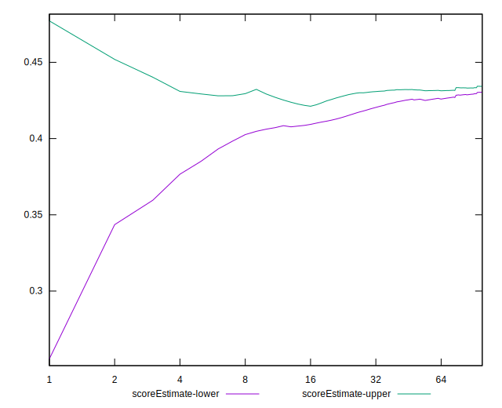

# //first-cpu-idle/samples/astro

[→ Parent](../..)


## Raw


```yaml
p90min: 6880.339999999999
p90max: 7205.072000000001
p90range: 324.7320000000018
p90mean: 7057.756143617024
median: 7035.502
p90stdev: 65.4268347804347
mad: 13.388000000000375
stdevBySn: 20.04879859999991
lfitCenter: 7038.567984426488
lfitStdev: 64.52581562806476
mfitCenter: 7038.567984426488
mfitStdev: 80.87111702984296
mfitConfidence: 8.087111702984297
p90skewness: 0.9115065988706063
p90eccentricity: 0.9999999999999997
p90discretization: 1
outlandishness: 0.9933396022157126

```


## Score


```yaml
p90min: 0.41
p90max: 0.45
p90range: 0.040000000000000036
p90mean: 0.42840425531914883
median: 0.43
p90stdev: 0.007621804037488507
mad: 0
stdevBySn: 0
lfitCenter: 0.43070514648692854
lfitStdev: 0.007678319418164235
mfitCenter: 0.43070514648692854
mfitStdev: 0.009623346287292783
mfitConfidence: 0.0009623346287292783
p90skewness: -0.5881003425427304
p90eccentricity: 1.0000000000000002
p90discretization: 18.8
outlandishness: 1.017327959763032

```


## Raw Estimate


## Score Estimate


## P Score


```yaml
p90min: 0.4127604936852311
p90max: 0.451556595943772
p90range: 0.03879610225854091
p90mean: 0.430107179953243
median: 0.43271432743882177
p90stdev: 0.007749099446149262
mad: 0.0016039831259640203
stdevBySn: 0.0024013445661761764
lfitCenter: 0.43273761282280354
lfitStdev: 0.007852727596098123
mfitCenter: 0.43273761282280354
mfitStdev: 0.009841934522580713
mfitConfidence: 0.0009841934522580712
p90skewness: -0.873945319737625
p90eccentricity: 0.9999999999999999
p90discretization: 1
outlandishness: 1.0166970399838184

```


## Score Difference


```yaml
p90min: 0
p90max: 5.551115123125783e-17
p90range: 5.551115123125783e-17
p90mean: 4.133809134242604e-18
median: 0
p90stdev: 1.4573404751592852e-17
mad: 0
stdevBySn: 0
lfitCenter: 2.9226926675442233e-18
lfitStdev: 6.94038067323661e-18
mfitCenter: 2.9226926675442233e-18
mfitStdev: 8.69847722487149e-18
mfitConfidence: 8.69847722487149e-19
p90skewness: 3.2417635938924185
p90eccentricity: 0.999999999999997
p90discretization: 47
outlandishness: 1.8032653061224493

```


## P Score Difference


```yaml
p90min: -0.004878623967731199
p90max: 0.004745762812383536
p90range: 0.009624386780114735
p90mean: 0.0016863218211206881
median: 0.002629380314193047
p90stdev: 0.0028167371856597104
mad: 0.0015145287217619985
stdevBySn: 0.0021005273117989244
lfitCenter: 0.001965696576144572
lfitStdev: 0.0022089243012539863
mfitCenter: 0.001965696576144572
mfitStdev: 0.0027684760578071425
mfitConfidence: 0.00027684760578071426
p90skewness: -1.1027522890660504
p90eccentricity: 1
p90discretization: 1
outlandishness: 0.8812947820905127

```

