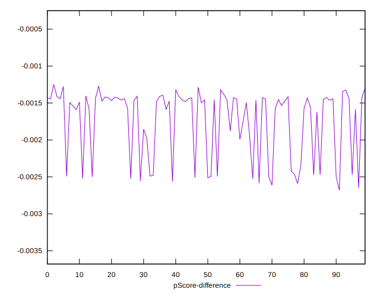

# //first-cpu-idle/samples/card

[→ Parent](../..)


## Raw


```yaml
p90min: 1589.4264
p90max: 1761.02
p90range: 171.59359999999992
p90mean: 1654.1890623655913
median: 1620.7644
p90stdev: 58.535506121840136
mad: 13.134600000000091
stdevBySn: 22.67001413999978
lfitCenter: 1646.1440634013297
lfitStdev: 51.936598505740285
mfitCenter: 1646.1440634013297
mfitStdev: 65.0928732168226
mfitConfidence: 6.542079908678026
p90skewness: 0.9293357635065438
p90eccentricity: 1.0000000000000004
p90discretization: 1
outlandishness: 1.0016241139179916

```


## Score


```yaml
p90min: 1
p90max: 1
p90range: 0
p90mean: 1
median: 1
p90stdev: 0
mad: 0
stdevBySn: 0
lfitCenter: 1
lfitStdev: 0
mfitCenter: 1
mfitStdev: 0
mfitConfidence: 0
p90skewness: .nan
p90eccentricity: .nan
p90discretization: 93
outlandishness: 1

```


## Raw Estimate


## Score Estimate


## P Score


```yaml
p90min: 0.9974088245209314
p90max: 0.998714784458628
p90range: 0.0013059599376966657
p90mean: 0.9982620621443926
median: 0.9985261082200896
p90stdev: 0.0004533333816409796
mad: 0.00008512995676301927
stdevBySn: 0.00014415584835298108
lfitCenter: 0.9983267327146653
lfitStdev: 0.0004012076828839704
mfitCenter: 0.9983267327146653
mfitStdev: 0.0005028392614640524
mfitConfidence: 0.000050537247276838695
p90skewness: -0.9862526328410792
p90eccentricity: 0.9999999999999999
p90discretization: 1
outlandishness: 0.9999734594181053

```


## Score Difference


```yaml
p90min: 0
p90max: 0
p90range: 0
p90mean: 0
median: 0
p90stdev: 0
mad: 0
stdevBySn: 0
lfitCenter: 0
lfitStdev: 0
mfitCenter: 0
mfitStdev: 0
mfitConfidence: 0
p90skewness: .nan
p90eccentricity: .nan
p90discretization: 93
outlandishness: .nan

```


## P Score Difference


```yaml
p90min: -0.0025911754790686192
p90max: -0.0012852155413719535
p90range: 0.0013059599376966657
p90mean: -0.0017379378556073102
median: -0.001473891779910419
p90stdev: 0.0004533333816409794
mad: 0.00008512995676301927
stdevBySn: 0.00014415584835298108
lfitCenter: -0.0016732672853350637
lfitStdev: 0.0004012076828842313
mfitCenter: -0.0016732672853350637
mfitStdev: 0.0005028392614643794
mfitConfidence: 0.00005053724727687155
p90skewness: -0.98625263283864
p90eccentricity: 1.0000000000000004
p90discretization: 1
outlandishness: 1.0153029686935433

```

