# //first-cpu-idle/samples/music

[→ Parent](../..)


## Raw


```yaml
p90min: 1438.2479999999998
p90max: 1611.1575
p90range: 172.9095000000002
p90mean: 1507.342510638298
median: 1471.3545
p90stdev: 61.89857490823276
mad: 14.905500000000075
stdevBySn: 24.30757319999994
lfitCenter: 1499.4486678333462
lfitStdev: 58.89273253806206
mfitCenter: 1499.4486678333462
mfitStdev: 73.8110943493656
mfitConfidence: 7.38110943493656
p90skewness: 0.752740690312395
p90eccentricity: 0.9999999999999994
p90discretization: 1
outlandishness: 1.0014547095835435

```

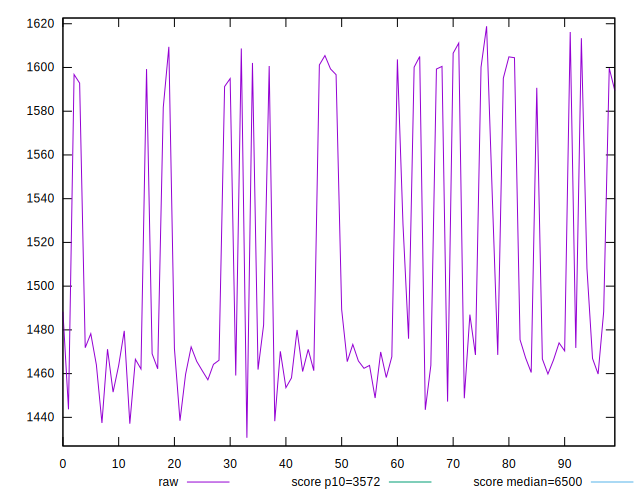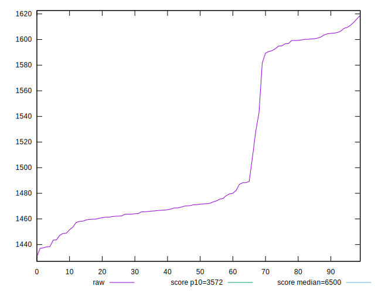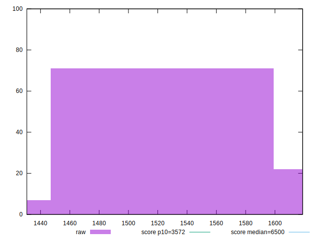
## Score


```yaml
p90min: 1
p90max: 1
p90range: 0
p90mean: 1
median: 1
p90stdev: 0
mad: 0
stdevBySn: 0
lfitCenter: 1
lfitStdev: 0
mfitCenter: 1
mfitStdev: 0
mfitConfidence: 0
p90skewness: .nan
p90eccentricity: .nan
p90discretization: 94
outlandishness: 1

```


## Raw Estimate

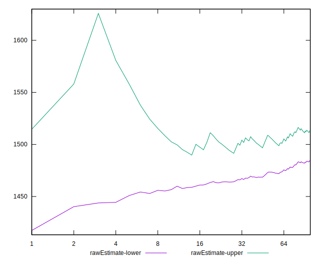
## Score Estimate

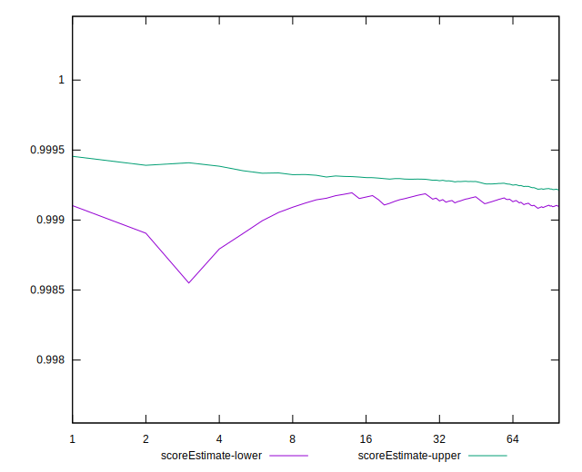
## P Score


```yaml
p90min: 0.9985860750399445
p90max: 0.9993785847849244
p90range: 0.0007925097449799079
p90mean: 0.9990892566429295
median: 0.999264008082461
p90stdev: 0.00028911287891986804
mad: 0.00005525529125083306
stdevBySn: 0.00008920364477444521
lfitCenter: 0.9991282897626148
lfitStdev: 0.0002750988899524083
mfitCenter: 0.9991282897626148
mfitStdev: 0.000344785328284092
mfitConfidence: 0.0000344785328284092
p90skewness: -0.8010952534116204
p90eccentricity: 0.9999999999999994
p90discretization: 1
outlandishness: 0.999985905865601

```

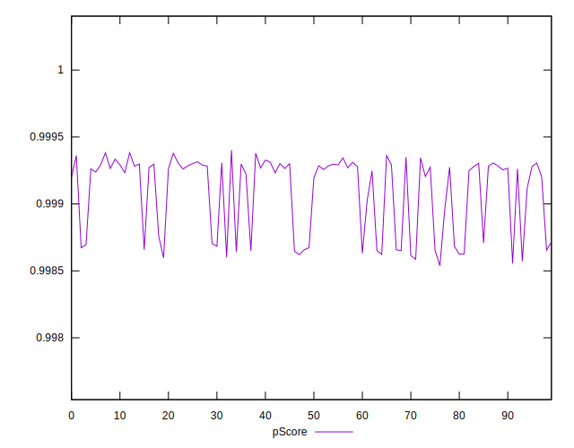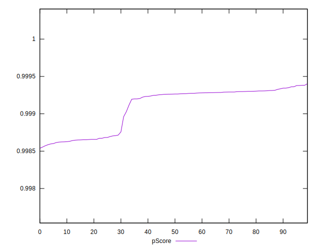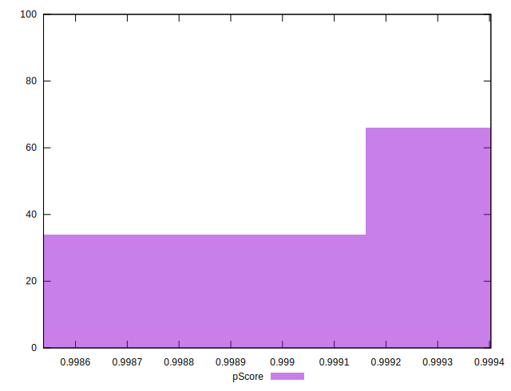
## Score Difference


```yaml
p90min: 0
p90max: 0
p90range: 0
p90mean: 0
median: 0
p90stdev: 0
mad: 0
stdevBySn: 0
lfitCenter: 0
lfitStdev: 0
mfitCenter: 0
mfitStdev: 0
mfitConfidence: 0
p90skewness: .nan
p90eccentricity: .nan
p90discretization: 94
outlandishness: .nan

```


## P Score Difference


```yaml
p90min: -0.001413924960055546
p90max: -0.000621415215075638
p90range: 0.0007925097449799079
p90mean: -0.0009107433570703543
median: -0.0007359919175390361
p90stdev: 0.0002891128789198679
mad: 0.00005525529125083306
stdevBySn: 0.00008920364477444521
lfitCenter: -0.0008717102373848824
lfitStdev: 0.00027509888995222236
mfitCenter: -0.0008717102373848824
mfitStdev: 0.000344785328283859
mfitConfidence: 0.000034478532828385896
p90skewness: -0.8010952534169161
p90eccentricity: 1.0000000000000007
p90discretization: 1
outlandishness: 1.0155211421846586

```

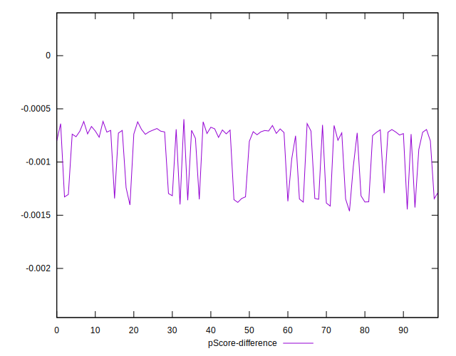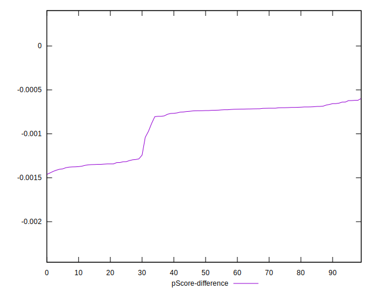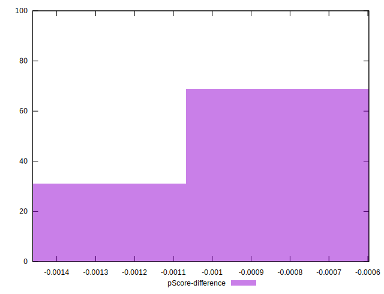