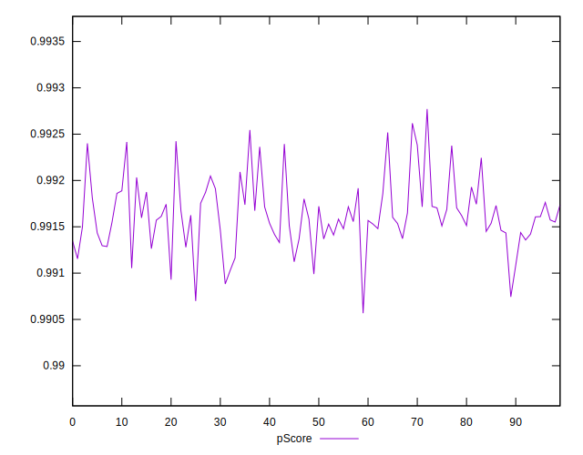

# //first-meaningful-paint/samples/agenda

[→ Parent](../..)


## Raw


```yaml
p90min: 1440.6399000000001
p90max: 1485.1023
p90range: 44.46239999999989
p90mean: 1465.3804595744682
median: 1466.6541000000002
p90stdev: 9.383918729789913
mad: 4.533899999999903
stdevBySn: 8.544501960000146
lfitCenter: 1465.726755382862
lfitStdev: 6.974468677920174
mfitCenter: 1465.726755382862
mfitStdev: 8.741200203097268
mfitConfidence: 0.8741200203097268
p90skewness: -0.6403510248296895
p90eccentricity: 0.9999999999999999
p90discretization: 1
outlandishness: 0.9998600991456539

```


## Score


```yaml
p90min: 0.99
p90max: 0.99
p90range: 0
p90mean: 0.9899999999999988
median: 0.99
p90stdev: 1.2212453270876722e-15
mad: 0
stdevBySn: 0
lfitCenter: 0.9899999999999985
lfitStdev: 0
mfitCenter: 0.9899999999999985
mfitStdev: 0
mfitConfidence: 0
p90skewness: 1
p90eccentricity: 1
p90discretization: 94
outlandishness: 0.9999999999999996

```


## Raw Estimate


## Score Estimate


## P Score


```yaml
p90min: 0.9908826266404034
p90max: 0.9925178411998186
p90range: 0.0016352145594151768
p90mean: 0.9916316494209195
median: 0.9915895681028664
p90stdev: 0.0003445858769220442
mad: 0.00016993238757179174
stdevBySn: 0.00032045824143818235
lfitCenter: 0.991619766810436
lfitStdev: 0.000256752215812632
mfitCenter: 0.991619766810436
mfitStdev: 0.000321791182188852
mfitConfidence: 0.0000321791182188852
p90skewness: 0.5424504063182566
p90eccentricity: 0.9999999999999999
p90discretization: 1
outlandishness: 1.0000030907040018

```


## Score Difference


```yaml
p90min: 0
p90max: 0
p90range: 0
p90mean: 0
median: 0
p90stdev: 0
mad: 0
stdevBySn: 0
lfitCenter: 0
lfitStdev: 0
mfitCenter: 0
mfitStdev: 0
mfitConfidence: 0
p90skewness: .nan
p90eccentricity: .nan
p90discretization: 94
outlandishness: .nan

```


## P Score Difference


```yaml
p90min: 0.0008826266404033944
p90max: 0.0025178411998185712
p90range: 0.0016352145594151768
p90mean: 0.001631649420919279
median: 0.0015895681028663122
p90stdev: 0.00034458587692204427
mad: 0.00016993238757173623
stdevBySn: 0.00032045824143818235
lfitCenter: 0.0016197668104358915
lfitStdev: 0.00025675221581261665
mfitCenter: 0.0016197668104358915
mfitStdev: 0.00032179118218883274
mfitConfidence: 0.000032179118218883276
p90skewness: 0.5424504063166119
p90eccentricity: 1
p90discretization: 1
outlandishness: 1.0018792497475764

```

