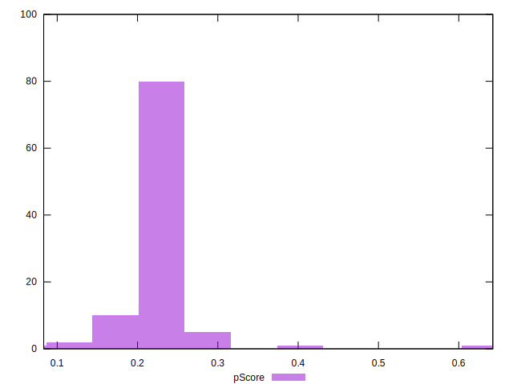

# //first-meaningful-paint/samples/astro

[→ Parent](../..)


## Raw


```yaml
p90min: 5003.754999999999
p90max: 5972.140000000002
p90range: 968.385000000003
p90mean: 5593.056212765956
median: 5637.262999999999
p90stdev: 178.40420188036992
mad: 20.537000000000262
stdevBySn: 38.787227950002666
lfitCenter: 5604.04372602486
lfitStdev: 136.99772151690425
mfitCenter: 5604.04372602486
mfitStdev: 171.701181329921
mfitConfidence: 17.1701181329921
p90skewness: -1.1322443988750908
p90eccentricity: 0.9999999999999997
p90discretization: 1
outlandishness: 0.9970971423861213

```


## Score


```yaml
p90min: 0.17
p90max: 0.3
p90range: 0.12999999999999998
p90mean: 0.21414893617021294
median: 0.21
p90stdev: 0.02349330255255129
mad: 0
stdevBySn: 0
lfitCenter: 0.21427792162669632
lfitStdev: 0.01915190710815855
mfitCenter: 0.21427792162669632
mfitStdev: 0.024003355959361528
mfitConfidence: 0.002400335595936153
p90skewness: 1.436175804733195
p90eccentricity: 1.0000000000000024
p90discretization: 9.4
outlandishness: 1.0362896118103664

```


## Raw Estimate


## Score Estimate


## P Score


```yaml
p90min: 0.1697845806472454
p90max: 0.29685223867625243
p90range: 0.12706765802900705
p90mean: 0.21325689807628997
median: 0.20681602481125666
p90stdev: 0.02336815881841516
mad: 0.0024800361486725653
stdevBySn: 0.004691546928633801
lfitCenter: 0.21289029501111215
lfitStdev: 0.01963271832621603
mfitCenter: 0.21289029501111215
mfitStdev: 0.02460596345693922
mfitConfidence: 0.002460596345693922
p90skewness: 1.524668353381079
p90eccentricity: 1.0000000000000004
p90discretization: 1
outlandishness: 1.038027630855459

```


## Score Difference


```yaml
p90min: 0
p90max: 0
p90range: 0
p90mean: 0
median: 0
p90stdev: 0
mad: 0
stdevBySn: 0
lfitCenter: 0
lfitStdev: 0
mfitCenter: 0
mfitStdev: 0
mfitConfidence: 0
p90skewness: .nan
p90eccentricity: .nan
p90discretization: 94
outlandishness: .nan

```


## P Score Difference


```yaml
p90min: -0.004715895125579489
p90max: 0.004753955104838226
p90range: 0.009469850230417715
p90mean: -0.0007709106893999849
median: -0.0015661115902842887
p90stdev: 0.0029311256132227596
mad: 0.0020370397998946965
stdevBySn: 0.003277771946072196
lfitCenter: -0.0009798290896528782
lfitStdev: 0.0026699830120698233
mfitCenter: -0.0009798290896528782
mfitStdev: 0.0033463274587865483
mfitConfidence: 0.0003346327458786548
p90skewness: 0.5114996347598753
p90eccentricity: 1.0000000000000002
p90discretization: 1
outlandishness: 0.8871431692650564

```

