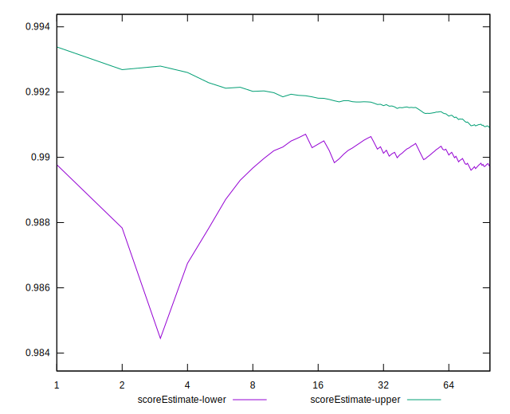

# //first-meaningful-paint/samples/music

[→ Parent](../..)


## Raw


```yaml
p90min: 1438.2479999999998
p90max: 1611.1575
p90range: 172.9095000000002
p90mean: 1507.342510638298
median: 1471.3545
p90stdev: 61.89857490823276
mad: 14.905500000000075
stdevBySn: 24.30757319999994
lfitCenter: 1499.4486678333462
lfitStdev: 58.89273253806206
mfitCenter: 1499.4486678333462
mfitStdev: 73.8110943493656
mfitConfidence: 7.38110943493656
p90skewness: 0.752740690312395
p90eccentricity: 0.9999999999999994
p90discretization: 1
outlandishness: 1.0014547095835435

```


## Score


```yaml
p90min: 0.98
p90max: 0.99
p90range: 0.010000000000000009
p90mean: 0.9897872340425521
median: 0.99
p90stdev: 0.0014430489325798438
mad: 0
stdevBySn: 0
lfitCenter: 0.9897545013928887
lfitStdev: 0.0006002664107248266
mfitCenter: 0.9897545013928887
mfitStdev: 0.0007523223794740765
mfitConfidence: 0.00007523223794740765
p90skewness: -6.634888026968367
p90eccentricity: 1.0000000000000044
p90discretization: 47
outlandishness: 0.9994196886859379

```


## Raw Estimate


## Score Estimate


## P Score


```yaml
p90min: 0.9848711224783901
p90max: 0.9925992699811463
p90range: 0.0077281475027561886
p90mean: 0.989725532708818
median: 0.9914133461741144
p90stdev: 0.0028114867971369044
mad: 0.0005644156390022248
stdevBySn: 0.0009130380624793418
lfitCenter: 0.990101185802334
lfitStdev: 0.002675987983901575
mfitCenter: 0.990101185802334
mfitStdev: 0.0033538535748850375
mfitConfidence: 0.00033538535748850375
p90skewness: -0.7920227914873746
p90eccentricity: 0.9999999999999994
p90discretization: 1
outlandishness: 0.9998691854391203

```


## Score Difference


```yaml
p90min: 0
p90max: 0
p90range: 0
p90mean: 0
median: 0
p90stdev: 0
mad: 0
stdevBySn: 0
lfitCenter: 0
lfitStdev: 0
mfitCenter: 0
mfitStdev: 0
mfitConfidence: 0
p90skewness: .nan
p90eccentricity: .nan
p90discretization: 94
outlandishness: .nan

```


## P Score Difference


```yaml
p90min: -0.004785399896655607
p90max: 0.004583171993322255
p90range: 0.009368571889977861
p90mean: 0.00017194333396033874
median: 0.0014837812423625363
p90stdev: 0.0027026753617931856
mad: 0.0005360772880076969
stdevBySn: 0.0009130380624793418
lfitCenter: 0.0005428461707607888
lfitStdev: 0.0022607144818953
mfitCenter: 0.0005428461707607888
mfitStdev: 0.002833385423444339
mfitConfidence: 0.0002833385423444339
p90skewness: -0.9520094032954062
p90eccentricity: 0.9999999999999996
p90discretization: 1
outlandishness: 0.8745330140023664

```

