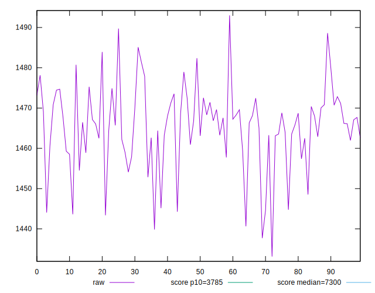
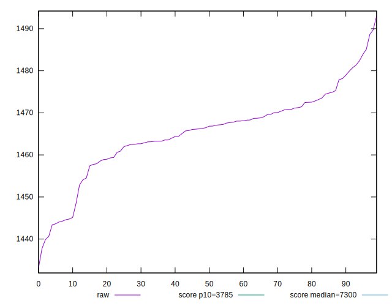
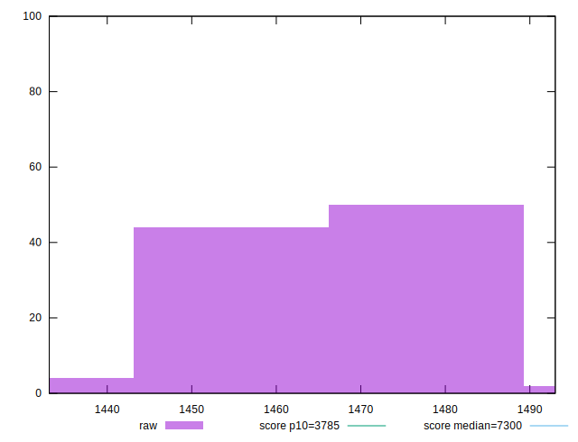
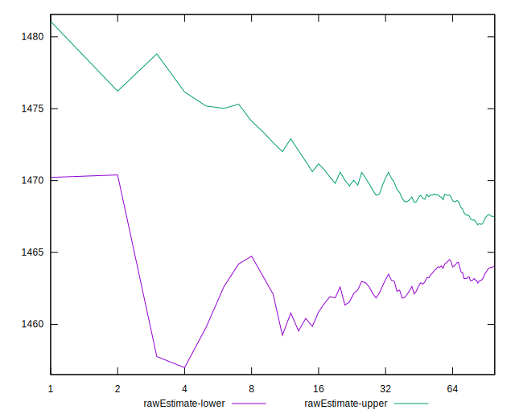
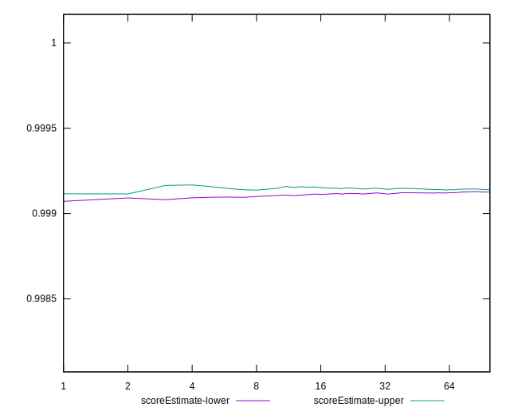
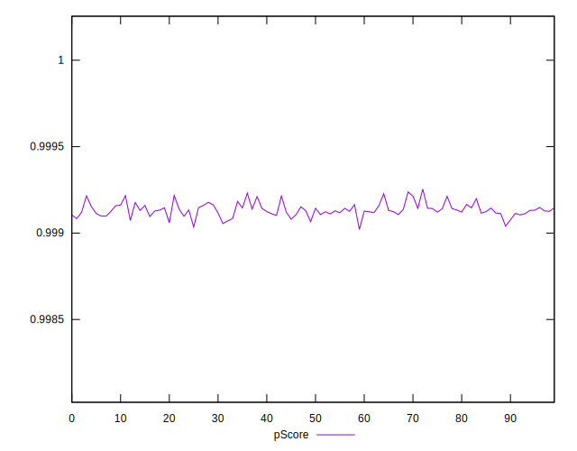
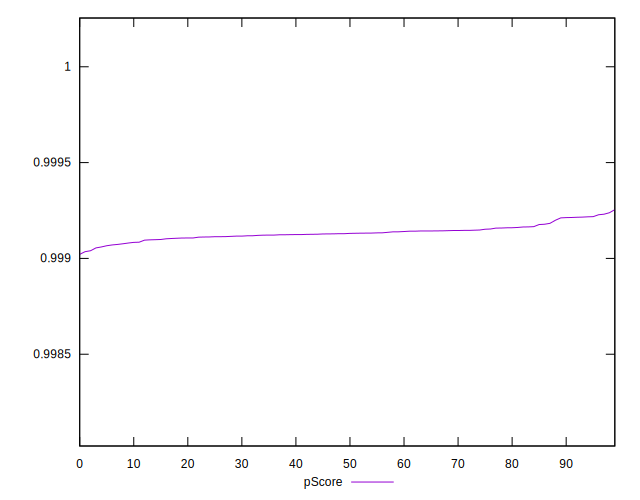
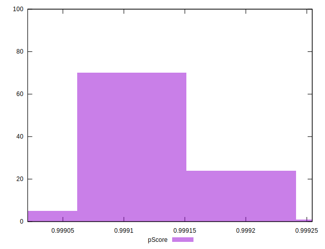
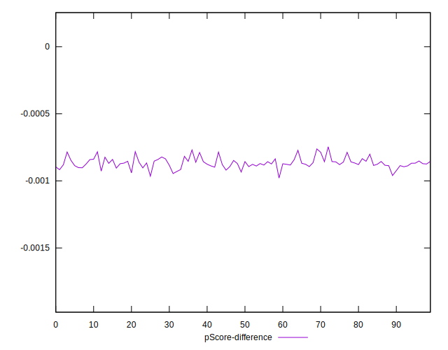
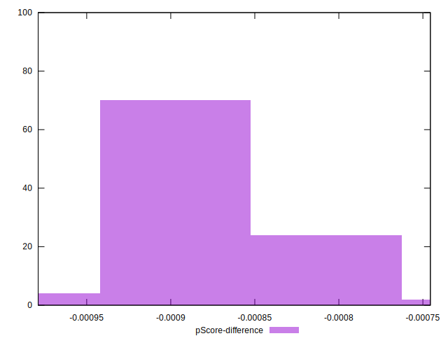

# //interactive/samples/agenda

[→ Parent](../..)


## Raw


```yaml
p90min: 1440.6399000000001
p90max: 1485.1023
p90range: 44.46239999999989
p90mean: 1465.3804595744682
median: 1466.6541000000002
p90stdev: 9.383918729789913
mad: 4.533899999999903
stdevBySn: 8.544501960000146
lfitCenter: 1465.726755382862
lfitStdev: 6.974468677920174
mfitCenter: 1465.726755382862
mfitStdev: 8.741200203097268
mfitConfidence: 0.8741200203097268
p90skewness: -0.6403510248296895
p90eccentricity: 0.9999999999999999
p90discretization: 1
outlandishness: 0.9998600991456539

```


## Score


```yaml
p90min: 1
p90max: 1
p90range: 0
p90mean: 1
median: 1
p90stdev: 0
mad: 0
stdevBySn: 0
lfitCenter: 1
lfitStdev: 0
mfitCenter: 1
mfitStdev: 0
mfitConfidence: 0
p90skewness: .nan
p90eccentricity: .nan
p90discretization: 94
outlandishness: 1

```


## Raw Estimate


## Score Estimate


## P Score


```yaml
p90min: 0.9990547785765218
p90max: 0.9992278524676207
p90range: 0.00017307389109888494
p90mean: 0.9991342752159477
median: 0.9991298658422475
p90stdev: 0.00003646491192131232
mad: 0.00001801278512375548
stdevBySn: 0.00003398626515888475
lfitCenter: 0.9991330255301988
lfitStdev: 0.000027175835560294325
mfitCenter: 0.9991330255301988
mfitStdev: 0.000034059858935350654
mfitConfidence: 0.0000034059858935350653
p90skewness: 0.5338960039198448
p90eccentricity: 0.9999999999999997
p90discretization: 1
outlandishness: 1.0000002831998498

```


## Score Difference


```yaml
p90min: 0
p90max: 0
p90range: 0
p90mean: 0
median: 0
p90stdev: 0
mad: 0
stdevBySn: 0
lfitCenter: 0
lfitStdev: 0
mfitCenter: 0
mfitStdev: 0
mfitConfidence: 0
p90skewness: .nan
p90eccentricity: .nan
p90discretization: 94
outlandishness: .nan

```


## P Score Difference


```yaml
p90min: -0.000945221423478193
p90max: -0.0007721475323793081
p90range: 0.00017307389109888494
p90mean: -0.0008657247840525029
median: -0.0008701341577525001
p90stdev: 0.00003646491192131232
mad: 0.00001801278512375548
stdevBySn: 0.00003398626515888475
lfitCenter: -0.0008669744698015479
lfitStdev: 0.00002717583556022362
mfitCenter: -0.0008669744698015479
mfitStdev: 0.00003405985893526204
mfitConfidence: 0.000003405985893526204
p90skewness: 0.5338960039062423
p90eccentricity: 0.9999999999999996
p90discretization: 1
outlandishness: 0.9996731853573132

```

