# //interactive/samples/astro

[→ Parent](../..)


## Raw


```yaml
p90min: 14787.86
p90max: 15140.354000000001
p90range: 352.4940000000006
p90mean: 14921.397106382981
median: 14905.28975
p90stdev: 83.86363469923926
mad: 59.92424999999912
stdevBySn: 94.5506696750016
lfitCenter: 14901.728395724915
lfitStdev: 97.17662885632032
mfitCenter: 14901.728395724915
mfitStdev: 121.79284288484078
mfitConfidence: 12.179284288484078
p90skewness: 0.46796323259304984
p90eccentricity: 1.0000000000000007
p90discretization: 1
outlandishness: 0.9950841169421145

```

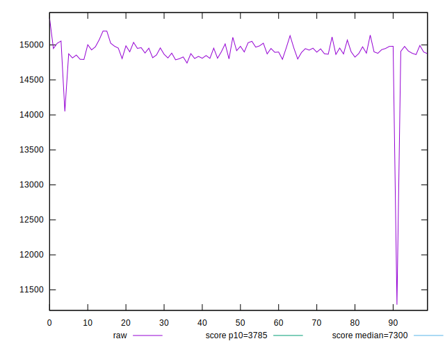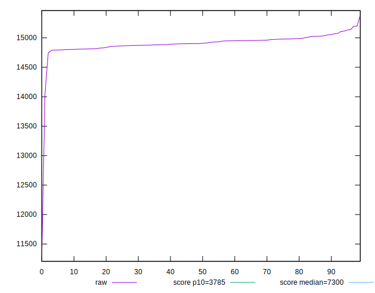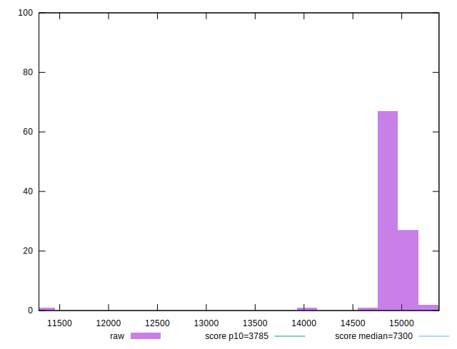
## Score


```yaml
p90min: 0.08
p90max: 0.08
p90range: 0
p90mean: 0.08000000000000006
median: 0.08
p90stdev: 5.551115123125783e-17
mad: 0
stdevBySn: 0
lfitCenter: 0.08065650177299195
lfitStdev: 0.0017386618711664908
mfitCenter: 0.08065650177299195
mfitStdev: 0.0021790895053370764
mfitConfidence: 0.00021790895053370763
p90skewness: -1
p90eccentricity: 1
p90discretization: 94
outlandishness: 1.03530625

```

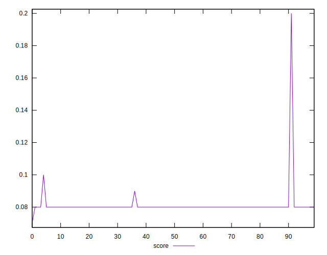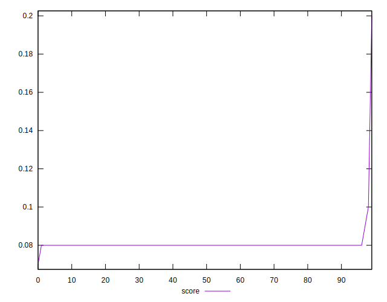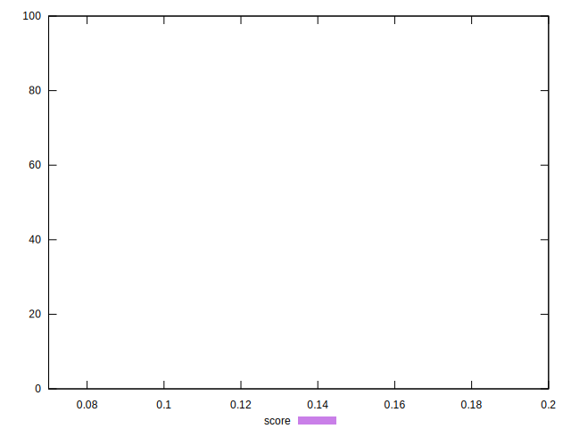
## Raw Estimate

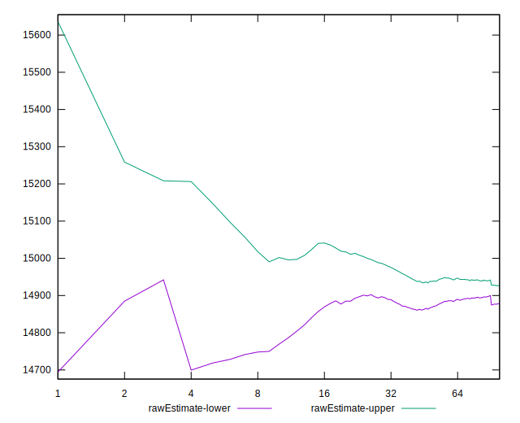
## Score Estimate

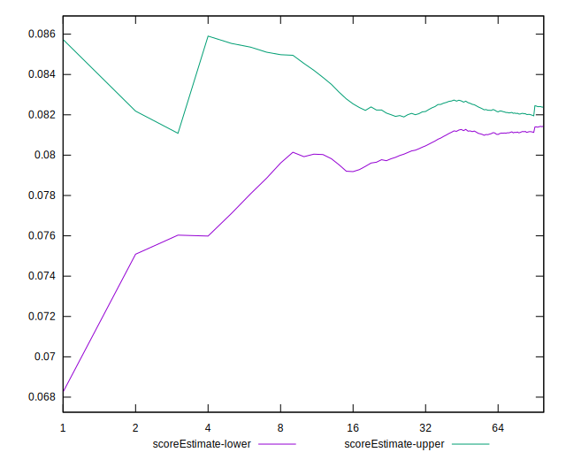
## P Score


```yaml
p90min: 0.07732152495165617
p90max: 0.08420071019771158
p90range: 0.006879185246055408
p90mean: 0.08154046946819803
median: 0.08184149989994535
p90stdev: 0.001646034113285753
mad: 0.0011854081455637822
stdevBySn: 0.0018516437442168286
lfitCenter: 0.0821425806994849
lfitStdev: 0.0022531680444223814
mfitCenter: 0.0821425806994849
mfitStdev: 0.0028239273666636456
mfitConfidence: 0.00028239273666636454
p90skewness: -0.4199061876936307
p90eccentricity: 1.0000000000000002
p90discretization: 1
outlandishness: 1.029563828137076

```

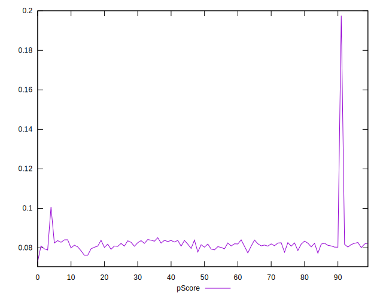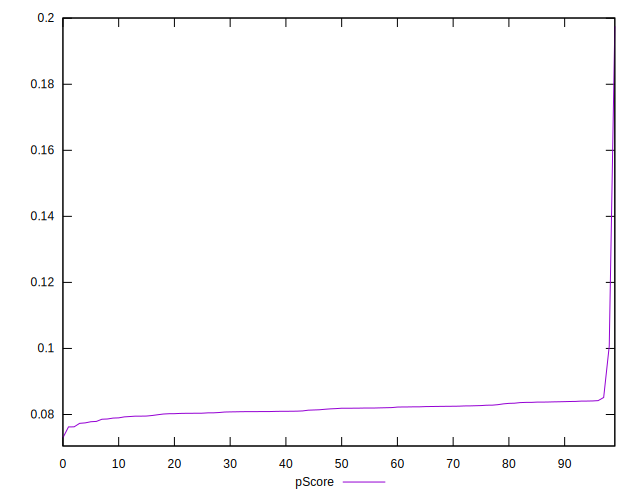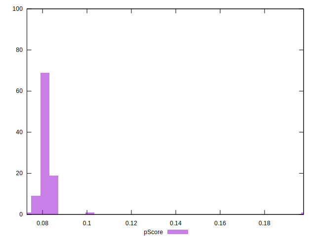
## Score Difference


```yaml
p90min: 0
p90max: 0
p90range: 0
p90mean: 0
median: 0
p90stdev: 0
mad: 0
stdevBySn: 0
lfitCenter: 0
lfitStdev: 0
mfitCenter: 0
mfitStdev: 0
mfitConfidence: 0
p90skewness: .nan
p90eccentricity: .nan
p90discretization: 94
outlandishness: .nan

```


## P Score Difference


```yaml
p90min: -0.0026784750483438285
p90max: 0.004056381395646194
p90range: 0.006734856443990023
p90mean: 0.001422090513027152
median: 0.0016471984397030265
p90stdev: 0.0016366725805629196
mad: 0.0011462232365564151
stdevBySn: 0.0017680496500147684
lfitCenter: 0.001433180138352935
lfitStdev: 0.0014066381862215282
mfitCenter: 0.001433180138352935
mfitStdev: 0.0017629595266532394
mfitConfidence: 0.00017629595266532394
p90skewness: -0.48197182559112656
p90eccentricity: 1.0000000000000007
p90discretization: 1
outlandishness: 0.8839297369384727

```

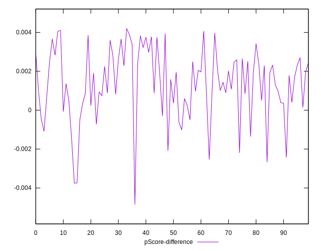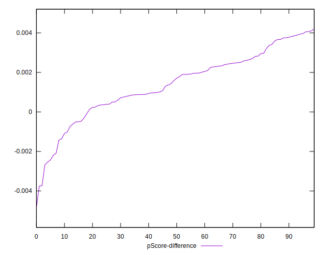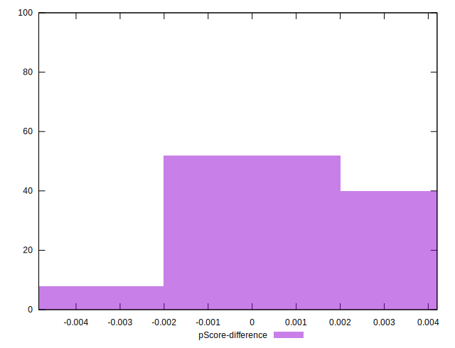