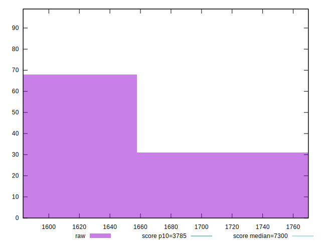
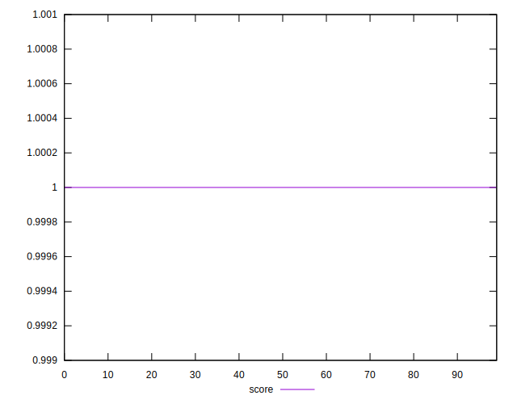
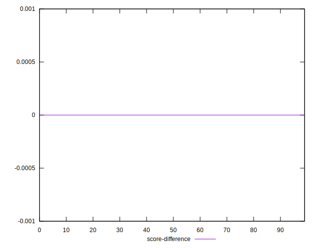

# //interactive/samples/card

[→ Parent](../..)


## Raw


```yaml
p90min: 1589.4264
p90max: 1761.02
p90range: 171.59359999999992
p90mean: 1654.1890623655913
median: 1620.7644
p90stdev: 58.535506121840136
mad: 13.134600000000091
stdevBySn: 22.67001413999978
lfitCenter: 1646.1440634013297
lfitStdev: 51.936598505740285
mfitCenter: 1646.1440634013297
mfitStdev: 65.0928732168226
mfitConfidence: 6.542079908678026
p90skewness: 0.9293357635065438
p90eccentricity: 1.0000000000000004
p90discretization: 1
outlandishness: 1.0016241139179916

```


## Score


```yaml
p90min: 1
p90max: 1
p90range: 0
p90mean: 1
median: 1
p90stdev: 0
mad: 0
stdevBySn: 0
lfitCenter: 1
lfitStdev: 0
mfitCenter: 1
mfitStdev: 0
mfitConfidence: 0
p90skewness: .nan
p90eccentricity: .nan
p90discretization: 93
outlandishness: 1

```


## Raw Estimate


## Score Estimate


## P Score


```yaml
p90min: 0.9972352430092235
p90max: 0.9985325301068371
p90range: 0.0012972870976135642
p90mean: 0.9980783290212375
median: 0.998339652311602
p90stdev: 0.00044953774186620585
mad: 0.0000862717476898256
stdevBySn: 0.0001464181689536189
lfitCenter: 0.9981422085452453
lfitStdev: 0.0003980187510470426
mfitCenter: 0.9981422085452453
mfitStdev: 0.0004988425281058736
mfitConfidence: 0.00005013556046059093
p90skewness: -0.9800678580538128
p90eccentricity: 1.0000000000000007
p90discretization: 1
outlandishness: 0.9999743152292913

```


## Score Difference


```yaml
p90min: 0
p90max: 0
p90range: 0
p90mean: 0
median: 0
p90stdev: 0
mad: 0
stdevBySn: 0
lfitCenter: 0
lfitStdev: 0
mfitCenter: 0
mfitStdev: 0
mfitConfidence: 0
p90skewness: .nan
p90eccentricity: .nan
p90discretization: 93
outlandishness: .nan

```


## P Score Difference


```yaml
p90min: -0.0027647569907764957
p90max: -0.0014674698931629315
p90range: 0.0012972870976135642
p90mean: -0.0019216709787625295
median: -0.0016603476883979562
p90stdev: 0.000449537741866206
mad: 0.0000862717476898256
stdevBySn: 0.0001464181689536189
lfitCenter: -0.0018577914547548303
lfitStdev: 0.00039801875104710974
mfitCenter: -0.0018577914547548303
mfitStdev: 0.0004988425281059577
mfitConfidence: 0.000050135560460599385
p90skewness: -0.9800678580536283
p90eccentricity: 1.0000000000000002
p90discretization: 1
outlandishness: 1.0133847439031594

```

