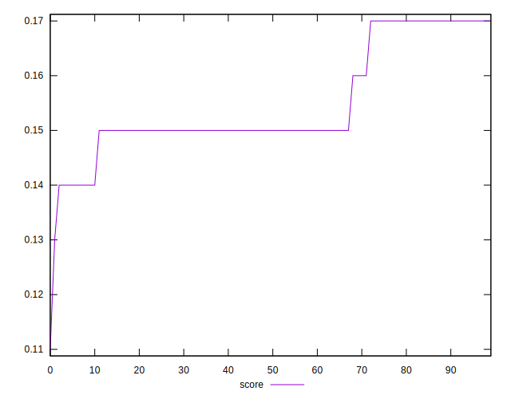
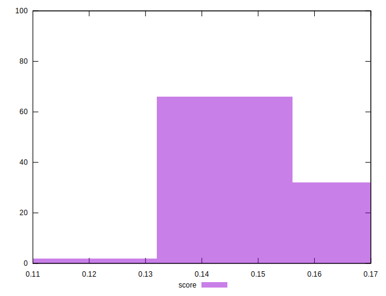
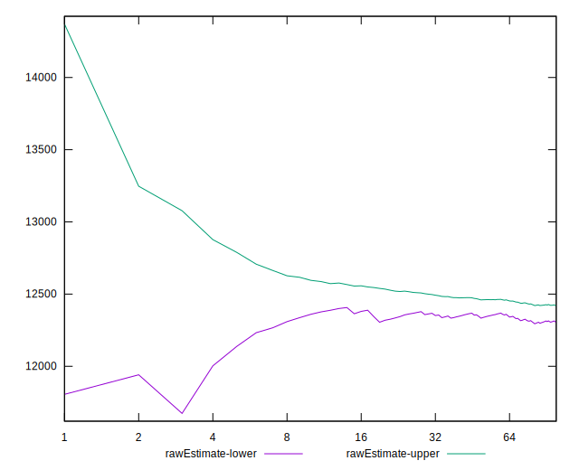

# //interactive/samples/music

[→ Parent](../..)


## Raw


```yaml
p90min: 11863.084
p90max: 12658.874499999996
p90range: 795.7904999999955
p90mean: 12323.274441489368
median: 12458.22125
p90stdev: 255.58115872998115
mad: 47.615750000000844
stdevBySn: 92.6328197999992
lfitCenter: 12360.73294213956
lfitStdev: 235.94023326157404
mfitCenter: 12360.73294213956
mfitStdev: 295.7072302058007
mfitConfidence: 29.570723020580072
p90skewness: -0.7733247901541995
p90eccentricity: 1.0000000000000002
p90discretization: 1
outlandishness: 1.0013943698864725

```


## Score


```yaml
p90min: 0.14
p90max: 0.17
p90range: 0.03
p90mean: 0.15489361702127674
median: 0.15
p90stdev: 0.009757122968338812
mad: 0
stdevBySn: 0
lfitCenter: 0.1535392851481141
lfitStdev: 0.008710358307996855
mfitCenter: 0.1535392851481141
mfitStdev: 0.010916815219480942
mfitConfidence: 0.0010916815219480943
p90skewness: 0.6139337125515758
p90eccentricity: 1.000000000000001
p90discretization: 23.5
outlandishness: 0.9949240401597031

```


## Raw Estimate


## Score Estimate


## P Score


```yaml
p90min: 0.14139770553251962
p90max: 0.17172248387960914
p90range: 0.03032477834708952
p90mean: 0.15377822902872015
median: 0.14850047094198002
p90stdev: 0.009821795918391553
mad: 0.0017270188172869572
stdevBySn: 0.0033552094743305788
lfitCenter: 0.15235350482775858
lfitStdev: 0.009060048405844534
mfitCenter: 0.15235350482775858
mfitStdev: 0.011355086763233687
mfitConfidence: 0.0011355086763233688
p90skewness: 0.8007060195031109
p90eccentricity: 1.0000000000000002
p90discretization: 1
outlandishness: 0.9972706979332512

```


## Score Difference


```yaml
p90min: 0
p90max: 0
p90range: 0
p90mean: 0
median: 0
p90stdev: 0
mad: 0
stdevBySn: 0
lfitCenter: 0
lfitStdev: 0
mfitCenter: 0
mfitStdev: 0
mfitConfidence: 0
p90skewness: .nan
p90eccentricity: .nan
p90discretization: 94
outlandishness: .nan

```


## P Score Difference


```yaml
p90min: -0.0036769443973823923
p90max: 0.002829183160745985
p90range: 0.006506127558128377
p90mean: -0.0009763608872282346
median: -0.0014892721266846487
p90stdev: 0.0017362756004350485
mad: 0.0012486355356351175
stdevBySn: 0.0018163895579203337
lfitCenter: -0.0010830383796367098
lfitStdev: 0.0015467499120922366
mfitCenter: -0.0010830383796367098
mfitStdev: 0.0019385635336673724
mfitConfidence: 0.00019385635336673725
p90skewness: 0.632848174065796
p90eccentricity: 0.9999999999999997
p90discretization: 1
outlandishness: 0.9107408405005883

```

