# //largest-contentful-paint/samples/agenda

[→ Parent](../..)


## Raw


```yaml
p90min: 1665.6399000000001
p90max: 1710.1023
p90range: 44.46239999999989
p90mean: 1690.3804595744682
median: 1691.6541000000002
p90stdev: 9.383918729789912
mad: 4.533899999999903
stdevBySn: 8.544501960000146
lfitCenter: 1690.7267553828617
lfitStdev: 6.974468677920231
mfitCenter: 1690.7267553828617
mfitStdev: 8.741200203097339
mfitConfidence: 0.8741200203097339
p90skewness: -0.6403510248298353
p90eccentricity: 1.0000000000000002
p90discretization: 1
outlandishness: 0.9998787202422152

```

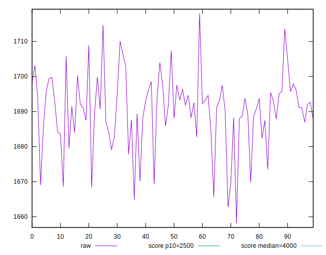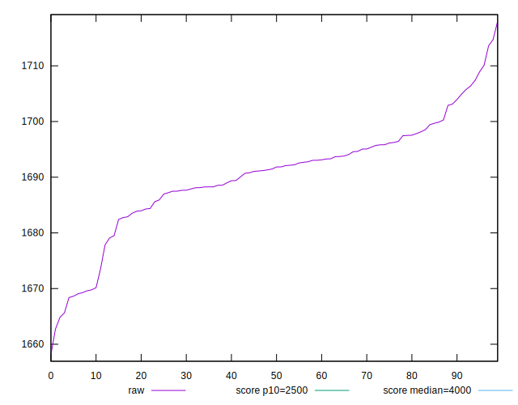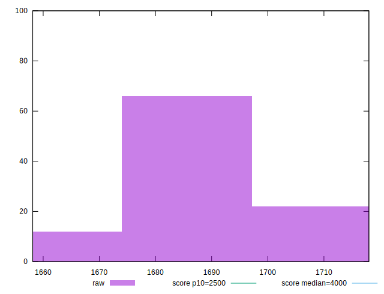
## Score


```yaml
p90min: 0.99
p90max: 0.99
p90range: 0
p90mean: 0.9899999999999988
median: 0.99
p90stdev: 1.2212453270876722e-15
mad: 0
stdevBySn: 0
lfitCenter: 0.9899999999999985
lfitStdev: 0
mfitCenter: 0.9899999999999985
mfitStdev: 0
mfitConfidence: 0
p90skewness: 1
p90eccentricity: 1
p90discretization: 94
outlandishness: 0.9999999999999996

```


## Raw Estimate

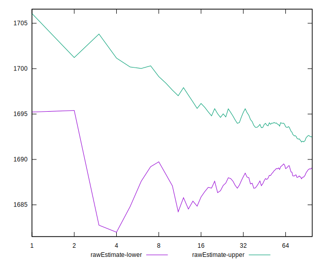
## Score Estimate

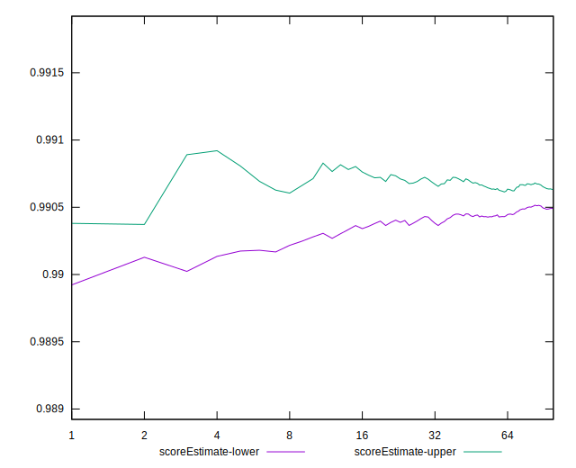
## P Score


```yaml
p90min: 0.9897475050475298
p90max: 0.9915484257235578
p90range: 0.001800920676027995
p90mean: 0.9905723350771117
median: 0.99052597111313
p90stdev: 0.00037950291668517236
mad: 0.0001871361095272528
stdevBySn: 0.00035289495913267164
lfitCenter: 0.9905592450484749
lfitStdev: 0.00028276567693212205
mfitCenter: 0.9905592450484749
mfitStdev: 0.0003543942208032225
mfitConfidence: 0.00003543942208032225
p90skewness: 0.542814997719719
p90eccentricity: 1.0000000000000002
p90discretization: 1
outlandishness: 1.0000034256095391

```

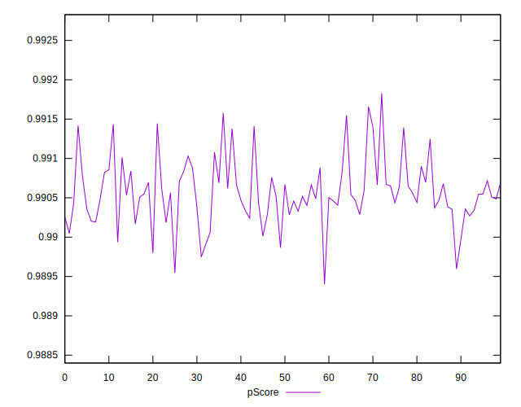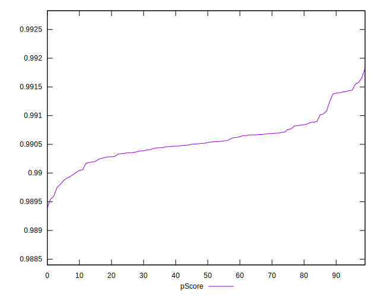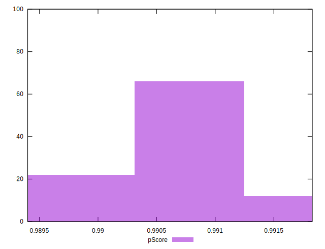
## Score Difference


```yaml
p90min: 0
p90max: 0
p90range: 0
p90mean: 0
median: 0
p90stdev: 0
mad: 0
stdevBySn: 0
lfitCenter: 0
lfitStdev: 0
mfitCenter: 0
mfitStdev: 0
mfitConfidence: 0
p90skewness: .nan
p90eccentricity: .nan
p90discretization: 94
outlandishness: .nan

```


## P Score Difference


```yaml
p90min: -0.0002524949524701503
p90max: 0.0015484257235578447
p90range: 0.001800920676027995
p90mean: 0.0005723350771120715
median: 0.0005259711131299638
p90stdev: 0.00037950291668517236
mad: 0.00018713610952719728
stdevBySn: 0.00035289495913267164
lfitCenter: 0.0005592450484745364
lfitStdev: 0.0002827656769320373
mfitCenter: 0.0005592450484745364
mfitStdev: 0.0003543942208031163
mfitConfidence: 0.00003543942208031163
p90skewness: 0.542814997721493
p90eccentricity: 1
p90discretization: 1
outlandishness: 1.0059376769161261

```

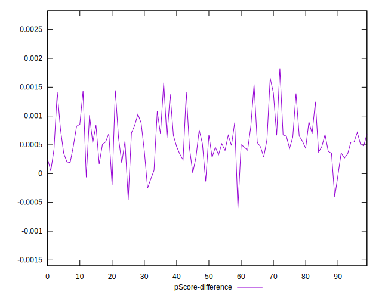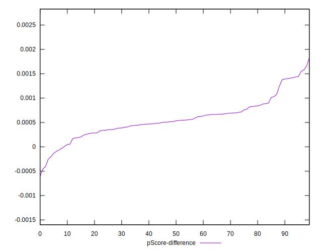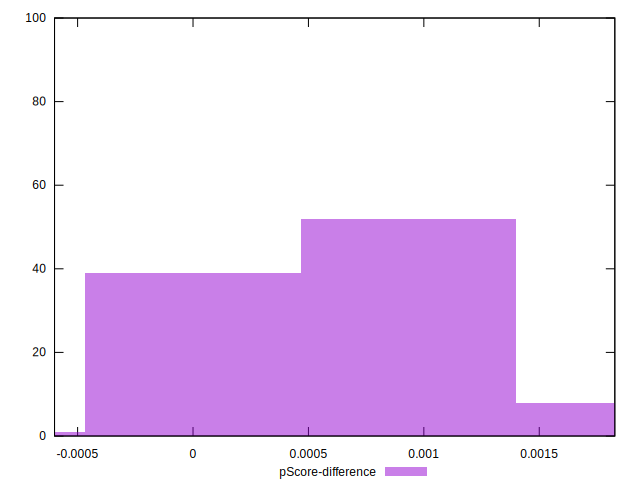