# //largest-contentful-paint/samples/astro

[→ Parent](../..)


## Raw


```yaml
p90min: 11251.431
p90max: 15749.8895
p90range: 4498.458499999999
p90mean: 12233.285117021278
median: 12125.39975
p90stdev: 688.0483339938091
mad: 156.73424999999952
stdevBySn: 219.63726604999823
lfitCenter: 12184.509590013266
lfitStdev: 392.0943158114287
mfitCenter: 12184.509590013266
mfitStdev: 491.4173496619971
mfitConfidence: 49.14173496619971
p90skewness: 3.6192031361233323
p90eccentricity: 1.0000000000000002
p90discretization: 1
outlandishness: 0.9992010828539954

```

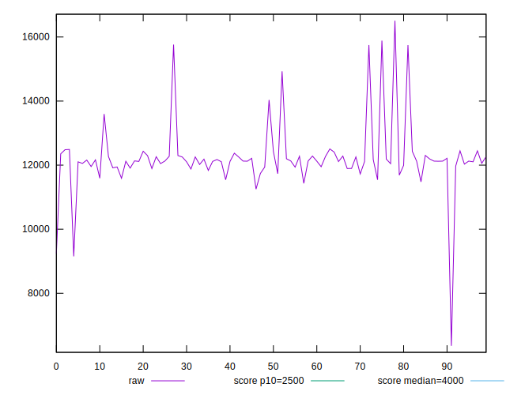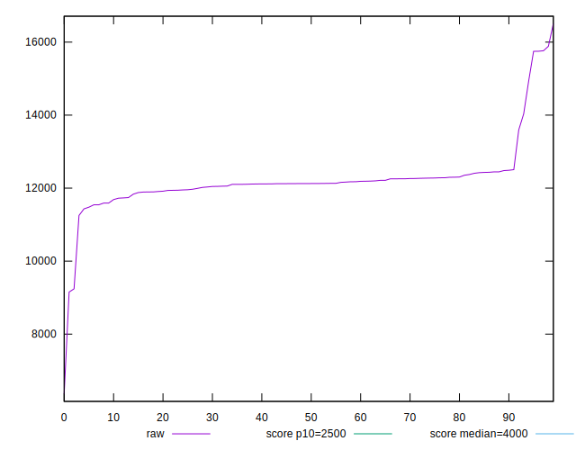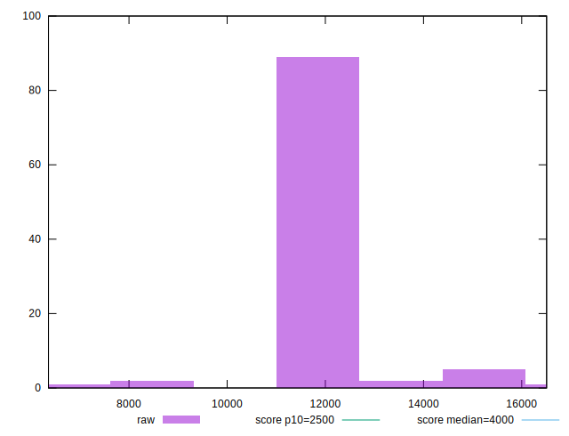
## Score


```yaml
p90min: 0
p90max: 0
p90range: 0
p90mean: 0
median: 0
p90stdev: 0
mad: 0
stdevBySn: 0
lfitCenter: 0.0005621909163431118
lfitStdev: 0.0013890003470662588
mfitCenter: 0.0005621909163431118
mfitStdev: 0.0017408537734659997
mfitConfidence: 0.00017408537734659997
p90skewness: .nan
p90eccentricity: .nan
p90discretization: 94
outlandishness: .inf

```

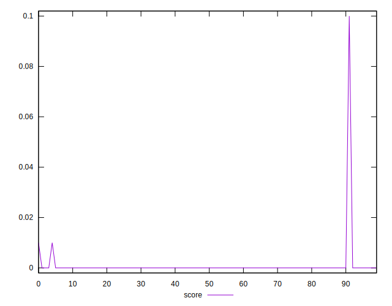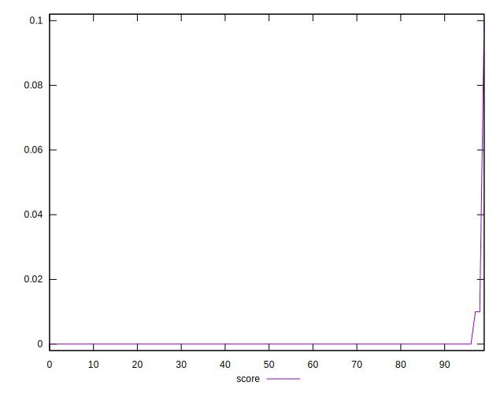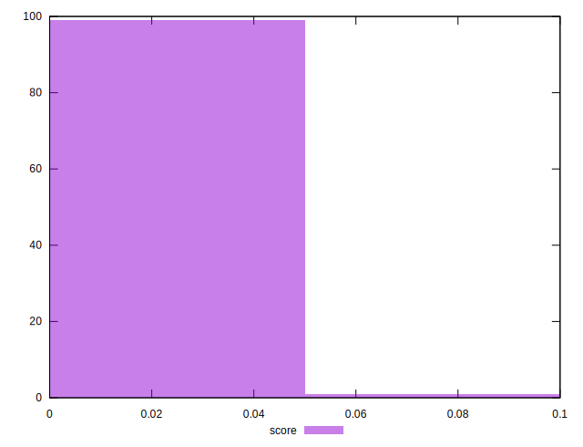
## Raw Estimate

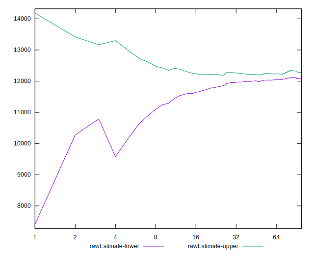
## Score Estimate

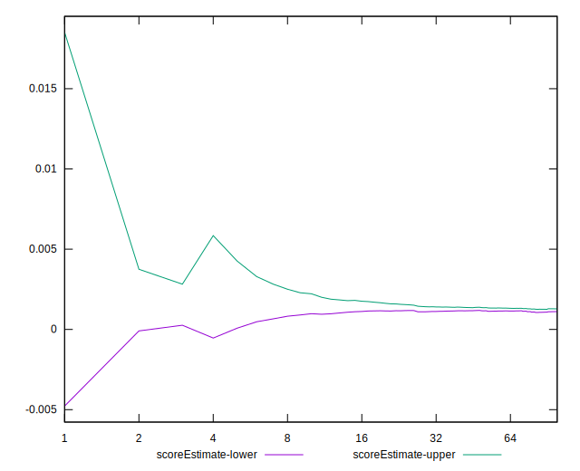
## P Score


```yaml
p90min: 0.00009313246007736087
p90max: 0.0024016963511182543
p90range: 0.0023085638910408934
p90mean: 0.0012489432604223527
median: 0.0012477022298023333
p90stdev: 0.00035993736145918594
mad: 0.0001382326262693856
stdevBySn: 0.00020581612943421107
lfitCenter: 0.0018030237663414995
lfitStdev: 0.0014382522634169982
mfitCenter: 0.0018030237663414995
mfitStdev: 0.0018025818965803752
mfitConfidence: 0.00018025818965803752
p90skewness: -0.4128193545507078
p90eccentricity: 0.9999999999999997
p90discretization: 1
outlandishness: 3.813250074052455

```

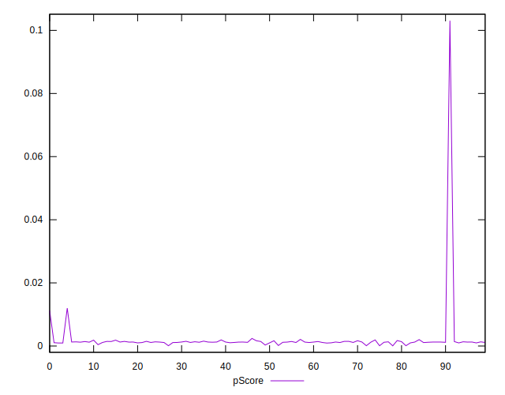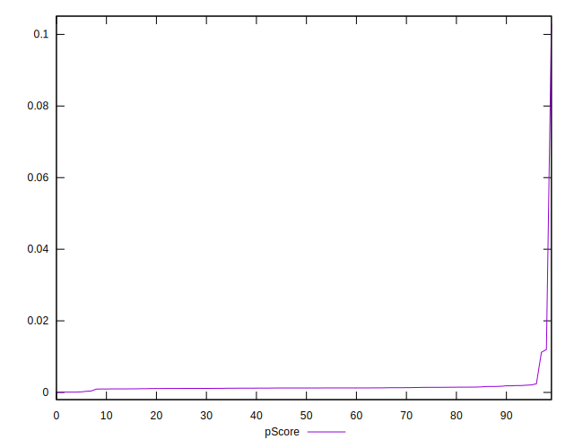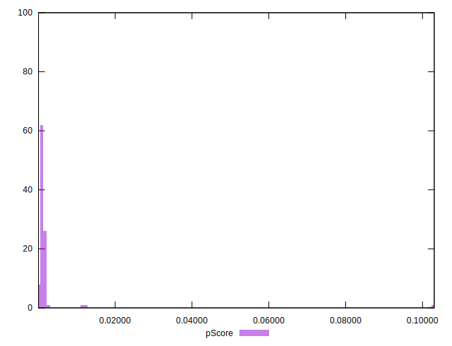
## Score Difference


```yaml
p90min: 0
p90max: 0
p90range: 0
p90mean: 0
median: 0
p90stdev: 0
mad: 0
stdevBySn: 0
lfitCenter: 0
lfitStdev: 0
mfitCenter: 0
mfitStdev: 0
mfitConfidence: 0
p90skewness: .nan
p90eccentricity: .nan
p90discretization: 94
outlandishness: .nan

```


## P Score Difference


```yaml
p90min: 0.00009313246007736087
p90max: 0.002024571966999178
p90range: 0.001931439506921817
p90mean: 0.0012352241983786157
median: 0.001247065542559378
p90stdev: 0.0003370966764071211
mad: 0.00013488703041800165
stdevBySn: 0.00019453965455315723
lfitCenter: 0.001238367338762079
lfitStdev: 0.00021479740826955615
mfitCenter: 0.001238367338762079
mfitStdev: 0.0002692086287138532
mfitConfidence: 0.000026920862871385322
p90skewness: -0.856531282381518
p90eccentricity: 0.9999999999999992
p90discretization: 1
outlandishness: 1.0059272835174882

```

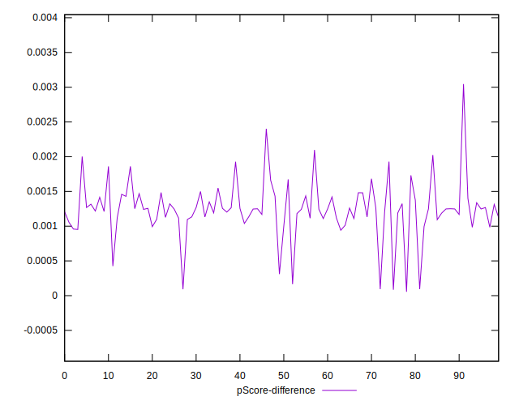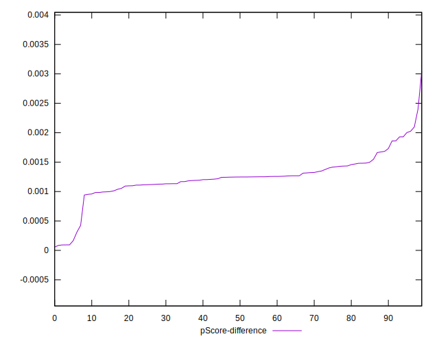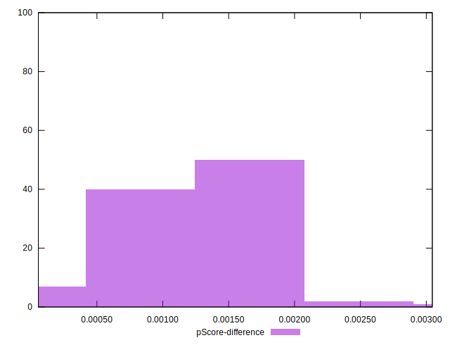