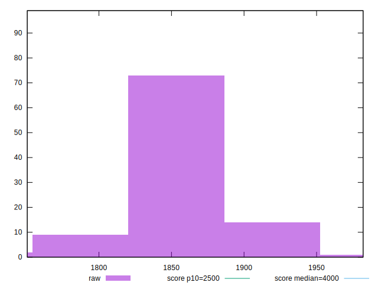

# //largest-contentful-paint/samples/card

[→ Parent](../..)


## Raw


```yaml
p90min: 1766.4515999999999
p90max: 1910.5154000000002
p90range: 144.06380000000036
p90mean: 1845.619917204301
median: 1840.9733999999999
p90stdev: 26.87753183401558
mad: 10.281899999999496
stdevBySn: 15.71942208000038
lfitCenter: 1844.0928263199187
lfitStdev: 18.309690206647605
mfitCenter: 1844.0928263199187
mfitStdev: 22.947793608949652
mfitConfidence: 2.306340035375807
p90skewness: 0.49001789240900673
p90eccentricity: 1.0000000000000002
p90discretization: 1
outlandishness: 1.0000687163887452

```


## Score


```yaml
p90min: 0.98
p90max: 0.99
p90range: 0.010000000000000009
p90mean: 0.9802150537634411
median: 0.98
p90stdev: 0.0014506169422830188
mad: 0
stdevBySn: 0
lfitCenter: 0.9802011016523577
lfitStdev: 0.0006094014945162435
mfitCenter: 0.9802011016523577
mfitStdev: 0.0007637715091469416
mfitConfidence: 0.00007676192489102735
p90skewness: 6.597118918283244
p90eccentricity: 0.9999999999999963
p90discretization: 46.5
outlandishness: 1.0003856395763355

```


## Raw Estimate


## Score Estimate


## P Score


```yaml
p90min: 0.9780375376345959
p90max: 0.9870790442699823
p90range: 0.009041506635386387
p90mean: 0.9824696638644863
median: 0.9828236950703935
p90stdev: 0.00174843069808591
mad: 0.0006391297327270618
stdevBySn: 0.0010003900610404998
lfitCenter: 0.982571583677764
lfitStdev: 0.0012087072389710051
mfitCenter: 0.982571583677764
mfitStdev: 0.0015148898720022922
mfitConfidence: 0.0001522521607315491
p90skewness: -0.786720289090005
p90eccentricity: 0.9999999999999996
p90discretization: 1
outlandishness: 0.9999084381706691

```


## Score Difference


```yaml
p90min: 0
p90max: 0
p90range: 0
p90mean: 0
median: 0
p90stdev: 0
mad: 0
stdevBySn: 0
lfitCenter: 0
lfitStdev: 0
mfitCenter: 0
mfitStdev: 0
mfitConfidence: 0
p90skewness: .nan
p90eccentricity: .nan
p90discretization: 93
outlandishness: .nan

```


## P Score Difference


```yaml
p90min: -0.0026088104188282113
p90max: 0.004533913393001021
p90range: 0.0071427238118292324
p90mean: 0.002091887830859044
median: 0.0027367565102150992
p90stdev: 0.001812301770612269
mad: 0.000577156022712022
stdevBySn: 0.0009948246603790325
lfitCenter: 0.002274279915121249
lfitStdev: 0.001334780013083361
mfitCenter: 0.002274279915121249
mfitStdev: 0.0016728986622868865
mfitConfidence: 0.00016813264166948709
p90skewness: -1.261574385222027
p90eccentricity: 0.9999999999999996
p90discretization: 1
outlandishness: 0.9330455689274783

```

