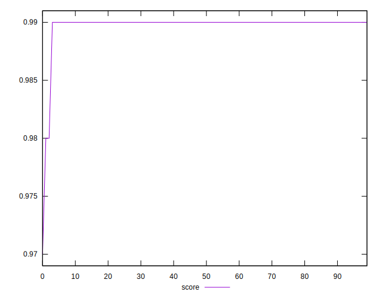
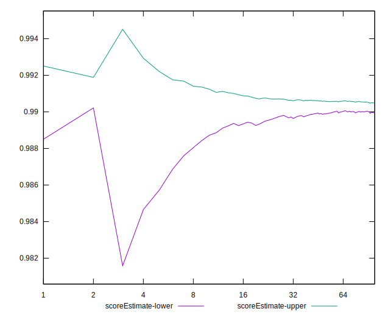

# //largest-contentful-paint/samples/music

[→ Parent](../..)


## Raw


```yaml
p90min: 1655.6609999999998
p90max: 1768.856
p90range: 113.19500000000016
p90mean: 1699.544962765957
median: 1691.625
p90stdev: 28.056051849637903
mad: 11.889749999999822
stdevBySn: 18.65822699999998
lfitCenter: 1698.8267285201819
lfitStdev: 25.647668875943676
mfitCenter: 1698.8267285201819
mfitStdev: 32.144586023752204
mfitConfidence: 3.2144586023752204
p90skewness: 1.0218581079411913
p90eccentricity: 0.9999999999999999
p90discretization: 1
outlandishness: 1.0051104755277536

```


## Score


```yaml
p90min: 0.99
p90max: 0.99
p90range: 0
p90mean: 0.9899999999999988
median: 0.99
p90stdev: 1.2212453270876722e-15
mad: 0
stdevBySn: 0
lfitCenter: 0.9898100971918607
lfitStdev: 0.0004691912635836103
mfitCenter: 0.9898100971918607
mfitStdev: 0.0005880440443459769
mfitConfidence: 0.00005880440443459769
p90skewness: 1
p90eccentricity: 1
p90discretization: 94
outlandishness: 0.999192082440567

```


## Raw Estimate


## Score Estimate


## P Score


```yaml
p90min: 0.9869550297883705
p90max: 0.991918021250519
p90range: 0.004962991462148514
p90mean: 0.9901454800940691
median: 0.9905271655910287
p90stdev: 0.0012358126878516226
mad: 0.00048742725063694037
stdevBySn: 0.0007591486413233053
lfitCenter: 0.990115085663501
lfitStdev: 0.0012492715650654748
mfitCenter: 0.990115085663501
mfitStdev: 0.0015657297154183243
mfitConfidence: 0.00015657297154183242
p90skewness: -1.1428740806210178
p90eccentricity: 1
p90discretization: 1
outlandishness: 0.999292888132183

```


## Score Difference


```yaml
p90min: 0
p90max: 0
p90range: 0
p90mean: 0
median: 0
p90stdev: 0
mad: 0
stdevBySn: 0
lfitCenter: 0
lfitStdev: 0
mfitCenter: 0
mfitStdev: 0
mfitConfidence: 0
p90skewness: .nan
p90eccentricity: .nan
p90discretization: 94
outlandishness: .nan

```


## P Score Difference


```yaml
p90min: -0.00290946630667277
p90max: 0.002692524907001115
p90range: 0.005601991213673885
p90mean: 0.00020651727618171286
median: 0.0005388348815682509
p90stdev: 0.0012182921667729153
mad: 0.00048684028628526166
stdevBySn: 0.0007591486413233053
lfitCenter: 0.0003212152105637715
lfitStdev: 0.0009007327731775143
mfitCenter: 0.0003212152105637715
mfitStdev: 0.0011289011197027229
mfitConfidence: 0.00011289011197027229
p90skewness: -1.0550464630535807
p90eccentricity: 0.9999999999999999
p90discretization: 1
outlandishness: 0.8947422522414241

```

