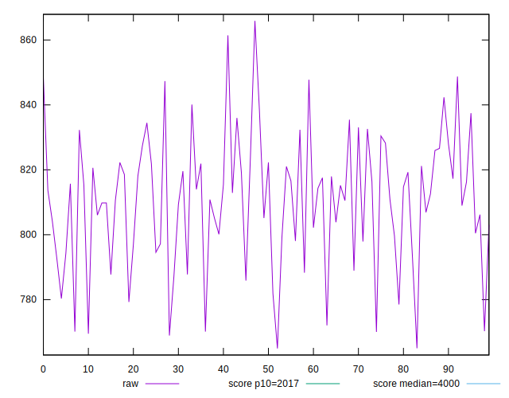
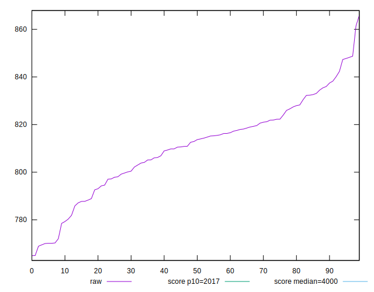
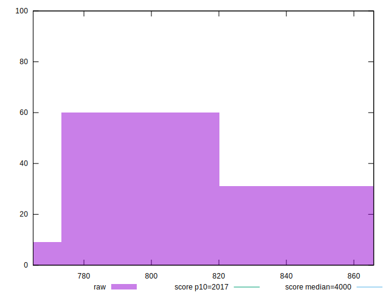
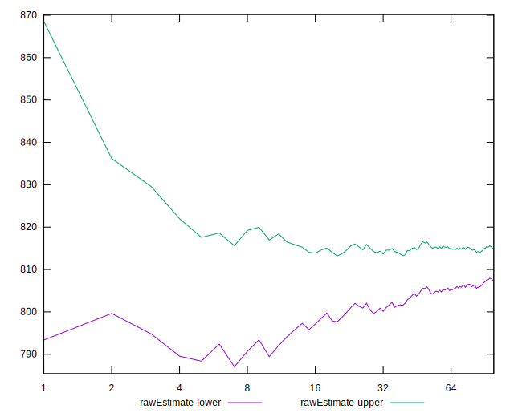
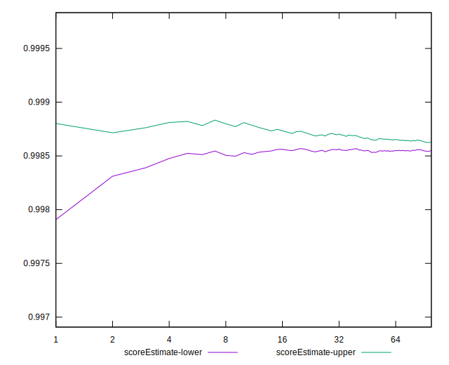
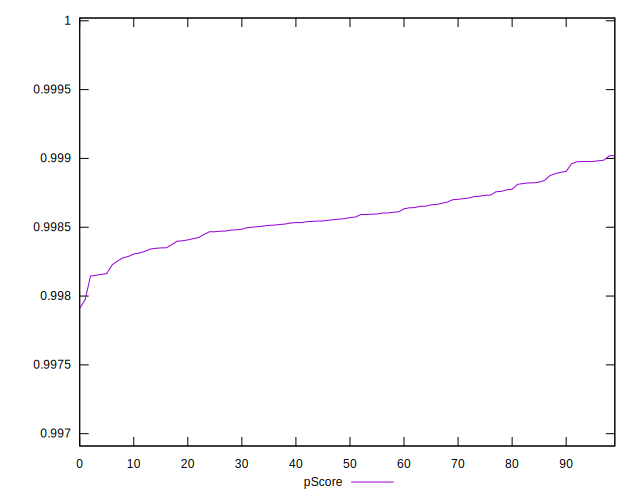
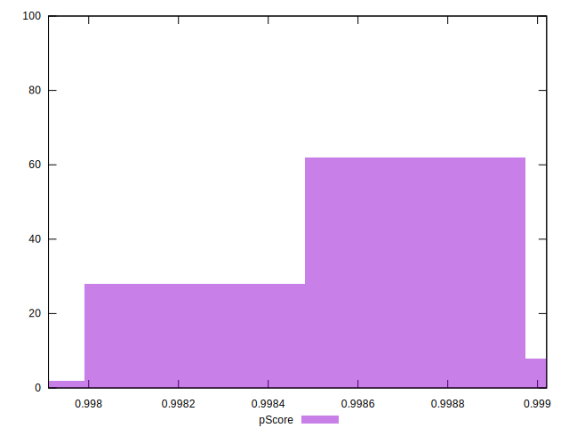
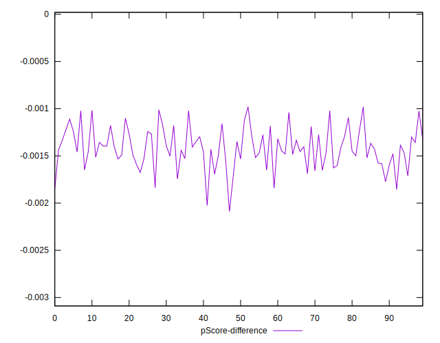
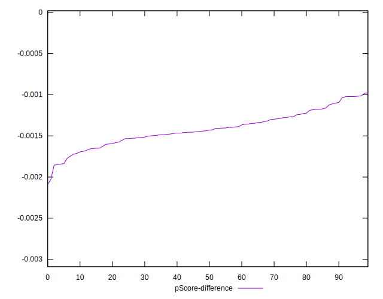
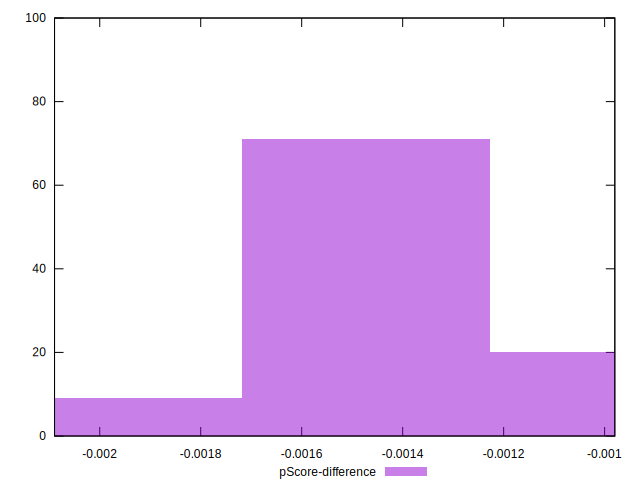

# //mainthread-work-breakdown/samples/agenda

[→ Parent](../..)


## Raw


```yaml
p90min: 769.5000000000007
p90max: 848.2280000000003
p90range: 78.72799999999961
p90mean: 810.3692765957454
median: 813.2840000000008
p90stdev: 19.04586399251468
mad: 13.473999999999819
stdevBySn: 20.83710720000018
lfitCenter: 811.0661690111007
lfitStdev: 15.269423589426053
mfitCenter: 811.0661690111007
mfitStdev: 19.137384472543314
mfitConfidence: 1.9137384472543313
p90skewness: -0.31416374319595924
p90eccentricity: 1.0000000000000002
p90discretization: 1
outlandishness: 1.0003141614669553

```


## Score


```yaml
p90min: 1
p90max: 1
p90range: 0
p90mean: 1
median: 1
p90stdev: 0
mad: 0
stdevBySn: 0
lfitCenter: 1
lfitStdev: 0
mfitCenter: 1
mfitStdev: 0
mfitConfidence: 0
p90skewness: .nan
p90eccentricity: .nan
p90discretization: 94
outlandishness: 1

```


## Raw Estimate


## Score Estimate


## P Score


```yaml
p90min: 0.9981512403369841
p90max: 0.9989828962907663
p90range: 0.0008316559537822066
p90mean: 0.9985866722024626
median: 0.9985663385778067
p90stdev: 0.00019954898139155523
mad: 0.00014374887223300714
stdevBySn: 0.00021927146496970404
lfitCenter: 0.9985815874191993
lfitStdev: 0.00016103020088600468
mfitCenter: 0.9985815874191993
mfitStdev: 0.00020182142750826596
mfitConfidence: 0.000020182142750826595
p90skewness: 0.06122338291363784
p90eccentricity: 1.0000000000000009
p90discretization: 1.0217391304347827
outlandishness: 0.9999907040438551

```


## Score Difference


```yaml
p90min: 0
p90max: 0
p90range: 0
p90mean: 0
median: 0
p90stdev: 0
mad: 0
stdevBySn: 0
lfitCenter: 0
lfitStdev: 0
mfitCenter: 0
mfitStdev: 0
mfitConfidence: 0
p90skewness: .nan
p90eccentricity: .nan
p90discretization: 94
outlandishness: .nan

```


## P Score Difference


```yaml
p90min: -0.0018487596630158976
p90max: -0.001017103709233691
p90range: 0.0008316559537822066
p90mean: -0.0014133277975376243
median: -0.0014336614221931998
p90stdev: 0.00019954898139155528
mad: 0.00014374887223300714
stdevBySn: 0.00021927146496970404
lfitCenter: -0.0014184125808011754
lfitStdev: 0.00016103020088595945
mfitCenter: -0.0014184125808011754
mfitStdev: 0.00020182142750820926
mfitConfidence: 0.000020182142750820927
p90skewness: 0.06122338291299875
p90eccentricity: 0.9999999999999996
p90discretization: 1.0217391304347827
outlandishness: 1.006578857425517

```

