# //mainthread-work-breakdown/samples/astro

[→ Parent](../..)


## Raw


```yaml
p90min: 2012.3639999999982
p90max: 2190.6919999999986
p90range: 178.32800000000043
p90mean: 2103.8840425531916
median: 2106.616
p90stdev: 31.298863020582115
mad: 18.792000000000826
stdevBySn: 32.17277020000065
lfitCenter: 2106.9401079035533
lfitStdev: 30.57990449023782
mfitCenter: 2106.9401079035533
mfitStdev: 38.326226653938285
mfitConfidence: 3.8326226653938287
p90skewness: -0.22641107020700182
p90eccentricity: 1.0000000000000004
p90discretization: 1
outlandishness: 1.0043370960748603

```

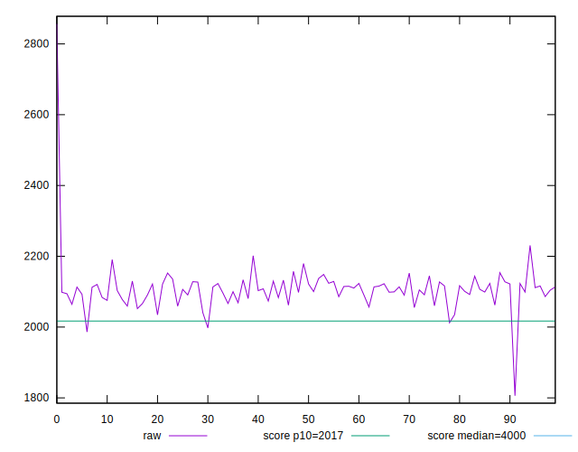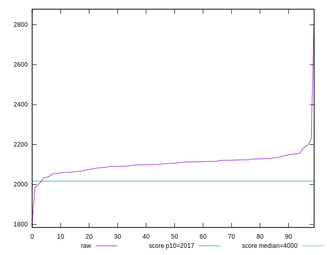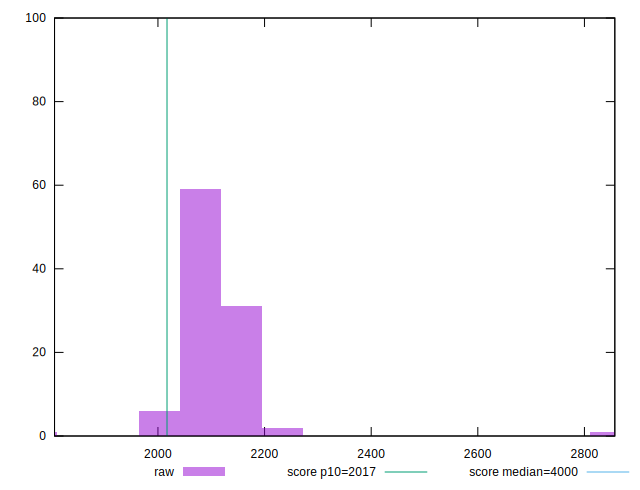
## Score


```yaml
p90min: 0.87
p90max: 0.9
p90range: 0.030000000000000027
p90mean: 0.8851063829787236
median: 0.88
p90stdev: 0.006144480458805816
mad: 0.010000000000000009
stdevBySn: 0.011926000000000011
lfitCenter: 0.884415419850545
lfitStdev: 0.007983853282972414
mfitCenter: 0.884415419850545
mfitStdev: 0.010006276199870835
mfitConfidence: 0.0010006276199870834
p90skewness: 0.23466757054765877
p90eccentricity: 0.9999999999999997
p90discretization: 23.5
outlandishness: 0.9975015624999997

```

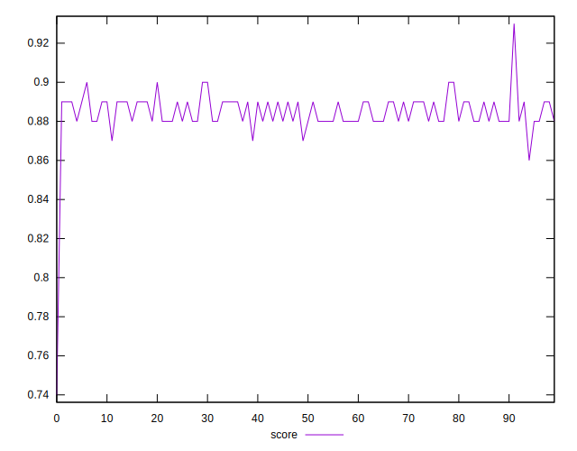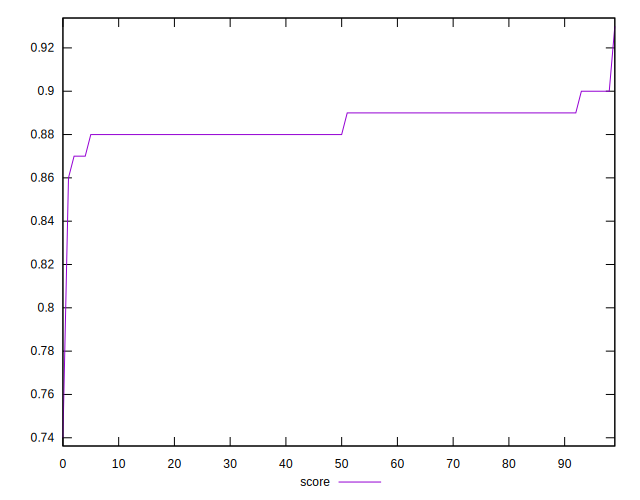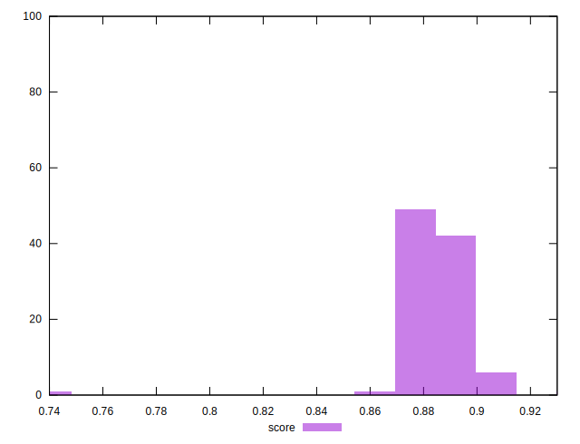
## Raw Estimate

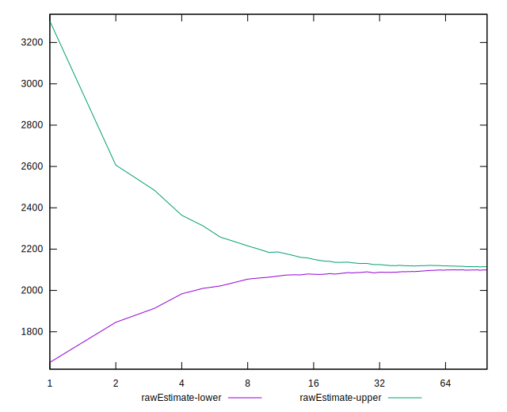
## Score Estimate

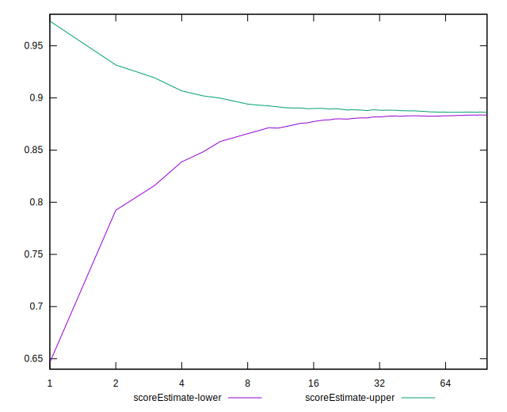
## P Score


```yaml
p90min: 0.8701147268009958
p90max: 0.9007537333690852
p90range: 0.030639006568089378
p90mean: 0.8853865412068831
median: 0.8849659584348823
p90stdev: 0.005377264525423656
mad: 0.0032383120782786823
stdevBySn: 0.005569445141378209
lfitCenter: 0.88475065105046
lfitStdev: 0.005357643762765648
mfitCenter: 0.88475065105046
mfitStdev: 0.006714810677331127
mfitConfidence: 0.0006714810677331127
p90skewness: 0.15946389587395182
p90eccentricity: 1.0000000000000004
p90discretization: 1
outlandishness: 0.9976077121518155

```

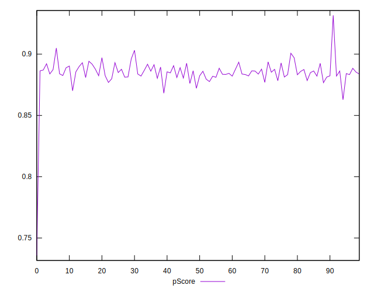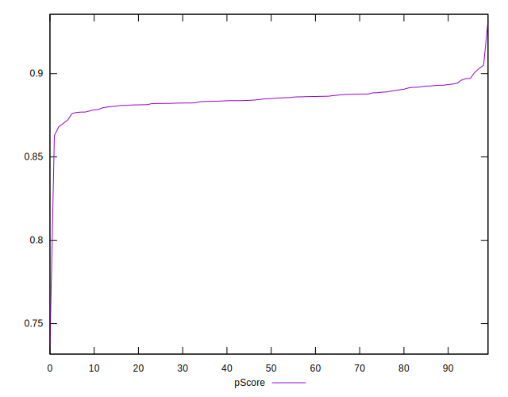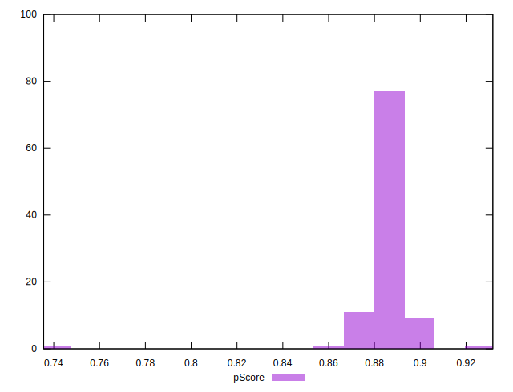
## Score Difference


```yaml
p90min: 0
p90max: 0
p90range: 0
p90mean: 0
median: 0
p90stdev: 0
mad: 0
stdevBySn: 0
lfitCenter: 0
lfitStdev: 0
mfitCenter: 0
mfitStdev: 0
mfitConfidence: 0
p90skewness: .nan
p90eccentricity: .nan
p90discretization: 94
outlandishness: .nan

```


## P Score Difference


```yaml
p90min: -0.0044061379390071265
p90max: 0.004715385395730576
p90range: 0.009121523334737702
p90mean: 0.00033627269054437145
median: 0.0010189574571994875
p90stdev: 0.00275766994073196
mad: 0.002510623885526919
stdevBySn: 0.0032811683815422567
lfitCenter: 0.0004582718428973275
lfitStdev: 0.002602896321797847
mfitCenter: 0.0004582718428973275
mfitStdev: 0.0032622467613583686
mfitConfidence: 0.00032622467613583684
p90skewness: -0.25637013105004597
p90eccentricity: 0.9999999999999996
p90discretization: 1
outlandishness: 0.9447855795382107

```

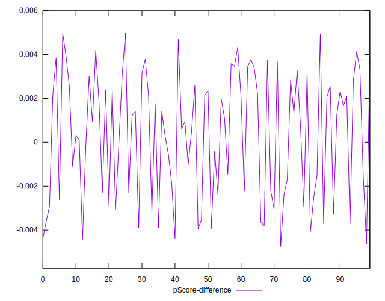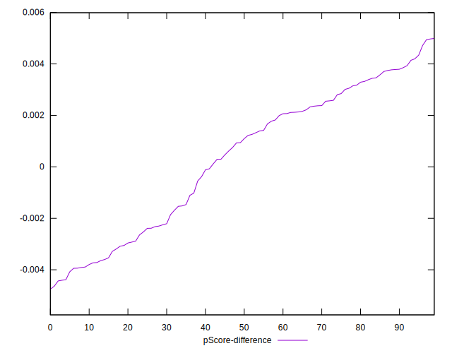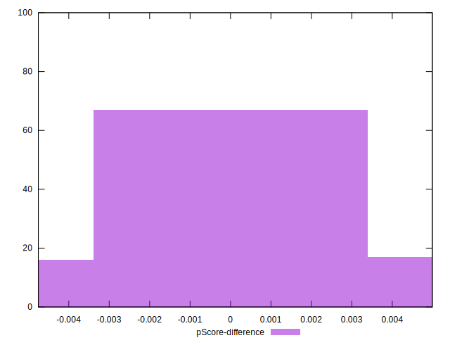