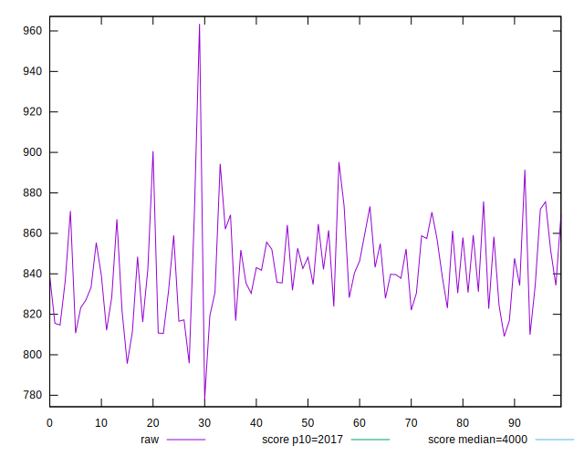
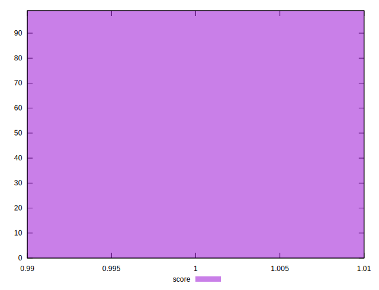

# //mainthread-work-breakdown/samples/card

[→ Parent](../..)


## Raw


```yaml
p90min: 809.0760000000009
p90max: 894.3640000000005
p90range: 85.28799999999956
p90mean: 841.7397419354849
median: 839.0400000000005
p90stdev: 19.912503877867557
mad: 16.356000000000222
stdevBySn: 22.41133920000031
lfitCenter: 841.4993715682224
lfitStdev: 17.83312723571421
mfitCenter: 841.4993715682224
mfitStdev: 22.350510499556737
mfitConfidence: 2.2463108242402585
p90skewness: 0.3383677834690937
p90eccentricity: 1.0000000000000002
p90discretization: 1
outlandishness: 1.0018812018551586

```


## Score


```yaml
p90min: 1
p90max: 1
p90range: 0
p90mean: 1
median: 1
p90stdev: 0
mad: 0
stdevBySn: 0
lfitCenter: 1
lfitStdev: 0
mfitCenter: 1
mfitStdev: 0
mfitConfidence: 0
p90skewness: .nan
p90eccentricity: .nan
p90discretization: 93
outlandishness: 1

```


## Raw Estimate


## Score Estimate


## P Score


```yaml
p90min: 0.9974743707063339
p90max: 0.9986111530651682
p90range: 0.0011367823588342985
p90mean: 0.9982210105941351
median: 0.9982680720885379
p90stdev: 0.0002562796505109751
mad: 0.00020515554906086475
stdevBySn: 0.00029219728252695675
lfitCenter: 0.9982238459867995
lfitStdev: 0.00023132479313038183
mfitCenter: 0.9982238459867995
mfitStdev: 0.0002899226338336235
mfitConfidence: 0.000029138321050234152
p90skewness: -0.550726395586986
p90eccentricity: 0.9999999999999996
p90discretization: 1
outlandishness: 0.9999605609844039

```


## Score Difference


```yaml
p90min: 0
p90max: 0
p90range: 0
p90mean: 0
median: 0
p90stdev: 0
mad: 0
stdevBySn: 0
lfitCenter: 0
lfitStdev: 0
mfitCenter: 0
mfitStdev: 0
mfitConfidence: 0
p90skewness: .nan
p90eccentricity: .nan
p90discretization: 93
outlandishness: .nan

```


## P Score Difference


```yaml
p90min: -0.002525629293666065
p90max: -0.0013888469348317667
p90range: 0.0011367823588342985
p90mean: -0.0017789894058648837
median: -0.00173192791146215
p90stdev: 0.00025627965051097505
mad: 0.00020515554906086475
stdevBySn: 0.00029219728252695675
lfitCenter: -0.001776154013200658
lfitStdev: 0.00023132479313041856
mfitCenter: -0.001776154013200658
mfitStdev: 0.00028992263383366954
mfitConfidence: 0.000029138321050238777
p90skewness: -0.5507263955839963
p90eccentricity: 1
p90discretization: 1
outlandishness: 1.0222525516595629

```

