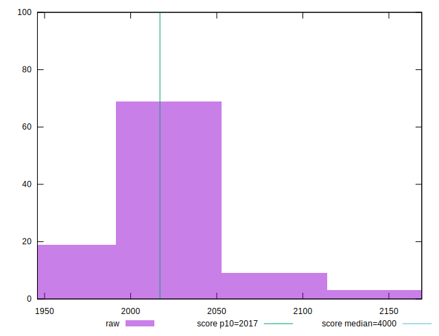

# //mainthread-work-breakdown/samples/music

[→ Parent](../..)


## Raw


```yaml
p90min: 1970.8440000000023
p90max: 2104.412000000002
p90range: 133.56799999999976
p90mean: 2018.9803404255345
median: 2018.856000000002
p90stdev: 24.90268771043121
mad: 18.474000000000387
stdevBySn: 26.36361559999986
lfitCenter: 2019.7201207023747
lfitStdev: 20.89823453974237
mfitCenter: 2019.7201207023747
mfitStdev: 26.192052819949755
mfitConfidence: 2.6192052819949754
p90skewness: 0.43538109765808525
p90eccentricity: 1
p90discretization: 1
outlandishness: 1.0021127743422882

```


## Score


```yaml
p90min: 0.89
p90max: 0.91
p90range: 0.020000000000000018
p90mean: 0.8995744680851069
median: 0.9
p90stdev: 0.004592985775515516
mad: 0
stdevBySn: 0
lfitCenter: 0.8995481079696572
lfitStdev: 0.0025091942408015824
mfitCenter: 0.8995481079696572
mfitStdev: 0.003144808618431697
mfitConfidence: 0.0003144808618431697
p90skewness: -0.16044443393662502
p90eccentricity: 1.0000000000000002
p90discretization: 31.333333333333332
outlandishness: 0.9991676283442642

```


## Raw Estimate


## Score Estimate


## P Score


```yaml
p90min: 0.8853458960343829
p90max: 0.9073946694304836
p90range: 0.022048773396100785
p90mean: 0.8996423830604704
median: 0.8996974692516878
p90stdev: 0.0040757178330547116
mad: 0.003031649320083707
stdevBySn: 0.004286765991174575
lfitCenter: 0.8995177067218605
lfitStdev: 0.0034262623838177977
mfitCenter: 0.8995177067218605
mfitStdev: 0.004294183088112142
mfitConfidence: 0.00042941830881121416
p90skewness: -0.4896411580600027
p90eccentricity: 1.0000000000000002
p90discretization: 1
outlandishness: 0.9991497994213243

```


## Score Difference


```yaml
p90min: 0
p90max: 0
p90range: 0
p90mean: 0
median: 0
p90stdev: 0
mad: 0
stdevBySn: 0
lfitCenter: 0
lfitStdev: 0
mfitCenter: 0
mfitStdev: 0
mfitConfidence: 0
p90skewness: .nan
p90eccentricity: .nan
p90discretization: 94
outlandishness: .nan

```


## P Score Difference


```yaml
p90min: -0.004654103965617162
p90max: 0.004775699031121072
p90range: 0.009429802996738235
p90mean: 0.00006166558174441658
median: 0.000007421755181535872
p90stdev: 0.002714086341033494
mad: 0.002428559043688938
stdevBySn: 0.003082241385036453
lfitCenter: 0.00003512158621315232
lfitStdev: 0.002283401867068726
mfitCenter: 0.00003512158621315232
mfitStdev: 0.0028618198440495276
mfitConfidence: 0.0002861819844049528
p90skewness: 0.05809490561778137
p90eccentricity: 1
p90discretization: 1
outlandishness: 0.9424071274991933

```

