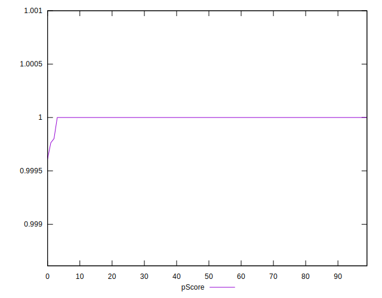

# //max-potential-fid/samples/agenda

[→ Parent](../..)


## Raw


```yaml
p90min: 16
p90max: 16
p90range: 0
p90mean: 16
median: 16
p90stdev: 0
mad: 0
stdevBySn: 0
lfitCenter: 16.381808876256876
lfitStdev: 0.9433319646703644
mfitCenter: 16.381808876256876
mfitStdev: 1.1822912886926455
mfitConfidence: 0.11822912886926455
p90skewness: .nan
p90eccentricity: .nan
p90discretization: 94
outlandishness: 1.1025

```


## Score


```yaml
p90min: 1
p90max: 1
p90range: 0
p90mean: 1
median: 1
p90stdev: 0
mad: 0
stdevBySn: 0
lfitCenter: 1
lfitStdev: 0
mfitCenter: 1
mfitStdev: 0
mfitConfidence: 0
p90skewness: .nan
p90eccentricity: .nan
p90discretization: 94
outlandishness: 1

```


## Raw Estimate


## Score Estimate


## P Score


```yaml
p90min: 0.9999999641342965
p90max: 0.9999999641342965
p90range: 0
p90mean: 0.9999999641342945
median: 0.9999999641342965
p90stdev: 1.9984014443252818e-15
mad: 0
stdevBySn: 0
lfitCenter: 0.9999960555579801
lfitStdev: 0.000009656886481614837
mfitCenter: 0.9999960555579801
mfitStdev: 0.000012103112362037481
mfitConfidence: 0.000001210311236203748
p90skewness: 1
p90eccentricity: 1
p90discretization: 94
outlandishness: 0.999983541978029

```


## Score Difference


```yaml
p90min: 0
p90max: 0
p90range: 0
p90mean: 0
median: 0
p90stdev: 0
mad: 0
stdevBySn: 0
lfitCenter: 0
lfitStdev: 0
mfitCenter: 0
mfitStdev: 0
mfitConfidence: 0
p90skewness: .nan
p90eccentricity: .nan
p90discretization: 94
outlandishness: .nan

```


## P Score Difference


```yaml
p90min: -3.5865703518211944e-8
p90max: -3.5865703518211944e-8
p90range: 0
p90mean: -3.5865703518211944e-8
median: -3.5865703518211944e-8
p90stdev: 0
mad: 0
stdevBySn: 0
lfitCenter: -0.000003944442020087521
lfitStdev: 0.00000965688648184479
mfitCenter: -0.000003944442020087521
mfitStdev: 0.000012103112362325684
mfitConfidence: 0.0000012103112362325683
p90skewness: .nan
p90eccentricity: .nan
p90discretization: 94
outlandishness: 53102.8189081513

```

