# //max-potential-fid/samples/astro

[→ Parent](../..)


## Raw


```yaml
p90min: 327
p90max: 351
p90range: 24
p90mean: 336.0531914893617
median: 335.5
p90stdev: 5.776634927965518
mad: 4.5
stdevBySn: 6.559300000000543
lfitCenter: 335.26305719072394
lfitStdev: 6.271345884315694
mfitCenter: 335.26305719072394
mfitStdev: 7.859966464717269
mfitConfidence: 0.785996646471727
p90skewness: 0.47265745656348324
p90eccentricity: 0.9999999999999997
p90discretization: 3.2413793103448274
outlandishness: 0.992852098475561

```

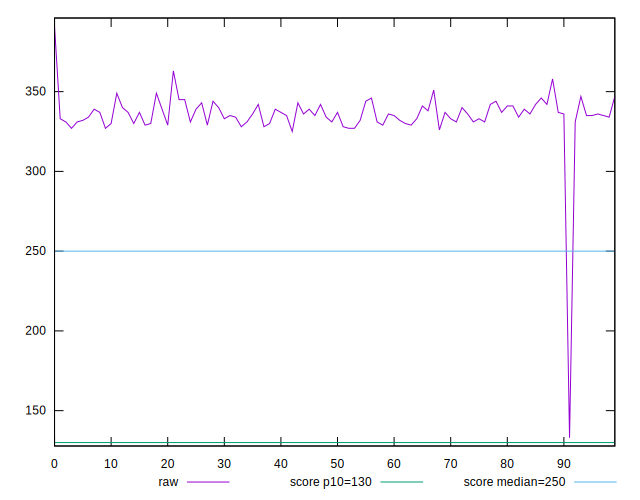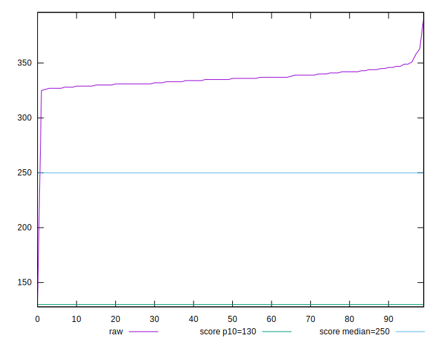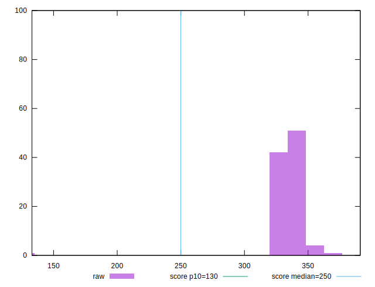
## Score


```yaml
p90min: 0.25
p90max: 0.3
p90range: 0.04999999999999999
p90mean: 0.28180851063829787
median: 0.28
p90stdev: 0.011756642844506709
mad: 0.009999999999999953
stdevBySn: 0.011925999999999945
lfitCenter: 0.28421449528560855
lfitStdev: 0.014566151172407352
mfitCenter: 0.28421449528560855
mfitStdev: 0.01825596320902281
mfitConfidence: 0.001825596320902281
p90skewness: -0.35383276440001976
p90eccentricity: 1.0000000000000007
p90discretization: 15.666666666666666
outlandishness: 1.0328513413824114

```

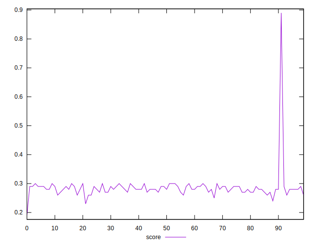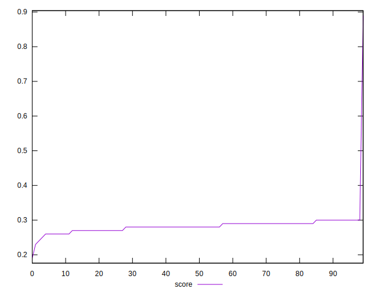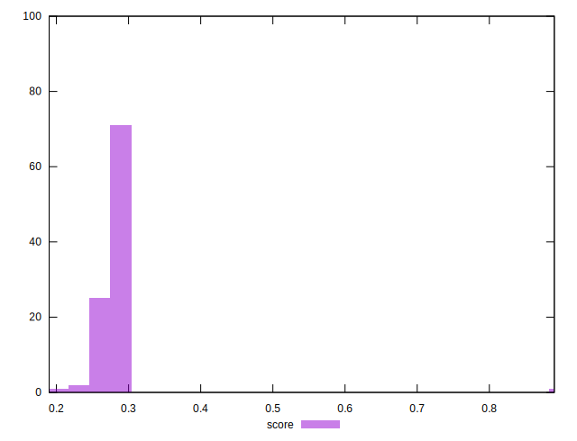
## Raw Estimate

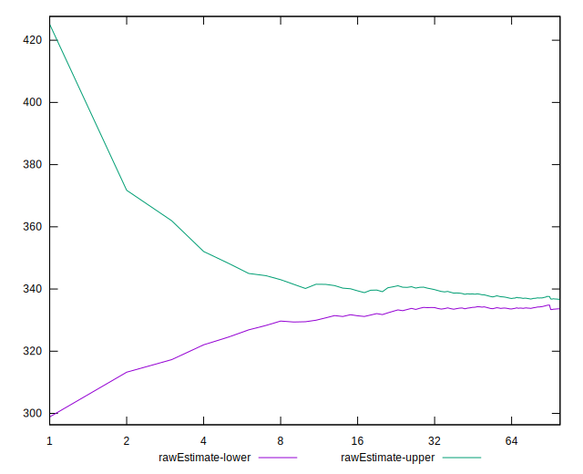
## Score Estimate

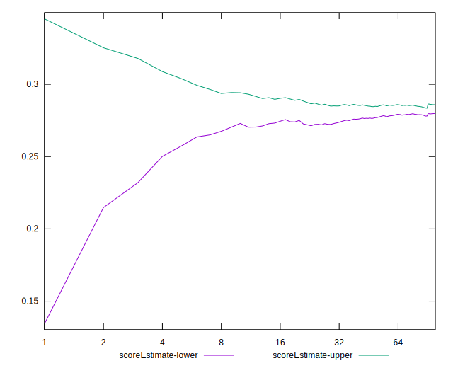
## P Score


```yaml
p90min: 0.2530243129688356
p90max: 0.29937486094236787
p90range: 0.046350547973532275
p90mean: 0.28125964728880637
median: 0.2821432978157302
p90stdev: 0.01126856430896575
mad: 0.009007212154435229
stdevBySn: 0.012621009643695554
lfitCenter: 0.2838457875396227
lfitStdev: 0.013628230070336218
mfitCenter: 0.2838457875396227
mfitStdev: 0.017080453430927674
mfitConfidence: 0.0017080453430927674
p90skewness: -0.40385936298597397
p90eccentricity: 0.9999999999999997
p90discretization: 3.2413793103448274
outlandishness: 1.0339178196803576

```

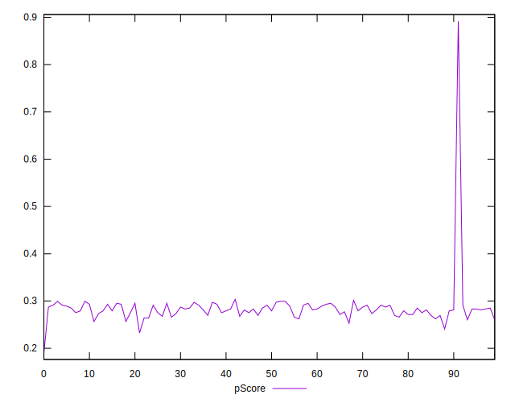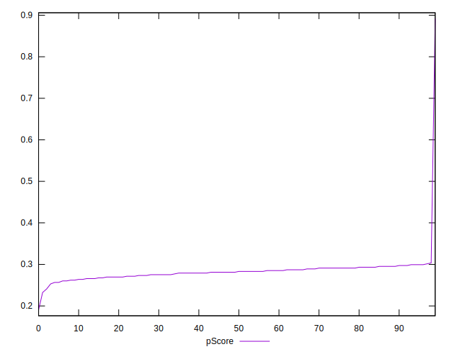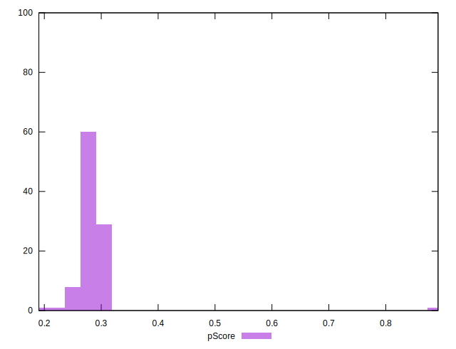
## Score Difference


```yaml
p90min: 0
p90max: 0
p90range: 0
p90mean: 0
median: 0
p90stdev: 0
mad: 0
stdevBySn: 0
lfitCenter: 0
lfitStdev: 0
mfitCenter: 0
mfitStdev: 0
mfitConfidence: 0
p90skewness: .nan
p90eccentricity: .nan
p90discretization: 94
outlandishness: .nan

```


## P Score Difference


```yaml
p90min: -0.004883752116671913
p90max: 0.0033866443527755252
p90range: 0.008270396469447439
p90mean: -0.00040257007991490286
median: -0.0004242705074622988
p90stdev: 0.0026468026329328326
mad: 0.002302602165604156
stdevBySn: 0.0029346642097991303
lfitCenter: -0.0002996825868973645
lfitStdev: 0.0022843517556382135
mfitCenter: -0.0002996825868973645
mfitStdev: 0.0028630103528237386
mfitConfidence: 0.00028630103528237385
p90skewness: -0.2983813182169569
p90eccentricity: 0.9999999999999997
p90discretization: 2.8484848484848486
outlandishness: 1.0386185666079795

```

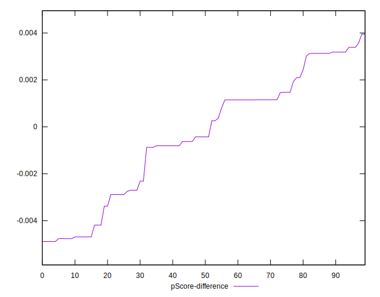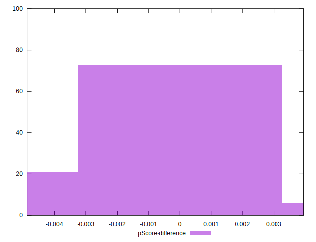