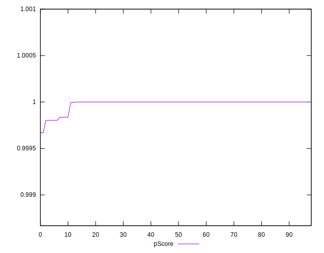

# //max-potential-fid/samples/card

[→ Parent](../..)


## Raw


```yaml
p90min: 16
p90max: 41
p90range: 25
p90mean: 18.333333333333332
median: 16
p90stdev: 6.970495937885023
mad: 0
stdevBySn: 0
lfitCenter: 17.62597894289879
lfitStdev: 3.780928388385163
mfitCenter: 17.62597894289879
mfitStdev: 4.738691006108907
mfitConfidence: 0.4762563655968174
p90skewness: 2.772134653176171
p90eccentricity: 1.0000000000000007
p90discretization: 18.6
outlandishness: 1.0751918888357657

```


## Score


```yaml
p90min: 1
p90max: 1
p90range: 0
p90mean: 1
median: 1
p90stdev: 0
mad: 0
stdevBySn: 0
lfitCenter: 1
lfitStdev: 0
mfitCenter: 1
mfitStdev: 0
mfitConfidence: 0
p90skewness: .nan
p90eccentricity: .nan
p90discretization: 93
outlandishness: 1

```


## Raw Estimate


## Score Estimate


## P Score


```yaml
p90min: 0.999802204850883
p90max: 0.9999999641342965
p90range: 0.00019775928341347893
p90mean: 0.9999842684815492
median: 0.9999999641342965
p90stdev: 0.00005098197513697783
mad: 0
stdevBySn: 0
lfitCenter: 0.9999876595395867
lfitStdev: 0.000028832980875184726
mfitCenter: 0.9999876595395867
mfitStdev: 0.00003613678258817883
mfitConfidence: 0.000003631883302292039
p90skewness: -3.0003733886439132
p90eccentricity: 0.9999999999999993
p90discretization: 18.6
outlandishness: 0.9999845238427709

```


## Score Difference


```yaml
p90min: 0
p90max: 0
p90range: 0
p90mean: 0
median: 0
p90stdev: 0
mad: 0
stdevBySn: 0
lfitCenter: 0
lfitStdev: 0
mfitCenter: 0
mfitStdev: 0
mfitConfidence: 0
p90skewness: .nan
p90eccentricity: .nan
p90discretization: 93
outlandishness: .nan

```


## P Score Difference


```yaml
p90min: -0.00019779514911699714
p90max: -3.5865703518211944e-8
p90range: 0.00019775928341347893
p90mean: -0.000015731518448871957
median: -3.5865703518211944e-8
p90stdev: 0.00005098197513697779
mad: 0
stdevBySn: 0
lfitCenter: -0.00001234046041358987
lfitStdev: 0.0000288329808754848
mfitCenter: -0.00001234046041358987
mfitStdev: 0.000036136782588554914
mfitConfidence: 0.0000036318833023298364
p90skewness: -3.0003733887443733
p90eccentricity: 0.9999999999999989
p90discretization: 18.6
outlandishness: 2.2256997752682555

```

