# //max-potential-fid/samples/music

[→ Parent](../..)


## Raw


```yaml
p90min: 364
p90max: 400
p90range: 36
p90mean: 379.82978723404256
median: 381
p90stdev: 8.694138766485203
mad: 7
stdevBySn: 10.733400000000001
lfitCenter: 380.18450938403544
lfitStdev: 7.716478636382541
mfitCenter: 380.18450938403544
mfitStdev: 9.671171775002817
mfitConfidence: 0.9671171775002817
p90skewness: 0.05799648372108808
p90eccentricity: 1.0000000000000004
p90discretization: 2.9375
outlandishness: 1.003162927283667

```

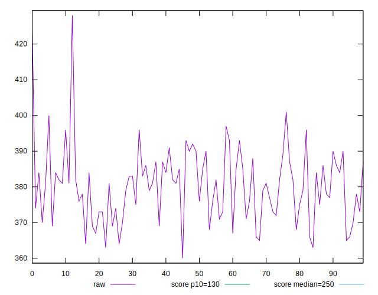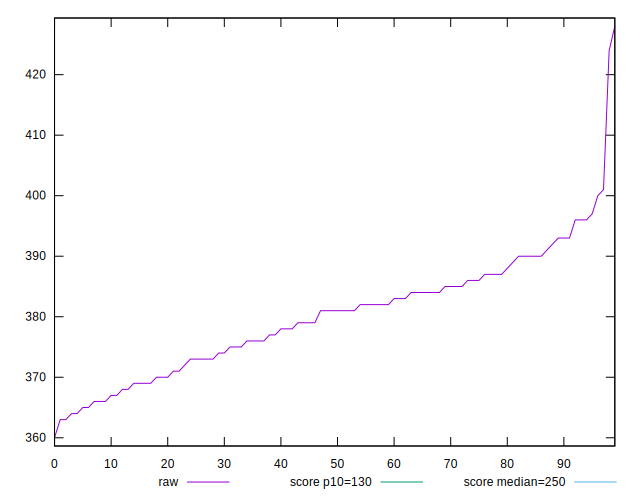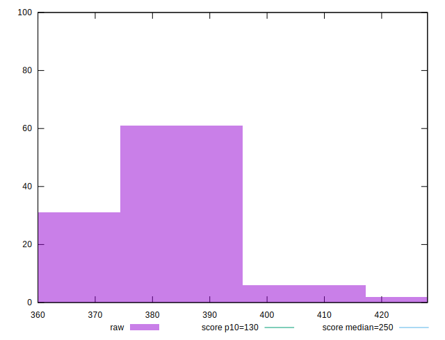
## Score


```yaml
p90min: 0.18
p90max: 0.23
p90range: 0.05000000000000002
p90mean: 0.20606382978723406
median: 0.2
p90stdev: 0.013226189775253786
mad: 0.009999999999999981
stdevBySn: 0.011925999999999978
lfitCenter: 0.20530222002128945
lfitStdev: 0.012142646935574422
mfitCenter: 0.20530222002128945
mfitStdev: 0.015218551084099712
mfitConfidence: 0.0015218551084099712
p90skewness: 0.11452301341842251
p90eccentricity: 0.9999999999999984
p90discretization: 15.666666666666666
outlandishness: 0.9945351067666072

```

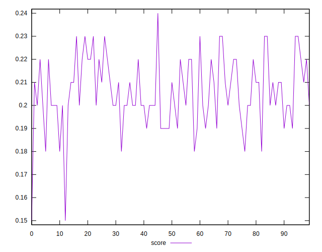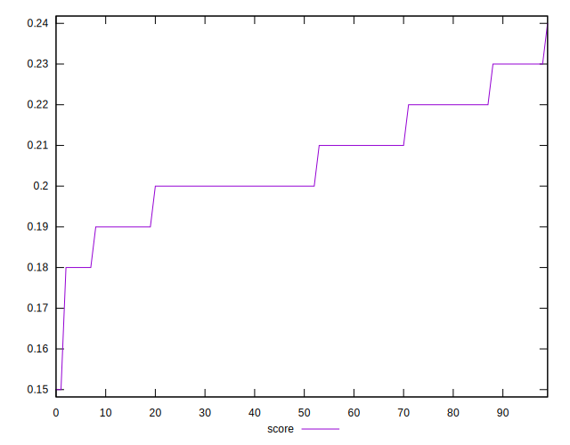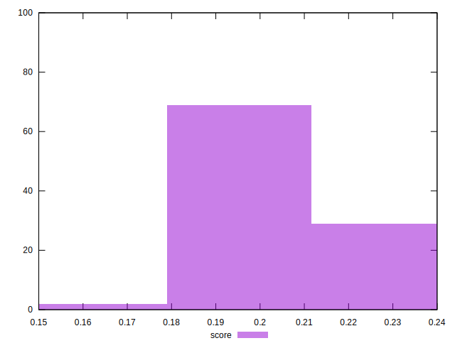
## Raw Estimate

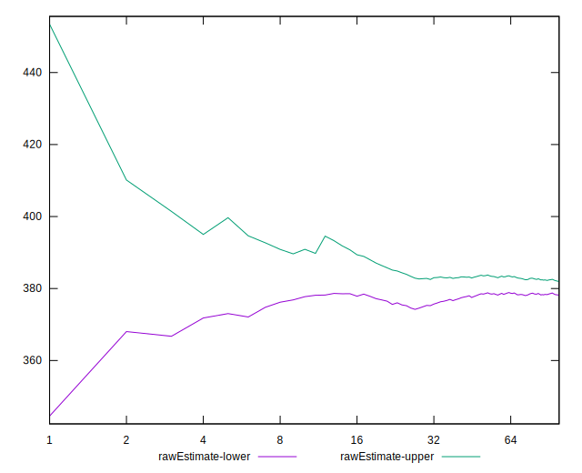
## Score Estimate

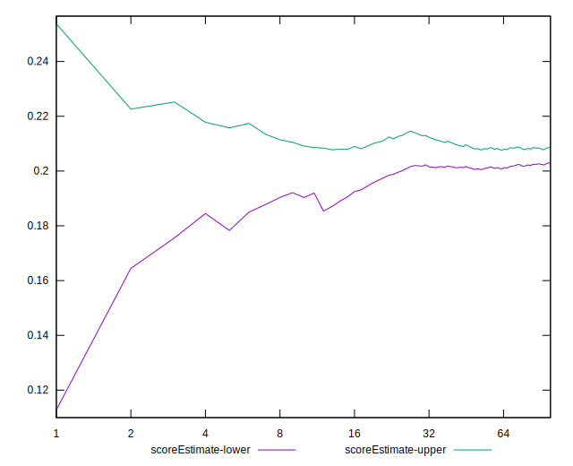
## P Score


```yaml
p90min: 0.17849820371043812
p90max: 0.23078152685278286
p90range: 0.05228332314234474
p90mean: 0.20657417967395472
median: 0.20447846975093842
p90stdev: 0.012788285517450478
mad: 0.010218091889242692
stdevBySn: 0.014611337492678915
lfitCenter: 0.20604210409218807
lfitStdev: 0.011312196083126405
mfitCenter: 0.20604210409218807
mfitStdev: 0.01417773528933359
mfitConfidence: 0.0014177735289333591
p90skewness: 0.052130378121843464
p90eccentricity: 1.000000000000001
p90discretization: 2.9375
outlandishness: 0.9938447301906689

```

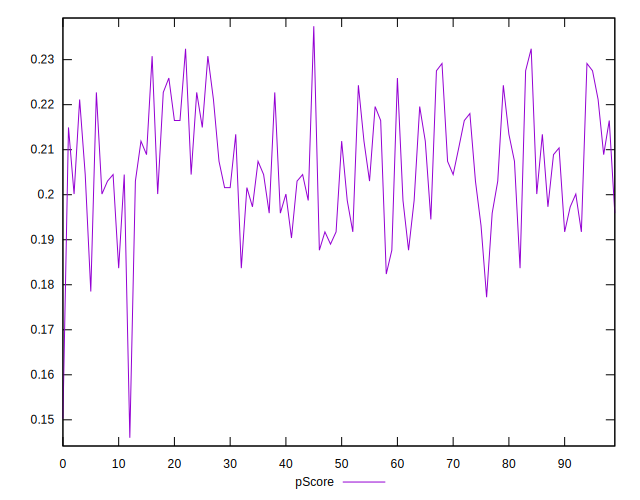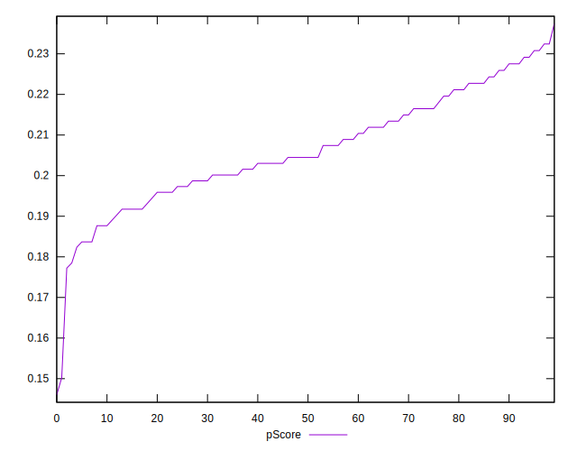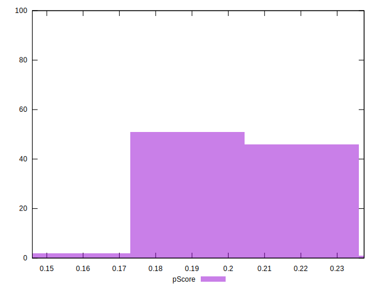
## Score Difference


```yaml
p90min: 0
p90max: 0
p90range: 0
p90mean: 0
median: 0
p90stdev: 0
mad: 0
stdevBySn: 0
lfitCenter: 0
lfitStdev: 0
mfitCenter: 0
mfitStdev: 0
mfitConfidence: 0
p90skewness: .nan
p90eccentricity: .nan
p90discretization: 94
outlandishness: .nan

```


## P Score Difference


```yaml
p90min: -0.0040986485428589625
p90max: 0.0044784697509384075
p90range: 0.00857711829379737
p90mean: 0.0004430765834578107
median: 0.0003963601809720829
p90stdev: 0.002597706256573507
mad: 0.002627849143233857
stdevBySn: 0.0032209528135328535
lfitCenter: 0.0004799057166054351
lfitStdev: 0.0023524650869514723
mfitCenter: 0.0004799057166054351
mfitStdev: 0.002948377753984201
mfitConfidence: 0.0002948377753984201
p90skewness: -0.09866473023802962
p90eccentricity: 0.9999999999999994
p90discretization: 2.6857142857142855
outlandishness: 0.9747118956578584

```

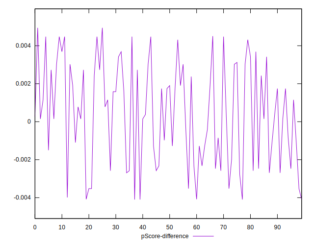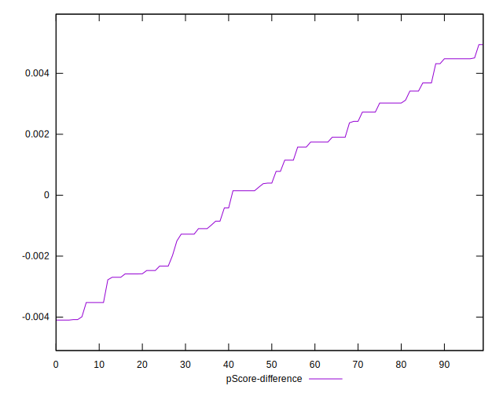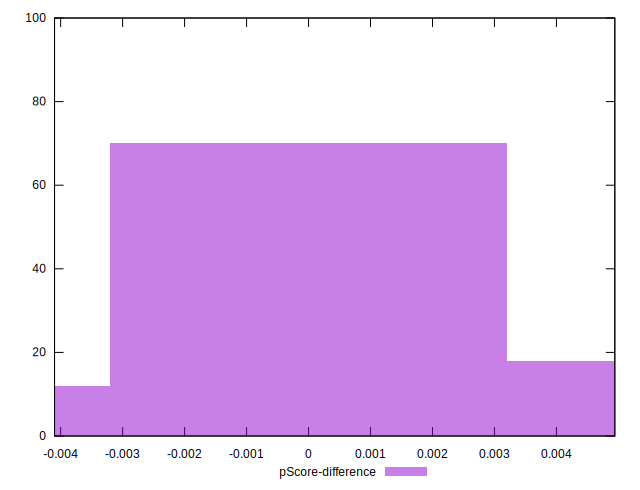