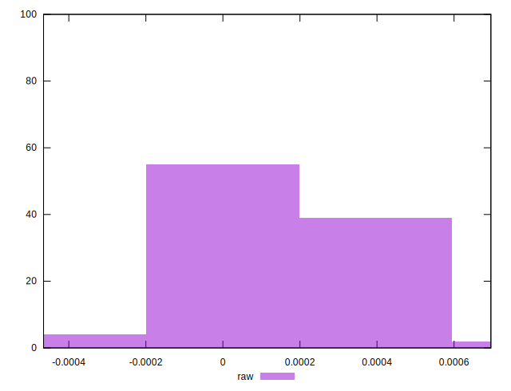

# //meta/pScore-difference/samples/agenda

[→ Parent](../..)


## Raw


```yaml
p90min: -0.000223350603185396
p90max: 0.0005809987072942502
p90range: 0.0008043493104796462
p90mean: 0.0001761090546439327
median: 0.00016030685906072428
p90stdev: 0.0001612331478949779
mad: 0.00007734907785444668
stdevBySn: 0.000147673930900692
lfitCenter: 0.00017090714789324445
lfitStdev: 0.00011959246316713865
mfitCenter: 0.00017090714789324445
mfitStdev: 0.0001498869249545807
mfitConfidence: 0.000014988692495458071
p90skewness: 0.3908401745980206
p90eccentricity: 0.9999999999999997
p90discretization: 1
outlandishness: 0.9825198728062544

```

