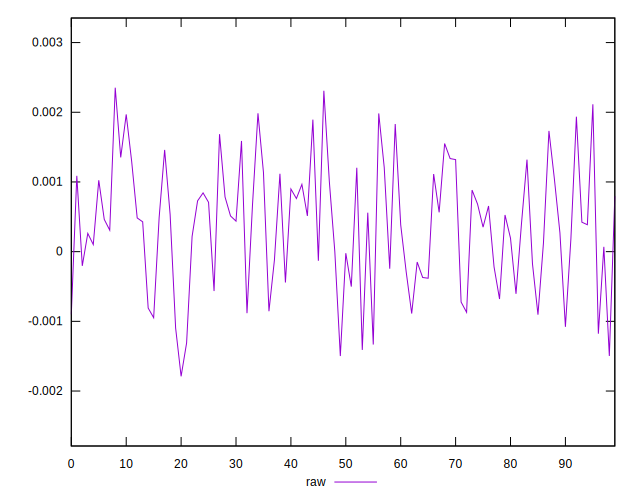
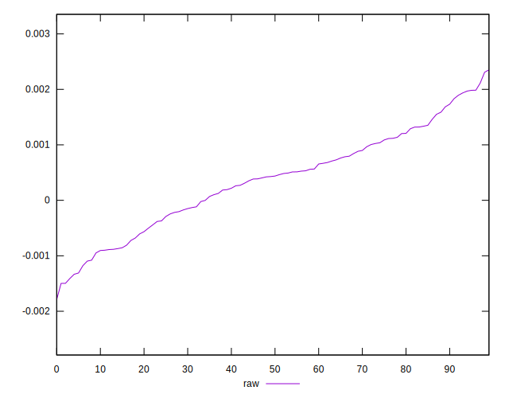
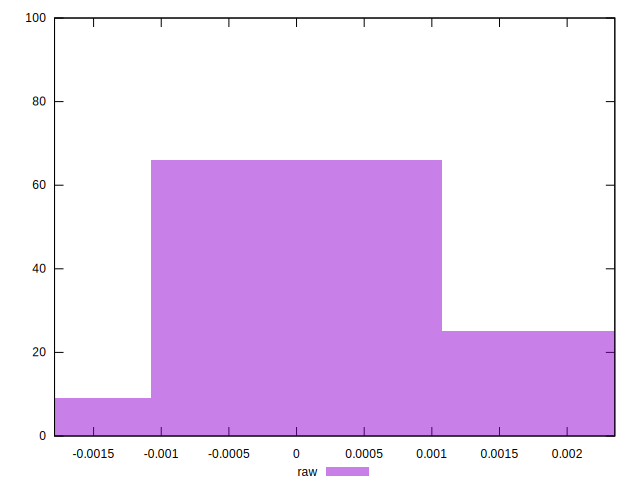

# //meta/pScore-difference/samples/astro

[→ Parent](../..)


## Raw


```yaml
p90min: -0.0014100797688720538
p90max: 0.0019850671102431476
p90range: 0.0033951468791152016
p90mean: 0.00036643511688127096
median: 0.0004328283404969153
p90stdev: 0.0008754144989137485
mad: 0.0006792168214628312
stdevBySn: 0.0009656717348102159
lfitCenter: 0.000379640724836966
lfitStdev: 0.0007176325695434463
mfitCenter: 0.000379640724836966
mfitStdev: 0.0008994190457118839
mfitConfidence: 0.00008994190457118839
p90skewness: -0.10340591715788902
p90eccentricity: 1.0000000000000002
p90discretization: 1
outlandishness: 0.9887849615739003

```

