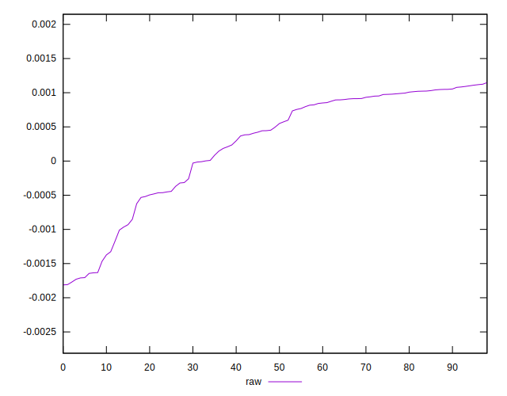

# //meta/pScore-difference/samples/card

[→ Parent](../..)


## Raw


```yaml
p90min: -0.0017291330886846923
p90max: 0.0011106872781903808
p90range: 0.002839820366875073
p90mean: 0.00024413516076800845
median: 0.0004964849612244304
p90stdev: 0.0008485879859805944
mad: 0.0005122612155923635
stdevBySn: 0.0007101724139647523
lfitCenter: 0.0003236754508686152
lfitStdev: 0.0007321318476853185
mfitCenter: 0.0003236754508686152
mfitStdev: 0.0009175911960062475
mfitConfidence: 0.00009222138509352064
p90skewness: -0.9391758136116173
p90eccentricity: 0.9999999999999996
p90discretization: 1
outlandishness: 0.7337644026798039

```

