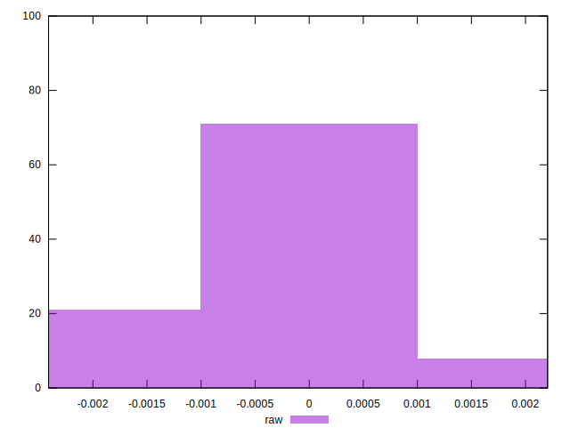

# //meta/pScore-difference/samples/music

[→ Parent](../..)


## Raw


```yaml
p90min: -0.002067376218442689
p90max: 0.0013509234885643129
p90range: 0.003418299707007002
p90mean: -0.00012646846745299395
median: -0.00014700898036876936
p90stdev: 0.0008186228888820831
mad: 0.000721733756745984
stdevBySn: 0.0009971312234444826
lfitCenter: -0.00011505851651821605
lfitStdev: 0.0007509319530656652
mfitCenter: -0.00011505851651821605
mfitStdev: 0.0009411536338861667
mfitConfidence: 0.00009411536338861667
p90skewness: -0.18766486325368203
p90eccentricity: 0.9999999999999996
p90discretization: 1
outlandishness: 0.9966935663941807

```

