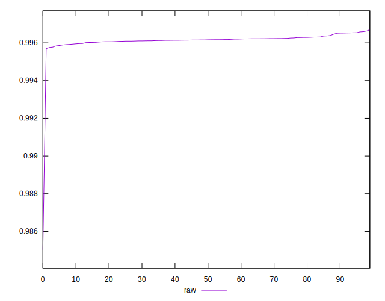

# //meta/pScore/samples/agenda

[→ Parent](../..)


## Raw


```yaml
p90min: 0.9957766493968147
p90max: 0.9965809987072943
p90range: 0.0008043493104796795
p90mean: 0.9961761090546442
median: 0.9961603068590609
p90stdev: 0.00016123314789498268
mad: 0.00007734907785450496
stdevBySn: 0.00014767393090073995
lfitCenter: 0.9961220443336921
lfitStdev: 0.000191864755354101
mfitCenter: 0.9961220443336921
mfitStdev: 0.00024046681057984253
mfitConfidence: 0.000024046681057984253
p90skewness: 0.39084017460718723
p90eccentricity: 1.0000000000000002
p90discretization: 1
outlandishness: 0.9997861014907539

```

