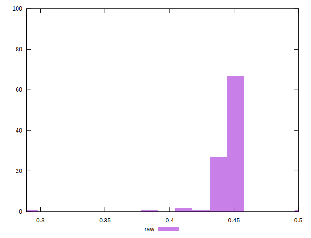

# //meta/pScore/samples/astro

[→ Parent](../..)


## Raw


```yaml
p90min: 0.4168569685043759
p90max: 0.4530200097246978
p90range: 0.03616304122032188
p90mean: 0.44591671056487
median: 0.447054287001966
p90stdev: 0.005391429948219121
mad: 0.0030430684480830528
stdevBySn: 0.004400888516961954
lfitCenter: 0.4453824167137176
lfitStdev: 0.005547955175817692
mfitCenter: 0.4453824167137176
mfitStdev: 0.006953330662041752
mfitConfidence: 0.0006953330662041752
p90skewness: -2.2264726753782766
p90eccentricity: 1.0000000000000004
p90discretization: 1
outlandishness: 0.9915779009411176

```

