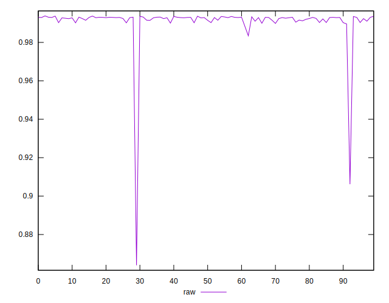
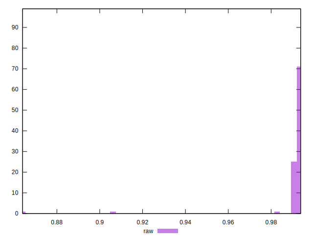

# //meta/pScore/samples/card

[→ Parent](../..)


## Raw


```yaml
p90min: 0.9896479781269276
p90max: 0.9936455782068262
p90range: 0.003997600079898578
p90mean: 0.9923645026277804
median: 0.9928951885213418
p90stdev: 0.001072773096447263
mad: 0.00032047031841564433
stdevBySn: 0.0005174580801944646
lfitCenter: 0.9914732367554212
lfitStdev: 0.0029271972889977804
mfitCenter: 0.9914732367554212
mfitStdev: 0.0036686977487041237
mfitConfidence: 0.0003687179970203982
p90skewness: -1.1674143236600427
p90eccentricity: 1.0000000000000002
p90discretization: 1
outlandishness: 0.9955389210251815

```

