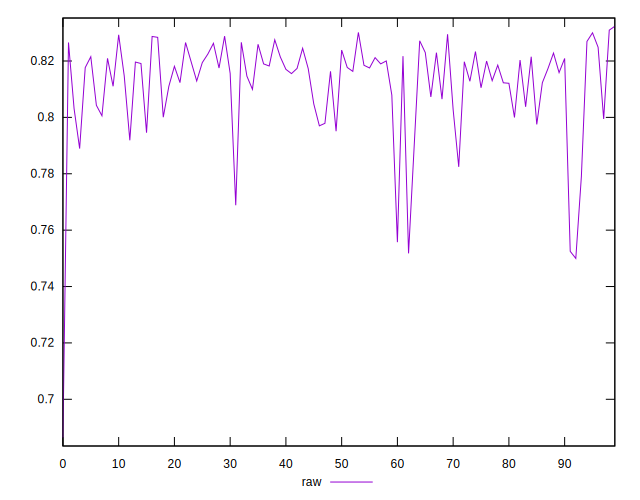
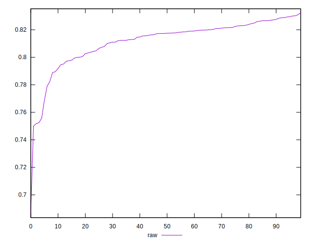
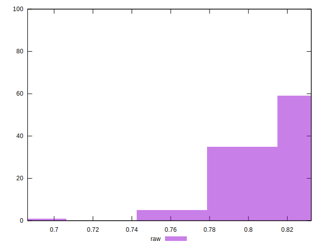

# //meta/pScore/samples/music

[→ Parent](../..)


## Raw


```yaml
p90min: 0.7524820300016252
p90max: 0.8300038055757234
p90range: 0.07752177557409823
p90mean: 0.8128124471424498
median: 0.8174323458222109
p90stdev: 0.014719703740143754
mad: 0.0064268351479615515
stdevBySn: 0.010885634785664596
lfitCenter: 0.8134251590745256
lfitStdev: 0.011474852584716474
mfitCenter: 0.8134251590745256
mfitStdev: 0.014381594982507838
mfitConfidence: 0.0014381594982507838
p90skewness: -1.8730017822721323
p90eccentricity: 1.0000000000000007
p90discretization: 1
outlandishness: 0.99519850277129

```

