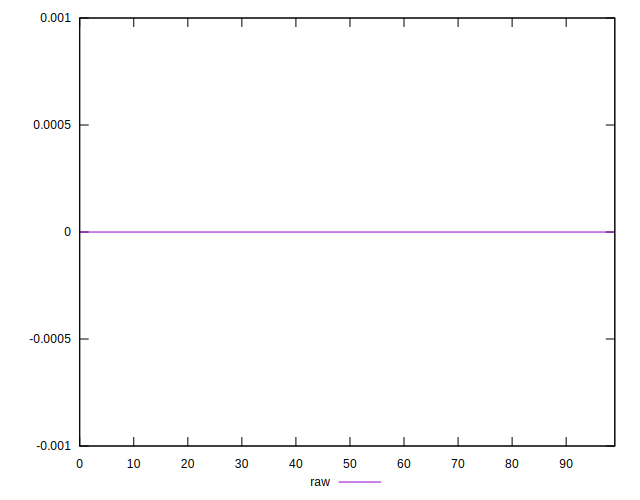
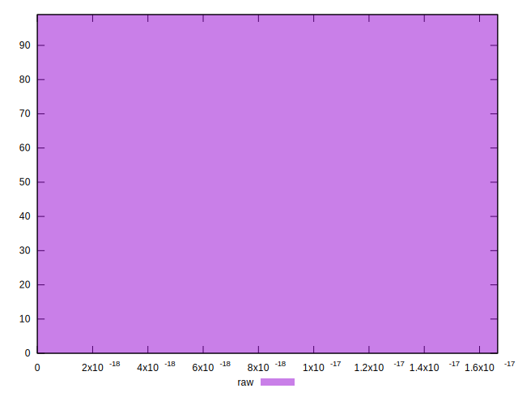

# //meta/score-difference/samples/card

[→ Parent](../..)


## Raw


```yaml
p90min: 0
p90max: 0
p90range: 0
p90mean: 0
median: 0
p90stdev: 0
mad: 0
stdevBySn: 0
lfitCenter: 1.0507123677263947e-19
lfitStdev: 2.6086531423365476e-19
mfitCenter: 1.0507123677263947e-19
mfitStdev: 3.2694618659327705e-19
mfitConfidence: 3.2859328108103784e-20
p90skewness: .nan
p90eccentricity: .nan
p90discretization: 93
outlandishness: .inf

```

