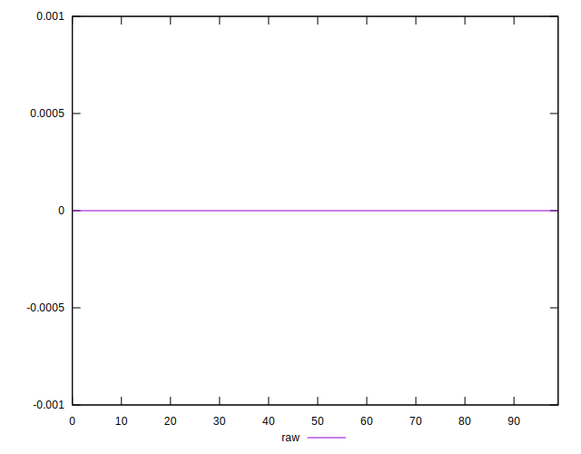

# //meta/score-difference/samples/music

[→ Parent](../..)


## Raw


```yaml
p90min: 0
p90max: 4.4408920985006264e-17
p90range: 4.4408920985006264e-17
p90mean: 1.1958519281201822e-17
median: 0
p90stdev: 1.3663697603031012e-17
mad: 0
stdevBySn: 0
lfitCenter: 1.0795429487091679e-17
lfitStdev: 1.515651960331874e-17
mfitCenter: 1.0795429487091679e-17
mfitStdev: 1.8995880310453356e-17
mfitConfidence: 1.8995880310453355e-18
p90skewness: 0.48364211925474143
p90eccentricity: 0.9999999999999983
p90discretization: 15.666666666666666
outlandishness: 1.1054575363511663

```

