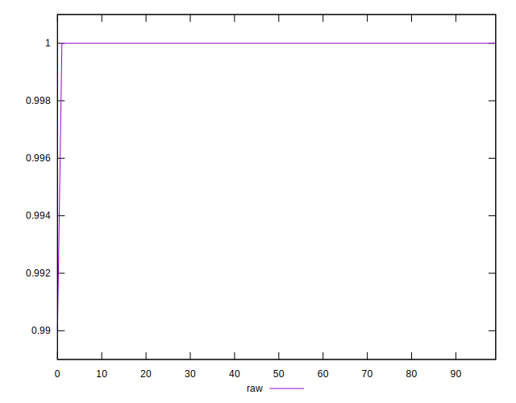
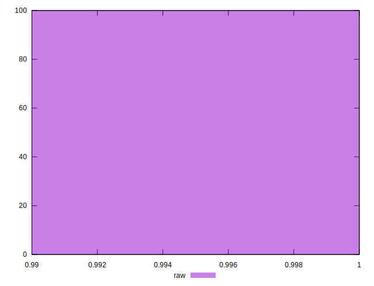

# //meta/score/samples/agenda

[→ Parent](../..)


## Raw


```yaml
p90min: 1
p90max: 1
p90range: 0
p90mean: 1
median: 1
p90stdev: 0
mad: 0
stdevBySn: 0
lfitCenter: 0.9999534639864746
lfitStdev: 0.00011610565185013966
mfitCenter: 0.9999534639864746
mfitStdev: 0.00014551685503243686
mfitConfidence: 0.000014551685503243686
p90skewness: .nan
p90eccentricity: .nan
p90discretization: 94
outlandishness: 0.9998000100000003

```

