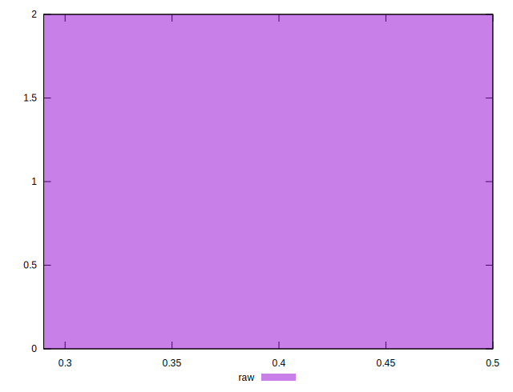

# //meta/score/samples/astro

[→ Parent](../..)


## Raw


```yaml
p90min: 0.29
p90max: 0.5
p90range: 0.21000000000000002
p90mean: 0.395
median: 0.395
p90stdev: 0.10500000000000001
mad: 0.10500000000000001
stdevBySn: 0.12522300000000003
lfitCenter: 0.395
lfitStdev: 0.13159798455054703
mfitCenter: 0.395
mfitStdev: 0.16493361464539058
mfitConfidence: 0.11662567736136453
p90skewness: -6.661338147750939e-16
p90eccentricity: 1
p90discretization: 1
outlandishness: 1

```

