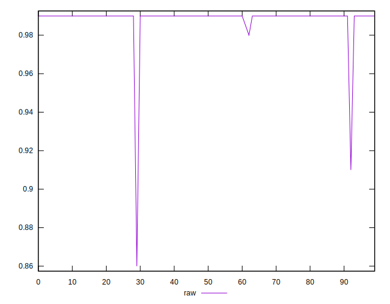
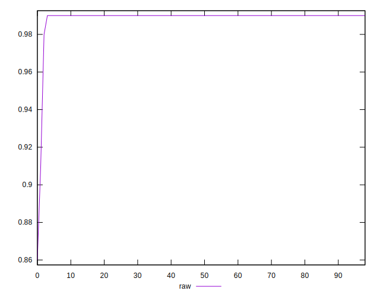
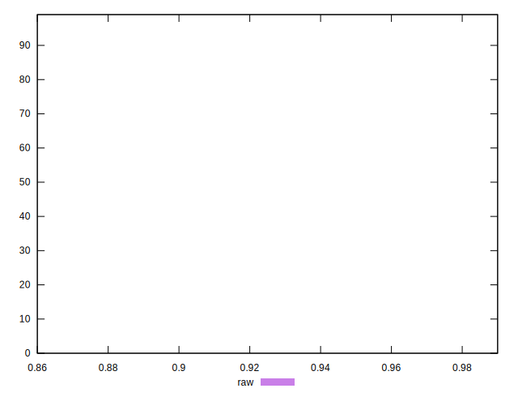

# //meta/score/samples/card

[→ Parent](../..)


## Raw


```yaml
p90min: 0.99
p90max: 0.99
p90range: 0
p90mean: 0.9899999999999989
median: 0.99
p90stdev: 1.1102230246251565e-15
mad: 0
stdevBySn: 0
lfitCenter: 0.9889532298883662
lfitStdev: 0.002585857469718457
mfitCenter: 0.9889532298883662
mfitStdev: 0.003240891727142153
mfitConfidence: 0.0003257218740938604
p90skewness: 1
p90eccentricity: 1
p90discretization: 93
outlandishness: 0.9955157007158499

```

