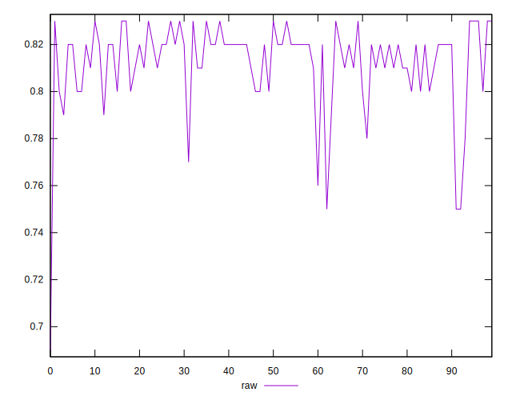
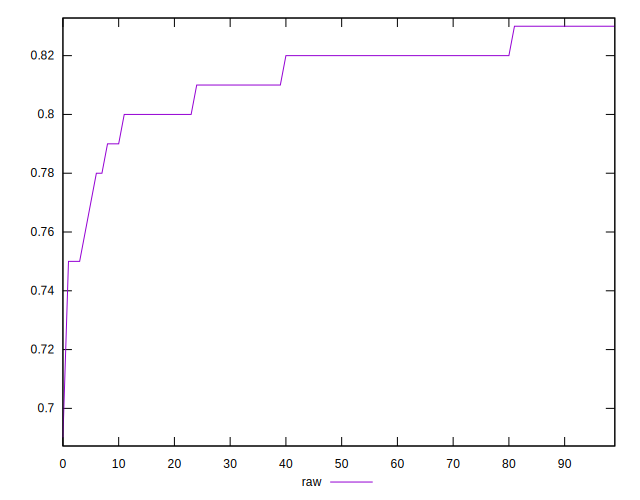
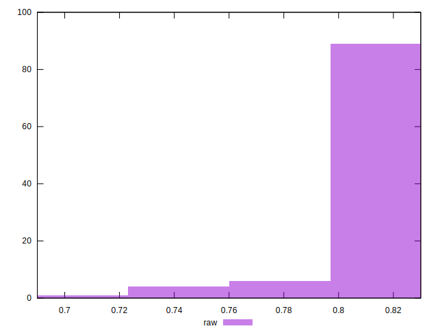

# //meta/score/samples/music

[→ Parent](../..)


## Raw


```yaml
p90min: 0.75
p90max: 0.83
p90range: 0.07999999999999996
p90mean: 0.8135106382978717
median: 0.82
p90stdev: 0.015067751022271716
mad: 0.009999999999999898
stdevBySn: 0.01192599999999988
lfitCenter: 0.8141794225159905
lfitStdev: 0.012512250502404218
mfitCenter: 0.8141794225159905
mfitStdev: 0.015681780460075852
mfitConfidence: 0.0015681780460075853
p90skewness: -1.728509778808675
p90eccentricity: 1.0000000000000013
p90discretization: 10.444444444444445
outlandishness: 0.9950629936493066

```

