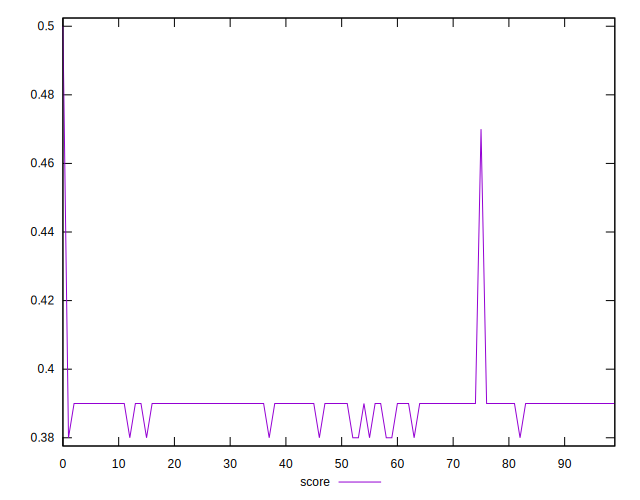
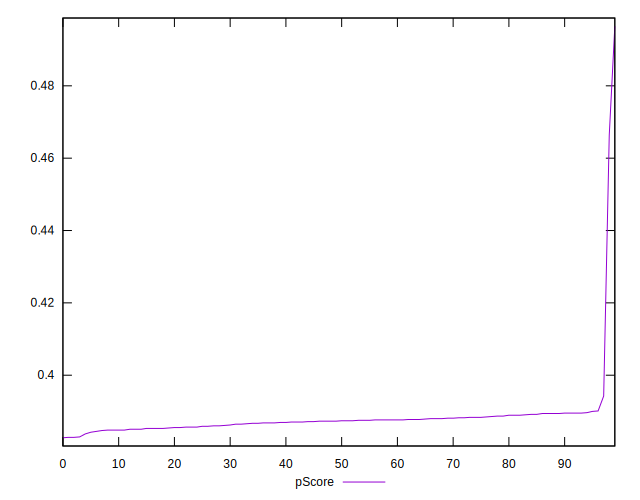

# //render-blocking-resources/samples/astro

[→ Parent](../..)


## Raw


```yaml
p90min: 1684
p90max: 1745
p90range: 61
p90mean: 1708.9468085106382
median: 1707.5
p90stdev: 13.444422256623584
mad: 11.5
stdevBySn: 14.9075
lfitCenter: 1701.2982283946974
lfitStdev: 22.910928185119236
mfitCenter: 1701.2982283946974
mfitStdev: 28.714590222323935
mfitConfidence: 2.8714590222323935
p90skewness: 0.2696236874880629
p90eccentricity: 0.9999999999999999
p90discretization: 2.186046511627907
outlandishness: 0.981946137180498

```


## Score


```yaml
p90min: 0.38
p90max: 0.39
p90range: 0.010000000000000009
p90mean: 0.38904255319148967
median: 0.39
p90stdev: 0.0029424078055190067
mad: 0
stdevBySn: 0
lfitCenter: 0.3902438263773792
lfitStdev: 0.002235399432506403
mfitCenter: 0.3902438263773792
mfitStdev: 0.0028016577141264684
mfitConfidence: 0.00028016577141264684
p90skewness: -2.747785799036675
p90eccentricity: 1.0000000000000007
p90discretization: 47
outlandishness: 1.0085387956869512

```


## Raw Estimate


## Score Estimate


## P Score


```yaml
p90min: 0.38294117647058823
p90max: 0.3901176470588235
p90range: 0.007176470588235284
p90mean: 0.3871827284105132
median: 0.38735294117647057
p90stdev: 0.0015816967360733662
mad: 0.0013529411764705568
stdevBySn: 0.0017538235294117918
lfitCenter: 0.38808256136532965
lfitStdev: 0.0026954033158963385
mfitCenter: 0.38808256136532965
mfitStdev: 0.0033781870849792337
mfitConfidence: 0.00033781870849792334
p90skewness: -0.2696236874878654
p90eccentricity: 1.0000000000000002
p90discretization: 2.186046511627907
outlandishness: 1.0094397100568495

```


## Score Difference


```yaml
p90min: 0
p90max: 0
p90range: 0
p90mean: 0
median: 0
p90stdev: 0
mad: 0
stdevBySn: 0
lfitCenter: 2.583267684513104e-19
lfitStdev: 6.445158398659724e-19
mfitCenter: 2.583267684513104e-19
mfitStdev: 8.077808146406197e-19
mfitConfidence: 8.077808146406197e-20
p90skewness: .nan
p90eccentricity: .nan
p90discretization: 94
outlandishness: .inf

```


## P Score Difference


```yaml
p90min: -0.004705882352941226
p90max: 0.004823529411764671
p90range: 0.009529411764705897
p90mean: -0.0017984981226533332
median: -0.002352941176470613
p90stdev: 0.002281623971713094
mad: 0.001235294117647029
stdevBySn: 0.0016836705882353055
lfitCenter: -0.001938472750209225
lfitStdev: 0.001620594357788512
mfitCenter: -0.001938472750209225
mfitStdev: 0.0020311138215138693
mfitConfidence: 0.00020311138215138694
p90skewness: 1.3668721947159033
p90eccentricity: 1.0000000000000002
p90discretization: 2.088888888888889
outlandishness: 0.8872932039173478

```

