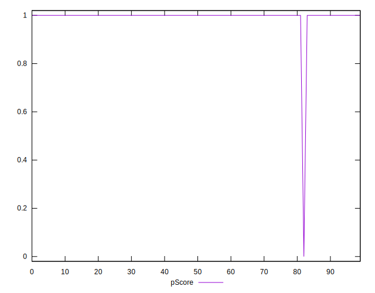
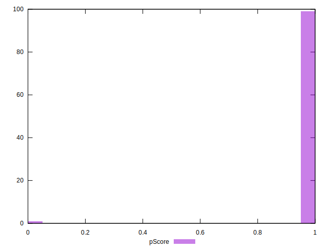

# //server-response-time/samples/astro

[→ Parent](../..)


## Raw


```yaml
p90min: 52.849000000000004
p90max: 501.674
p90range: 448.825
p90mean: 90.0575106382979
median: 56.058499999999995
p90stdev: 96.16941005957838
mad: 2.223999999999993
stdevBySn: 3.2894889500000026
lfitCenter: 82.0653013108871
lfitStdev: 55.66085018059163
mfitCenter: 82.0653013108871
mfitStdev: 69.76053049653152
mfitConfidence: 6.976053049653151
p90skewness: 3.1281912724454934
p90eccentricity: 0.9999999999999996
p90discretization: 1
outlandishness: 1.330508748963648

```


## Score


```yaml
p90min: 1
p90max: 1
p90range: 0
p90mean: 1
median: 1
p90stdev: 0
mad: 0
stdevBySn: 0
lfitCenter: 0.9953463986474514
lfitStdev: 0.01161056518501907
mfitCenter: 0.9953463986474514
mfitStdev: 0.01455168550325008
mfitConfidence: 0.001455168550325008
p90skewness: .nan
p90eccentricity: .nan
p90discretization: 94
outlandishness: 0.9801

```


## Raw Estimate


## Score Estimate


## P Score


```yaml
p90min: 1
p90max: 1
p90range: 0
p90mean: 1
median: 1
p90stdev: 0
mad: 0
stdevBySn: 0
lfitCenter: 0.9953463986474514
lfitStdev: 0.01161056518501907
mfitCenter: 0.9953463986474514
mfitStdev: 0.01455168550325008
mfitConfidence: 0.001455168550325008
p90skewness: .nan
p90eccentricity: .nan
p90discretization: 94
outlandishness: 0.9801

```


## Score Difference


```yaml
p90min: 0
p90max: 0
p90range: 0
p90mean: 0
median: 0
p90stdev: 0
mad: 0
stdevBySn: 0
lfitCenter: 0
lfitStdev: 0
mfitCenter: 0
mfitStdev: 0
mfitConfidence: 0
p90skewness: .nan
p90eccentricity: .nan
p90discretization: 94
outlandishness: .nan

```


## P Score Difference


```yaml
p90min: 0
p90max: 0
p90range: 0
p90mean: 0
median: 0
p90stdev: 0
mad: 0
stdevBySn: 0
lfitCenter: 0
lfitStdev: 0
mfitCenter: 0
mfitStdev: 0
mfitConfidence: 0
p90skewness: .nan
p90eccentricity: .nan
p90discretization: 94
outlandishness: .nan

```

