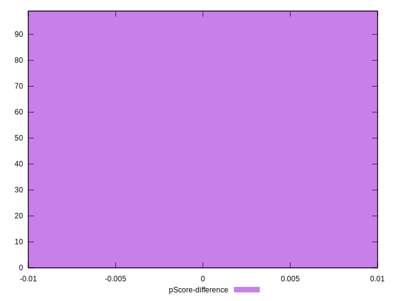

# //server-response-time/samples/card

[→ Parent](../..)


## Raw


```yaml
p90min: 161.22400000000002
p90max: 243.202
p90range: 81.97799999999998
p90mean: 178.96401075268818
median: 176.451
p90stdev: 16.148428946185195
mad: 11.620999999999981
stdevBySn: 16.295686399999987
lfitCenter: 210.37614819591136
lfitStdev: 82.39664780062634
mfitCenter: 210.37614819591136
mfitStdev: 103.26888365984465
mfitConfidence: 10.378913321774801
p90skewness: 1.3141543727359828
p90eccentricity: 1.0000000000000002
p90discretization: 1
outlandishness: 1.9205564194472222

```


## Score


```yaml
p90min: 1
p90max: 1
p90range: 0
p90mean: 1
median: 1
p90stdev: 0
mad: 0
stdevBySn: 0
lfitCenter: 0.9855152179633853
lfitStdev: 0.0357820512931506
mfitCenter: 0.9855152179633853
mfitStdev: 0.044846150792980134
mfitConfidence: 0.004507207741576194
p90skewness: .nan
p90eccentricity: .nan
p90discretization: 93
outlandishness: 0.9403122130394859

```


## Raw Estimate


## Score Estimate


## P Score


```yaml
p90min: 1
p90max: 1
p90range: 0
p90mean: 1
median: 1
p90stdev: 0
mad: 0
stdevBySn: 0
lfitCenter: 0.9855152179633853
lfitStdev: 0.0357820512931506
mfitCenter: 0.9855152179633853
mfitStdev: 0.044846150792980134
mfitConfidence: 0.004507207741576194
p90skewness: .nan
p90eccentricity: .nan
p90discretization: 93
outlandishness: 0.9403122130394859

```


## Score Difference


```yaml
p90min: 0
p90max: 0
p90range: 0
p90mean: 0
median: 0
p90stdev: 0
mad: 0
stdevBySn: 0
lfitCenter: 0
lfitStdev: 0
mfitCenter: 0
mfitStdev: 0
mfitConfidence: 0
p90skewness: .nan
p90eccentricity: .nan
p90discretization: 93
outlandishness: .nan

```


## P Score Difference


```yaml
p90min: 0
p90max: 0
p90range: 0
p90mean: 0
median: 0
p90stdev: 0
mad: 0
stdevBySn: 0
lfitCenter: 0
lfitStdev: 0
mfitCenter: 0
mfitStdev: 0
mfitConfidence: 0
p90skewness: .nan
p90eccentricity: .nan
p90discretization: 93
outlandishness: .nan

```

