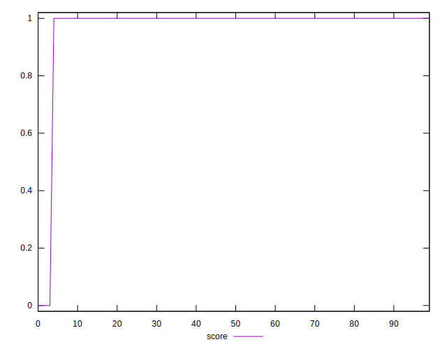
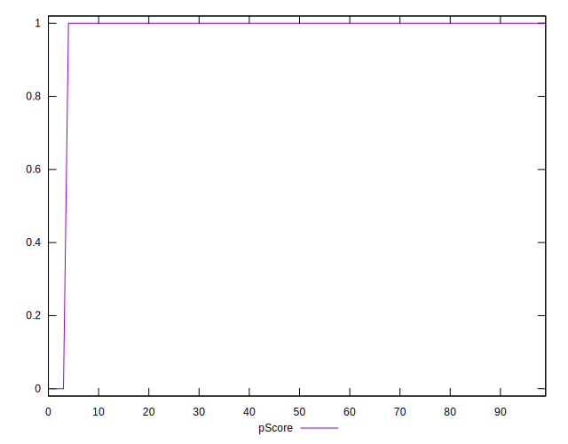

# //server-response-time/samples/music

[→ Parent](../..)


## Raw


```yaml
p90min: 161.39600000000002
p90max: 1380.742
p90range: 1219.346
p90mean: 194.65329787234043
median: 176.9845
p90stdev: 126.43487026687151
mad: 9.934999999999988
stdevBySn: 14.01543519999998
lfitCenter: 204.73962822379252
lfitStdev: 66.75480721523162
mfitCenter: 204.73962822379252
mfitStdev: 83.66474370080758
mfitConfidence: 8.366474370080757
p90skewness: 8.836610086424091
p90eccentricity: 0.9999999999999997
p90discretization: 1
outlandishness: 1.4414064438946763

```


## Score


```yaml
p90min: 0
p90max: 1
p90range: 1
p90mean: 0.9893617021276596
median: 1
p90stdev: 0.10259202937226548
mad: 0
stdevBySn: 0
lfitCenter: 0.9806252396582452
lfitStdev: 0.047624380658411104
mfitCenter: 0.9806252396582452
mfitStdev: 0.059688309620142425
mfitConfidence: 0.005968830962014242
p90skewness: -9.53995559151989
p90eccentricity: 1.0000000000000044
p90discretization: 47
outlandishness: 0.9415259105098853

```


## Raw Estimate


## Score Estimate


## P Score


```yaml
p90min: 0
p90max: 1
p90range: 1
p90mean: 0.9893617021276596
median: 1
p90stdev: 0.10259202937226548
mad: 0
stdevBySn: 0
lfitCenter: 0.9806252396582452
lfitStdev: 0.047624380658411104
mfitCenter: 0.9806252396582452
mfitStdev: 0.059688309620142425
mfitConfidence: 0.005968830962014242
p90skewness: -9.53995559151989
p90eccentricity: 1.0000000000000044
p90discretization: 47
outlandishness: 0.9415259105098853

```


## Score Difference


```yaml
p90min: 0
p90max: 0
p90range: 0
p90mean: 0
median: 0
p90stdev: 0
mad: 0
stdevBySn: 0
lfitCenter: 0
lfitStdev: 0
mfitCenter: 0
mfitStdev: 0
mfitConfidence: 0
p90skewness: .nan
p90eccentricity: .nan
p90discretization: 94
outlandishness: .nan

```


## P Score Difference


```yaml
p90min: 0
p90max: 0
p90range: 0
p90mean: 0
median: 0
p90stdev: 0
mad: 0
stdevBySn: 0
lfitCenter: 0
lfitStdev: 0
mfitCenter: 0
mfitStdev: 0
mfitConfidence: 0
p90skewness: .nan
p90eccentricity: .nan
p90discretization: 94
outlandishness: .nan

```

