# //speed-index/samples/agenda

[→ Parent](../..)


## Raw


```yaml
p90min: 1440.6399000000001
p90max: 1493.0064000000002
p90range: 52.36650000000009
p90mean: 1466.000221276596
median: 1466.6541000000002
p90stdev: 10.330224299864202
mad: 4.727249999999913
stdevBySn: 9.12249554999986
lfitCenter: 1473.9779636678322
lfitStdev: 21.99538186702553
mfitCenter: 1473.9779636678322
mfitStdev: 27.56712307733531
mfitConfidence: 2.756712307733531
p90skewness: -0.2033605122709701
p90eccentricity: 1
p90discretization: 1
outlandishness: 1.0230442207867936

```

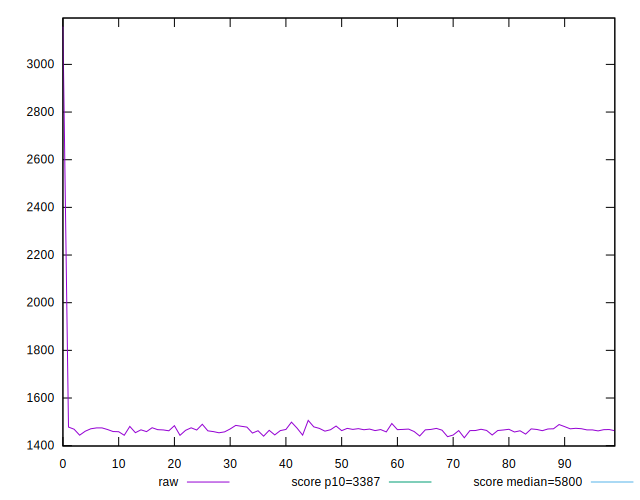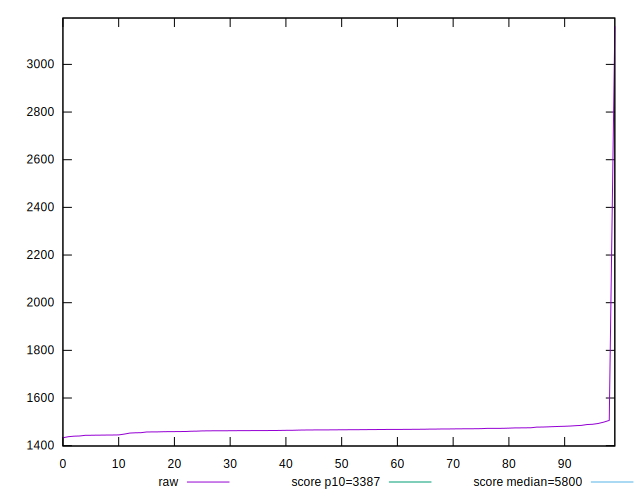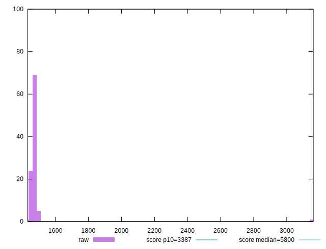
## Score


```yaml
p90min: 1
p90max: 1
p90range: 0
p90mean: 1
median: 1
p90stdev: 0
mad: 0
stdevBySn: 0
lfitCenter: 0.9996742479053216
lfitStdev: 0.000812739562951391
mfitCenter: 0.9996742479053216
mfitStdev: 0.001018617985227576
mfitConfidence: 0.00010186179852275761
p90skewness: .nan
p90eccentricity: .nan
p90discretization: 94
outlandishness: 0.9986004900000002

```

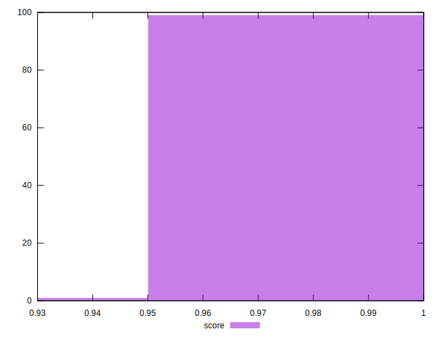
## Raw Estimate

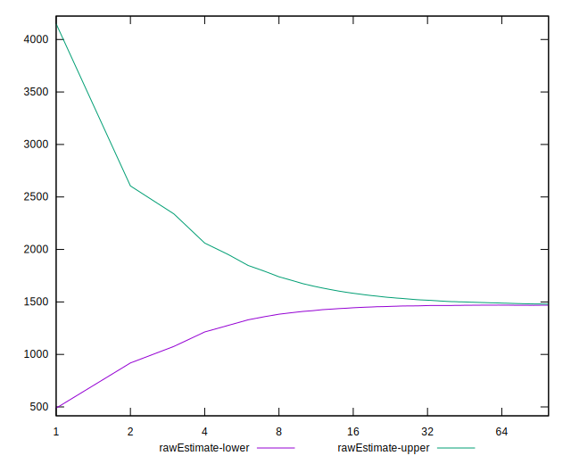
## Score Estimate

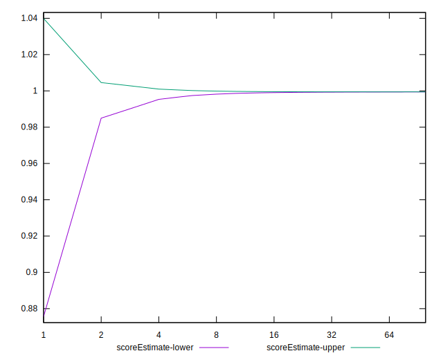
## P Score


```yaml
p90min: 0.9993877540409286
p90max: 0.9995469544611719
p90range: 0.0001592004202433106
p90mean: 0.9994739256452345
median: 0.9994726928793203
p90stdev: 0.00003113140690907473
mad: 0.000014338093351218273
stdevBySn: 0.00002746029542886738
lfitCenter: 0.9991319497643171
lfitStdev: 0.0008528512694477868
mfitCenter: 0.9991319497643171
mfitStdev: 0.0010688905541019454
mfitConfidence: 0.00010688905541019454
p90skewness: 0.01816759870100917
p90eccentricity: 1.0000000000000004
p90discretization: 1
outlandishness: 0.9985308843758396

```

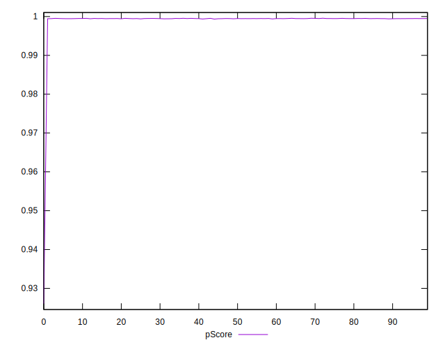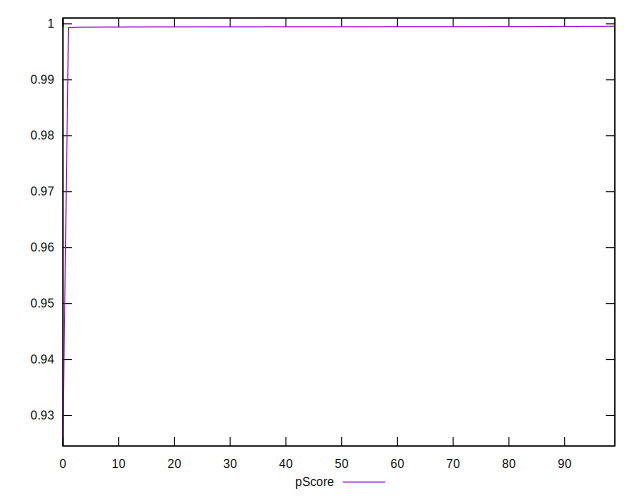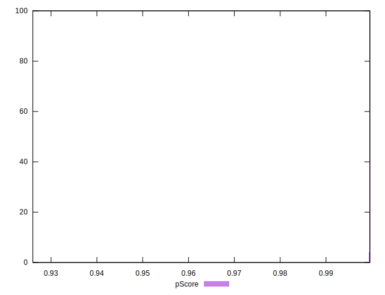
## Score Difference


```yaml
p90min: 0
p90max: 0
p90range: 0
p90mean: 0
median: 0
p90stdev: 0
mad: 0
stdevBySn: 0
lfitCenter: 0
lfitStdev: 0
mfitCenter: 0
mfitStdev: 0
mfitConfidence: 0
p90skewness: .nan
p90eccentricity: .nan
p90discretization: 94
outlandishness: .nan

```


## P Score Difference


```yaml
p90min: -0.0006122459590713891
p90max: -0.0004530455388280785
p90range: 0.0001592004202433106
p90mean: -0.0005260743547653015
median: -0.0005273071206796653
p90stdev: 0.00003113140690907473
mad: 0.000014338093351218273
stdevBySn: 0.00002746029542886738
lfitCenter: -0.0005422981410044738
lfitStdev: 0.000050174251028262336
mfitCenter: -0.0005422981410044738
mfitStdev: 0.00006288409820621461
mfitConfidence: 0.000006288409820621461
p90skewness: 0.018167598726387273
p90eccentricity: 1.0000000000000002
p90discretization: 1
outlandishness: 1.1352228209851654

```

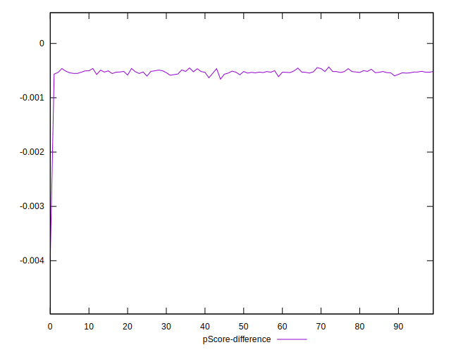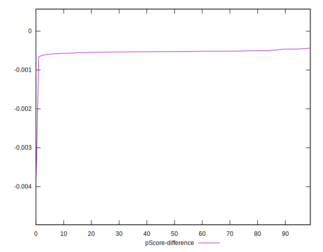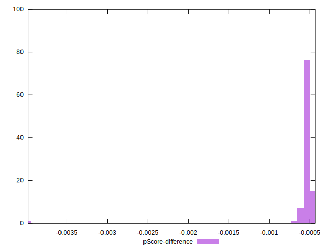