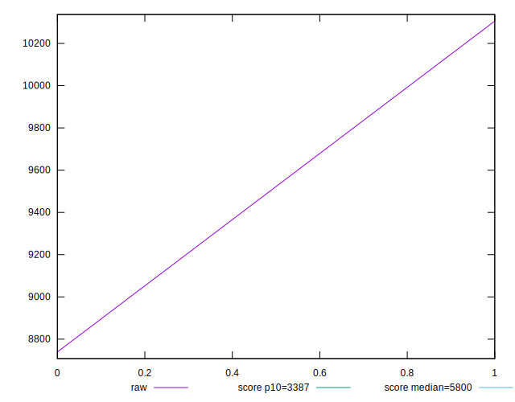

# //speed-index/samples/astro

[→ Parent](../..)


## Raw


```yaml
p90min: 8739.35809623992
p90max: 10305.594427902917
p90range: 1566.236331662998
p90mean: 9522.476262071417
median: 9522.476262071417
p90stdev: 783.118165831499
mad: 783.118165831499
stdevBySn: 933.9467245706459
lfitCenter: 9522.476262071417
lfitStdev: 981.4930694128221
mfitCenter: 9522.476262071417
mfitStdev: 1230.1191408100717
mfitConfidence: 869.8255861341712
p90skewness: 3.3306690738754696e-15
p90eccentricity: 1
p90discretization: 1
outlandishness: 1

```


## Score


```yaml
p90min: 0.09
p90max: 0.16
p90range: 0.07
p90mean: 0.125
median: 0.125
p90stdev: 0.035
mad: 0.035
stdevBySn: 0.04174100000000001
lfitCenter: 0.125
lfitStdev: 0.04386599485018234
mfitCenter: 0.125
mfitStdev: 0.05497787154846353
mfitConfidence: 0.03887522578712151
p90skewness: 0
p90eccentricity: 1
p90discretization: 1
outlandishness: 1

```


## Raw Estimate


## Score Estimate


## P Score


```yaml
p90min: 0.08542138785008696
p90max: 0.1643454802472264
p90range: 0.07892409239713943
p90mean: 0.12488343404865668
median: 0.12488343404865668
p90stdev: 0.03946204619856972
mad: 0.03946204619856972
stdevBySn: 0.047062436296414246
lfitCenter: 0.12488343404865666
lfitStdev: 0.049458340437831906
mfitCenter: 0.12488343404865666
mfitStdev: 0.06198683734127141
mfitConfidence: 0.043831313028320516
p90skewness: 0
p90eccentricity: 1
p90discretization: 1
outlandishness: 1

```


## Score Difference


```yaml
p90min: 0
p90max: 0
p90range: 0
p90mean: 0
median: 0
p90stdev: 0
mad: 0
stdevBySn: 0
lfitCenter: 0
lfitStdev: 0
mfitCenter: 0
mfitStdev: 0
mfitConfidence: 0
p90skewness: .nan
p90eccentricity: .nan
p90discretization: 2
outlandishness: .nan

```


## P Score Difference


```yaml
p90min: -0.004578612149913036
p90max: 0.004345480247226391
p90range: 0.008924092397139427
p90mean: -0.0001165659513433226
median: -0.0001165659513433226
p90stdev: 0.0044620461985697135
mad: 0.0044620461985697135
stdevBySn: 0.005321436296414241
lfitCenter: -0.00011656595134332221
lfitStdev: 0.005592345587649564
mfitCenter: -0.00011656595134332221
mfitStdev: 0.0070089657928078765
mfitConfidence: 0.004956087241198995
p90skewness: 0
p90eccentricity: 1
p90discretization: 1
outlandishness: 1

```

