# //speed-index/samples/card

[→ Parent](../..)


## Raw


```yaml
p90min: 1589.4264
p90max: 1961.4232638228418
p90range: 371.99686382284176
p90mean: 1660.4363207351764
median: 1621.0263
p90stdev: 68.48489047993779
mad: 14.502600000000257
stdevBySn: 26.325452400000355
lfitCenter: 1708.3499730809515
lfitStdev: 169.6521977545651
mfitCenter: 1708.3499730809515
mfitStdev: 212.62749808639623
mfitConfidence: 21.369867614078398
p90skewness: 1.4390708927645137
p90eccentricity: 0.9999999999999999
p90discretization: 1
outlandishness: 1.1532735530069198

```

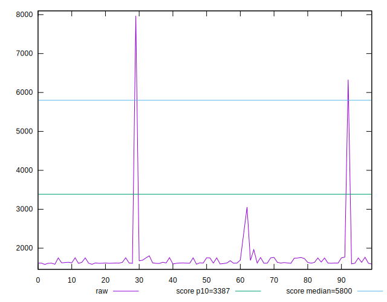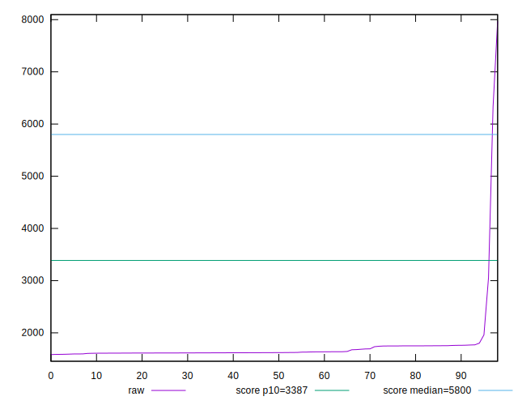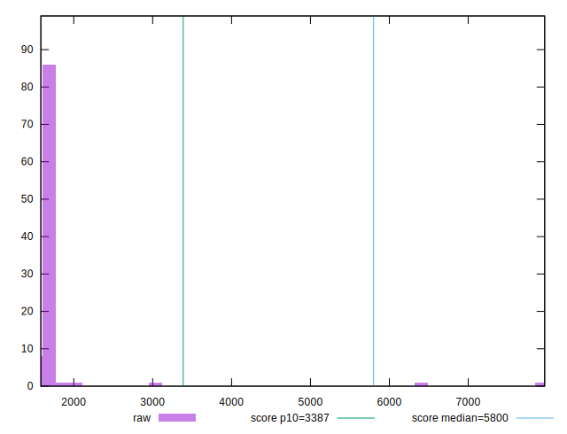
## Score


```yaml
p90min: 1
p90max: 1
p90range: 0
p90mean: 1
median: 1
p90stdev: 0
mad: 0
stdevBySn: 0
lfitCenter: 0.9932366985341101
lfitStdev: 0.016707520993534272
mfitCenter: 0.9932366985341101
mfitStdev: 0.020939772281762505
mfitConfidence: 0.0021045262986087994
p90skewness: .nan
p90eccentricity: .nan
p90discretization: 93
outlandishness: 0.9715188654218958

```

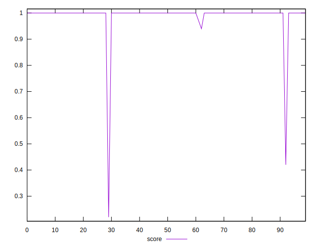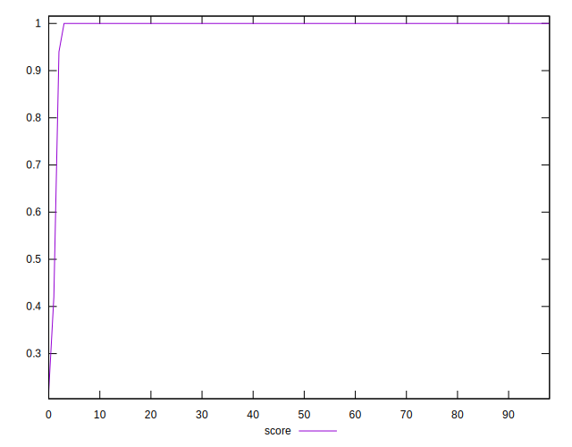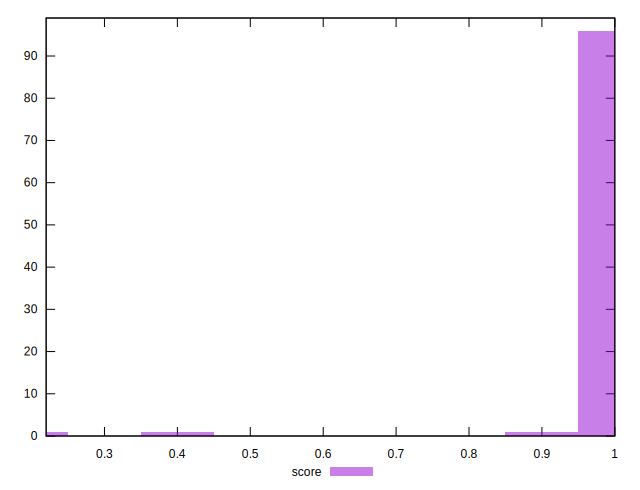
## Raw Estimate

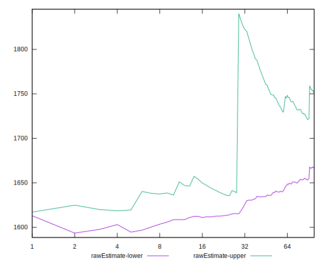
## Score Estimate

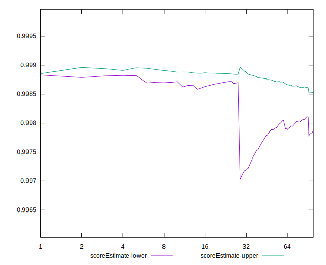
## P Score


```yaml
p90min: 0.9951030219177266
p90max: 0.9989788977802675
p90range: 0.0038758758625409007
p90mean: 0.9984950834973217
median: 0.9988057717005185
p90stdev: 0.0005750491417568371
mad: 0.00008669255841020629
stdevBySn: 0.00015440299830014135
lfitCenter: 0.9918398303428418
lfitStdev: 0.016674602512042704
mfitCenter: 0.9918398303428418
mfitStdev: 0.02089851508348865
mfitConfidence: 0.002100379794167112
p90skewness: -2.579656601774341
p90eccentricity: 0.9999999999999993
p90discretization: 1
outlandishness: 0.9715711312830567

```

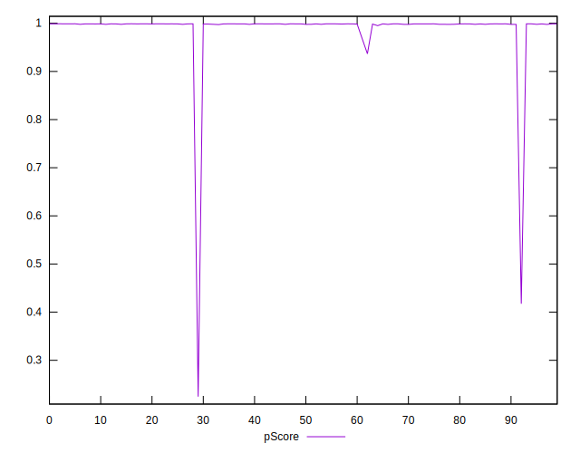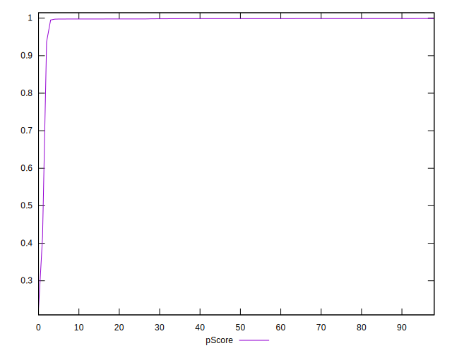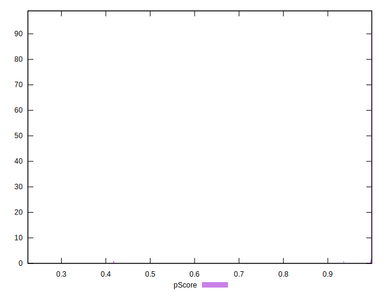
## Score Difference


```yaml
p90min: 0
p90max: 0
p90range: 0
p90mean: 0
median: 0
p90stdev: 0
mad: 0
stdevBySn: 0
lfitCenter: 5.21847134031707e-19
lfitStdev: 1.3019283231074932e-18
mfitCenter: 5.21847134031707e-19
mfitStdev: 1.631725174763995e-18
mfitConfidence: 1.6399455047482617e-19
p90skewness: .nan
p90eccentricity: .nan
p90discretization: 93
outlandishness: .inf

```

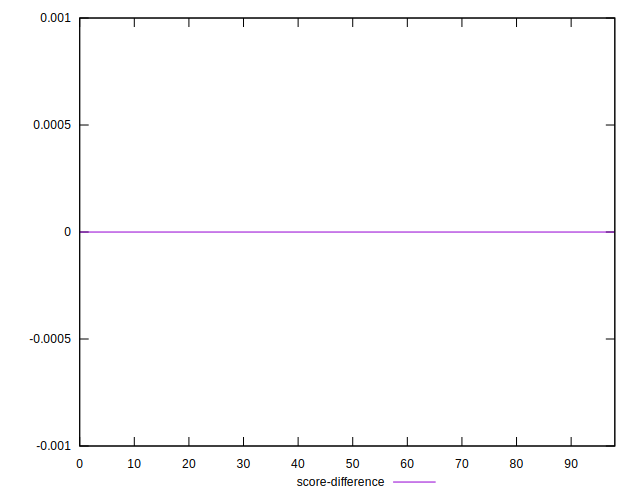
## P Score Difference


```yaml
p90min: -0.002498173778792634
p90max: -0.001012812042240907
p90range: 0.0014853617365517269
p90mean: -0.001461069808204865
median: -0.001192704095312136
p90stdev: 0.00045067041980488564
mad: 0.0000851683542408832
stdevBySn: 0.00015440299830014135
lfitCenter: -0.0013886633817534416
lfitStdev: 0.00045363822461108827
mfitCenter: -0.0013886633817534416
mfitStdev: 0.0005685512007038816
mfitConfidence: 0.000057141545661843096
p90skewness: -0.9718084852821444
p90eccentricity: 0.9999999999999996
p90discretization: 1
outlandishness: 0.9942427521215845

```

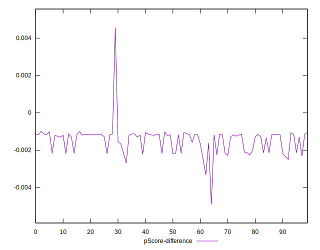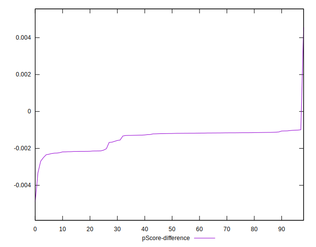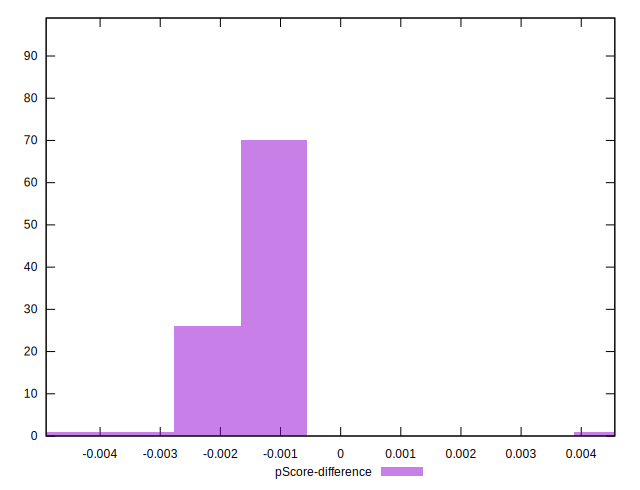