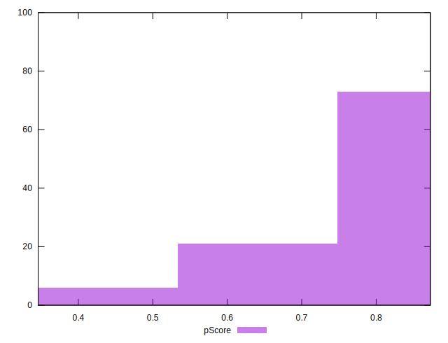

# //speed-index/samples/music

[→ Parent](../..)


## Raw


```yaml
p90min: 3751.0695522502797
p90max: 6735.1185349296975
p90range: 2984.048982679418
p90mean: 4298.025481971469
median: 4184.727200481302
p90stdev: 516.5993540007146
mad: 217.14234730467206
stdevBySn: 296.26799365086424
lfitCenter: 4274.520599692129
lfitStdev: 334.0997522176311
mfitCenter: 4274.520599692129
mfitStdev: 418.73194314930856
mfitConfidence: 41.873194314930856
p90skewness: 2.8379469438700466
p90eccentricity: 0.9999999999999997
p90discretization: 1
outlandishness: 1.026543387559733

```


## Score


```yaml
p90min: 0.36
p90max: 0.85
p90range: 0.49
p90mean: 0.7608510638297878
median: 0.78
p90stdev: 0.0871494140611897
mad: 0.039999999999999925
stdevBySn: 0.047704000000000045
lfitCenter: 0.7652295579623273
lfitStdev: 0.05633513576750047
mfitCenter: 0.7652295579623273
mfitStdev: 0.07060562215604281
mfitConfidence: 0.007060562215604281
p90skewness: -2.7638431853522856
p90eccentricity: 0.9999999999999997
p90discretization: 4.476190476190476
outlandishness: 0.9758301639315535

```


## Raw Estimate


## Score Estimate


## P Score


```yaml
p90min: 0.3608744295980612
p90max: 0.8504375449671242
p90range: 0.489563115369063
p90mean: 0.7614034573003955
median: 0.7816184618153094
p90stdev: 0.086808008462602
mad: 0.03585269366843191
stdevBySn: 0.04854377811728374
lfitCenter: 0.7658493835821777
lfitStdev: 0.056395739497643746
mfitCenter: 0.7658493835821777
mfitStdev: 0.07068157766788186
mfitConfidence: 0.007068157766788185
p90skewness: -2.770779429024993
p90eccentricity: 0.9999999999999996
p90discretization: 1
outlandishness: 0.9757057989467547

```


## Score Difference


```yaml
p90min: 0
p90max: 1.1102230246251565e-16
p90range: 1.1102230246251565e-16
p90mean: 1.4763604050866443e-17
median: 0
p90stdev: 3.63700419430474e-17
mad: 0
stdevBySn: 0
lfitCenter: 9.843949152062444e-18
lfitStdev: 2.222703734397196e-17
mfitCenter: 9.843949152062444e-18
mfitStdev: 2.7857460161870985e-17
mfitConfidence: 2.7857460161870984e-18
p90skewness: 2.157424424882451
p90eccentricity: 1.0000000000000016
p90discretization: 31.333333333333332
outlandishness: 1.35862336

```


## P Score Difference


```yaml
p90min: -0.0040591607751711
p90max: 0.004692491204791205
p90range: 0.008751651979962305
p90mean: 0.0005123662985274166
median: 0.0005117063011372824
p90stdev: 0.002511279852506575
mad: 0.0023560149765418648
stdevBySn: 0.002967240091302054
lfitCenter: 0.0005309617197108905
lfitStdev: 0.0022631054741893645
mfitCenter: 0.0005309617197108905
mfitStdev: 0.0028363820878917175
mfitConfidence: 0.0002836382087891717
p90skewness: -0.08310694438035851
p90eccentricity: 1.0000000000000002
p90discretization: 1
outlandishness: 0.943747405169725

```

