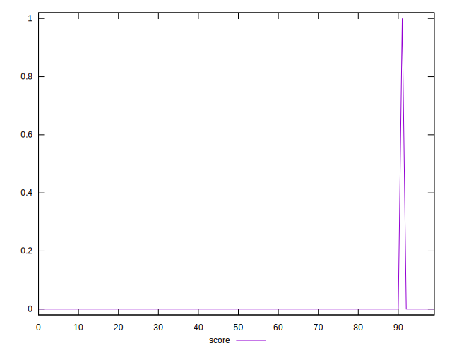
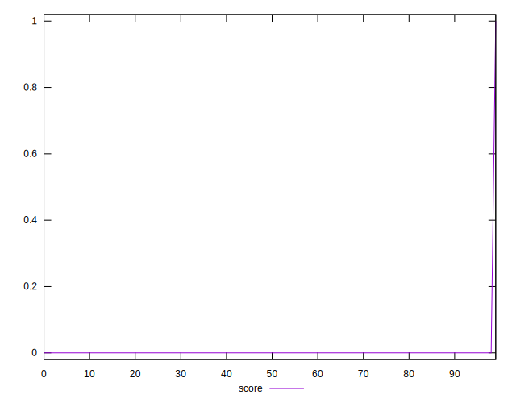
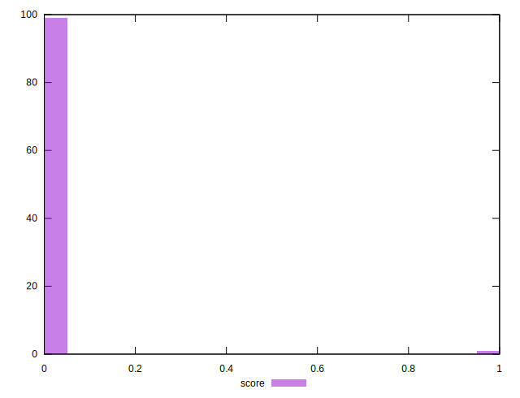

# //third-party-summary/samples/astro

[→ Parent](../..)


## Raw


```yaml
p90range: 0

```


## Score


```yaml
p90min: 0
p90max: 0
p90range: 0
p90mean: 0
median: 0
p90stdev: 0
mad: 0
stdevBySn: 0
lfitCenter: 0.0046536013525485835
lfitStdev: 0.011610565185019102
mfitCenter: 0.0046536013525485835
mfitStdev: 0.014551685503250122
mfitConfidence: 0.0014551685503250123
p90skewness: .nan
p90eccentricity: .nan
p90discretization: 94
outlandishness: .inf

```

