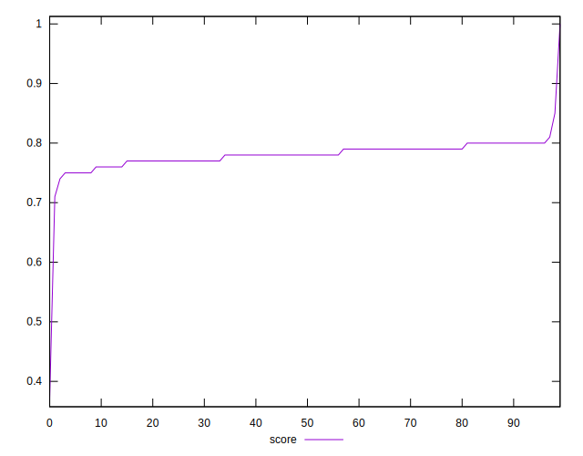
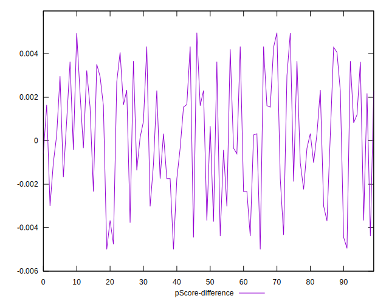

# //total-blocking-time/samples/astro

[→ Parent](../..)


## Raw


```yaml
p90min: 367
p90max: 410.5
p90range: 43.5
p90mean: 383.93617021276594
median: 382.25
p90stdev: 10.09587920005442
mad: 7.75
stdevBySn: 11.329700000000136
lfitCenter: 384.0158968303767
lfitStdev: 11.888826386715614
mfitCenter: 384.0158968303767
mfitStdev: 14.900434201553686
mfitConfidence: 1.4900434201553687
p90skewness: 0.5127060782037867
p90eccentricity: 1.000000000000001
p90discretization: 1.6206896551724137
outlandishness: 1.0052841142033244

```


## Score


```yaml
p90min: 0.75
p90max: 0.8
p90range: 0.050000000000000044
p90mean: 0.7807446808510639
median: 0.78
p90stdev: 0.014009067102000653
mad: 0.010000000000000009
stdevBySn: 0.023852000000000022
lfitCenter: 0.7802621773612668
lfitStdev: 0.015269242369056671
mfitCenter: 0.7802621773612668
mfitStdev: 0.019137157346492167
mfitConfidence: 0.0019137157346492168
p90skewness: -0.4575657896257474
p90eccentricity: 1.000000000000001
p90discretization: 15.666666666666666
outlandishness: 0.9947690877473112

```


## Raw Estimate


## Score Estimate


## P Score


```yaml
p90min: 0.7452436298593894
p90max: 0.8035186874875309
p90range: 0.05827505762814145
p90mean: 0.7810236627095987
median: 0.7833346874617383
p90stdev: 0.013510693606841252
mad: 0.010338795801386913
stdevBySn: 0.015182348798561394
lfitCenter: 0.7805891507066662
lfitStdev: 0.014988610477691268
mfitCenter: 0.7805891507066662
mfitStdev: 0.018785437429308403
mfitConfidence: 0.0018785437429308404
p90skewness: -0.5310706742655575
p90eccentricity: 1.0000000000000004
p90discretization: 1.6206896551724137
outlandishness: 0.9946269566555899

```


## Score Difference


```yaml
p90min: 0
p90max: 0
p90range: 0
p90mean: 0
median: 0
p90stdev: 0
mad: 0
stdevBySn: 0
lfitCenter: 0
lfitStdev: 0
mfitCenter: 0
mfitStdev: 0
mfitConfidence: 0
p90skewness: .nan
p90eccentricity: .nan
p90discretization: 94
outlandishness: .nan

```


## P Score Difference


```yaml
p90min: -0.004948582719496386
p90max: 0.004958489300692981
p90range: 0.009907072020189367
p90mean: 0.00023779970039286734
median: 0.0003256022751531029
p90stdev: 0.002768036202841164
mad: 0.0022913155027940446
stdevBySn: 0.0032120867350744074
lfitCenter: 0.000285065330437838
lfitStdev: 0.0023995583861845028
mfitCenter: 0.000285065330437838
mfitStdev: 0.003007400451745178
mfitConfidence: 0.0003007400451745178
p90skewness: -0.17018346863362668
p90eccentricity: 0.9999999999999999
p90discretization: 1.5666666666666667
outlandishness: 0.8762464959632867

```

