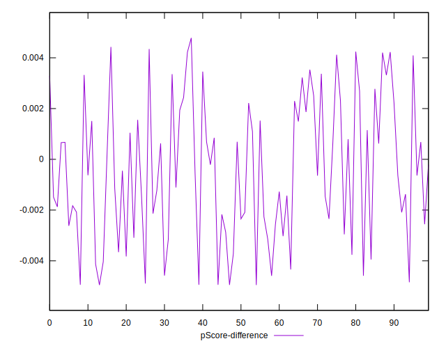

# //total-blocking-time/samples/music

[→ Parent](../..)


## Raw


```yaml
p90min: 236.81249999999818
p90max: 338.0000000000009
p90range: 101.18750000000273
p90mean: 265.39132446808514
median: 255.90400000000045
p90stdev: 27.43082035444069
mad: 9.034999999999854
stdevBySn: 14.663911450000542
lfitCenter: 263.0198699401803
lfitStdev: 19.667095334031426
mfitCenter: 263.0198699401803
mfitStdev: 24.649048646876217
mfitConfidence: 2.4649048646876217
p90skewness: 1.6139225708942218
p90eccentricity: 0.9999999999999999
p90discretization: 1.010752688172043
outlandishness: 1.0188639578976804

```


## Score


```yaml
p90min: 0.84
p90max: 0.95
p90range: 0.10999999999999999
p90mean: 0.9204255319148942
median: 0.93
p90stdev: 0.029206341981684536
mad: 0.009999999999999898
stdevBySn: 0.01192599999999988
lfitCenter: 0.9229523438311814
lfitStdev: 0.0209608605688519
mfitCenter: 0.9229523438311814
mfitStdev: 0.026270542907675644
mfitConfidence: 0.0026270542907675643
p90skewness: -1.7509088413793403
p90eccentricity: 1.0000000000000009
p90discretization: 9.4
outlandishness: 0.9932200377989508

```


## Raw Estimate


## Score Estimate


## P Score


```yaml
p90min: 0.8406922777819588
p90max: 0.9469078892165005
p90range: 0.10621561143454172
p90mean: 0.9200519148180817
median: 0.9306759691843933
p90stdev: 0.028967517509344683
mad: 0.008176295340236006
stdevBySn: 0.013040251081079934
lfitCenter: 0.9225714978763633
lfitStdev: 0.02075976353557824
mfitCenter: 0.9225714978763633
mfitStdev: 0.026018505152647944
mfitConfidence: 0.0026018505152647945
p90skewness: -1.7424133254027643
p90eccentricity: 0.9999999999999991
p90discretization: 1.010752688172043
outlandishness: 0.9931074145876604

```


## Score Difference


```yaml
p90min: 0
p90max: 1.1102230246251565e-16
p90range: 1.1102230246251565e-16
p90mean: 3.897591469428741e-17
median: 0
p90stdev: 5.29912621446783e-17
mad: 0
stdevBySn: 0
lfitCenter: 3.1657710212153656e-17
lfitStdev: 5.672650063496794e-17
mfitCenter: 3.1657710212153656e-17
mfitStdev: 7.109612527778195e-17
mfitConfidence: 7.109612527778195e-18
p90skewness: 0.6240740781687912
p90eccentricity: 0.9999999999999991
p90discretization: 47
outlandishness: 1.0515570247933883

```


## P Score Difference


```yaml
p90min: -0.004943282166987584
p90max: 0.0042425396099645685
p90range: 0.009185821776952152
p90mean: -0.0004376444071903128
median: -0.0006339017175506223
p90stdev: 0.0027223553684968087
mad: 0.002358108371283363
stdevBySn: 0.003231369888483583
lfitCenter: -0.0004543265407825859
lfitStdev: 0.002426248762546009
mfitCenter: -0.0004543265407825859
mfitStdev: 0.003040851877802986
mfitConfidence: 0.0003040851877802986
p90skewness: 0.05576088197363934
p90eccentricity: 1.0000000000000002
p90discretization: 1
outlandishness: 0.9401063329421143

```

