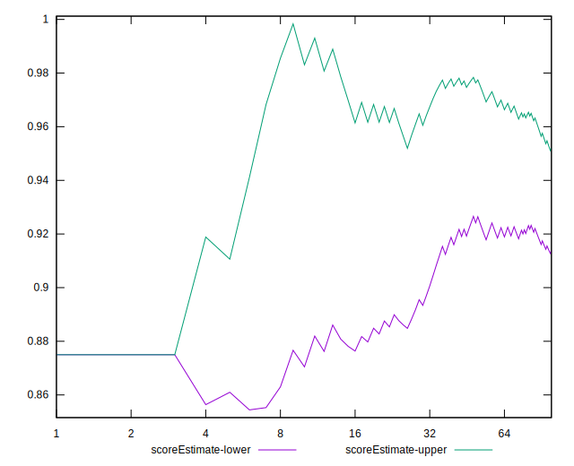

# //unminified-javascript/samples/astro

[→ Parent](../..)


## Raw


```yaml
p90min: 0
p90max: 150
p90range: 150
p90mean: 78.19148936170212
median: 150
p90stdev: 74.93206520345035
mad: 0
stdevBySn: 0
lfitCenter: 80.3164226969608
lfitStdev: 93.52623892871992
mfitCenter: 80.3164226969608
mfitStdev: 117.21775757726145
mfitConfidence: 11.721775757726146
p90skewness: -0.08518354199999216
p90eccentricity: 1.000000000000002
p90discretization: 47
outlandishness: 0.9951080383173679

```


## Score


```yaml
p90min: 0.88
p90max: 1
p90range: 0.12
p90mean: 0.937446808510638
median: 0.88
p90stdev: 0.0599456521627603
mad: 0
stdevBySn: 0
lfitCenter: 0.9357468618424316
lfitStdev: 0.07482099114297588
mfitCenter: 0.9357468618424316
mfitStdev: 0.0937742060618091
mfitConfidence: 0.00937742060618091
p90skewness: 0.08518354200001833
p90eccentricity: 1.0000000000000009
p90discretization: 47
outlandishness: 1.0003268537579975

```


## Raw Estimate


## Score Estimate


## P Score


```yaml
p90min: 0.875
p90max: 1
p90range: 0.125
p90mean: 0.9348404255319149
median: 0.875
p90stdev: 0.06244338766954203
mad: 0
stdevBySn: 0
lfitCenter: 0.933069647752533
lfitStdev: 0.07793853244059996
mfitCenter: 0.933069647752533
mfitStdev: 0.09768146464771792
mfitConfidence: 0.009768146464771792
p90skewness: 0.08518354199999038
p90eccentricity: 1.0000000000000002
p90discretization: 47
outlandishness: 1.000341423163075

```


## Score Difference


```yaml
p90min: 0
p90max: 0
p90range: 0
p90mean: 0
median: 0
p90stdev: 0
mad: 0
stdevBySn: 0
lfitCenter: 0
lfitStdev: 0
mfitCenter: 0
mfitStdev: 0
mfitConfidence: 0
p90skewness: .nan
p90eccentricity: .nan
p90discretization: 94
outlandishness: .nan

```


## P Score Difference


```yaml
p90min: -0.0050000000000000044
p90max: 0
p90range: 0.0050000000000000044
p90mean: -0.0026063829787234065
median: -0.0050000000000000044
p90stdev: 0.0024977355067816813
mad: 0
stdevBySn: 0
lfitCenter: -0.0026772140898986964
lfitStdev: 0.0031175412976239985
mfitCenter: -0.0026772140898986964
mfitStdev: 0.003907258585908717
mfitConfidence: 0.00039072585859087166
p90skewness: 0.0851835419999917
p90eccentricity: 1.0000000000000004
p90discretization: 47
outlandishness: 0.9951080383173679

```

