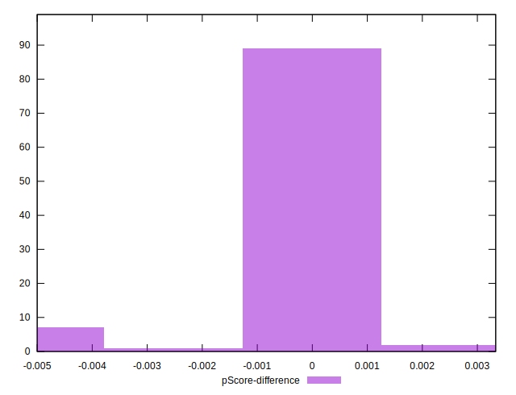

# //unminified-javascript/samples/card

[→ Parent](../..)


## Raw


```yaml
p90min: 0
p90max: 150
p90range: 150
p90mean: 9.24731182795699
median: 0
p90stdev: 24.853833314161776
mad: 0
stdevBySn: 0
lfitCenter: 7.217652482830157
lfitStdev: 16.274465020427144
mfitCenter: 7.217652482830157
mfitStdev: 20.397017107872276
mfitConfidence: 2.0499773511900727
p90skewness: 3.1368564116512156
p90eccentricity: 1.000000000000005
p90discretization: 11.625
outlandishness: 2.0475814986484138

```


## Score


```yaml
p90min: 0.88
p90max: 1
p90range: 0.12
p90mean: 0.9924731182795699
median: 1
p90stdev: 0.020195598050043305
mad: 0
stdevBySn: 0
lfitCenter: 0.9941574215730536
lfitStdev: 0.013173928568136536
mfitCenter: 0.9941574215730536
mfitStdev: 0.016511070935044208
mfitConfidence: 0.0016594250660146707
p90skewness: -3.0727151069160805
p90eccentricity: 1.000000000000003
p90discretization: 13.285714285714286
outlandishness: 0.9936016527267846

```


## Raw Estimate


## Score Estimate


## P Score


```yaml
p90min: 0.875
p90max: 1
p90range: 0.125
p90mean: 0.9922939068100359
median: 1
p90stdev: 0.020711527761801518
mad: 0
stdevBySn: 0
lfitCenter: 0.9939852895976413
lfitStdev: 0.013562054183689507
mfitCenter: 0.9939852895976413
mfitStdev: 0.016997514256560507
mfitConfidence: 0.0017083144593250882
p90skewness: -3.1368564116511966
p90eccentricity: 0.9999999999999999
p90discretization: 11.625
outlandishness: 0.9933179353530781

```


## Score Difference


```yaml
p90min: 0
p90max: 1.1102230246251565e-16
p90range: 1.1102230246251565e-16
p90mean: 5.9689409926083686e-18
median: 0
p90stdev: 2.5041112509012772e-17
mad: 0
stdevBySn: 0
lfitCenter: 4.5961331251298485e-18
lfitStdev: 1.1043855987317055e-17
mfitCenter: 4.5961331251298485e-18
mfitStdev: 1.3841420853308723e-17
mfitConfidence: 1.3911151374492699e-18
p90skewness: 3.9568697453691897
p90eccentricity: 0.9999999999999977
p90discretization: 46.5
outlandishness: 2.259100091827365

```


## P Score Difference


```yaml
p90min: -0.0050000000000000044
p90max: 0
p90range: 0.0050000000000000044
p90mean: -0.00023297491039426464
median: 0
p90stdev: 0.0010251146699695411
mad: 0
stdevBySn: 0
lfitCenter: -0.00016433704736557362
lfitStdev: 0.0004543173316391932
mfitCenter: -0.00016433704736557362
mfitStdev: 0.0005694023351438123
mfitConfidence: 0.00005722708789164308
p90skewness: -4.3434658747413275
p90eccentricity: 0.9999999999999967
p90discretization: 31
outlandishness: 1.8850201857194908

```

