# //unminified-javascript/samples/music

[→ Parent](../..)


## Raw


```yaml
p90min: 0
p90max: 300
p90range: 300
p90mean: 39.8936170212766
median: 0
p90stdev: 82.3781457391935
mad: 0
stdevBySn: 0
lfitCenter: 28.564838909421407
lfitStdev: 61.0552002768519
mfitCenter: 28.564838909421407
mfitStdev: 76.52134574060676
mfitConfidence: 7.6521345740606765
p90skewness: 1.9660263657248018
p90eccentricity: 0.9999999999999974
p90discretization: 31.333333333333332
outlandishness: 1.3998360348444447

```

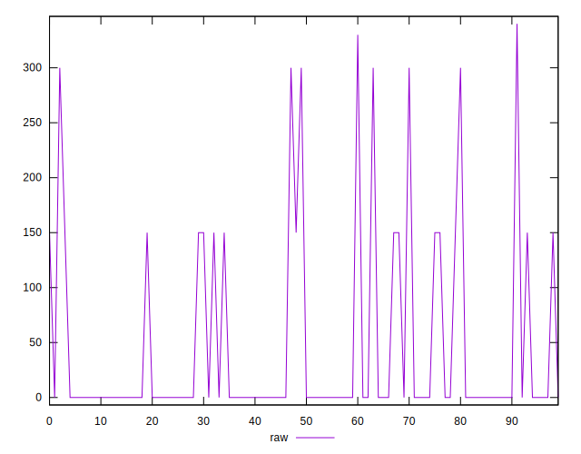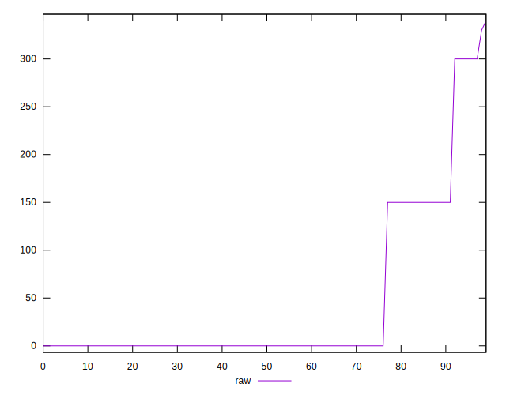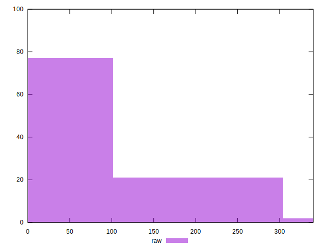
## Score


```yaml
p90min: 0.75
p90max: 1
p90range: 0.25
p90mean: 0.9675531914893616
median: 1
p90stdev: 0.06759841006270705
mad: 0
stdevBySn: 0
lfitCenter: 0.9768136320498206
lfitStdev: 0.04955912208642168
mfitCenter: 0.9768136320498206
mfitStdev: 0.06211314840635803
mfitConfidence: 0.006211314840635803
p90skewness: -2.0327375553087714
p90eccentricity: 0.9999999999999984
p90discretization: 31.333333333333332
outlandishness: 0.9877321948801979

```

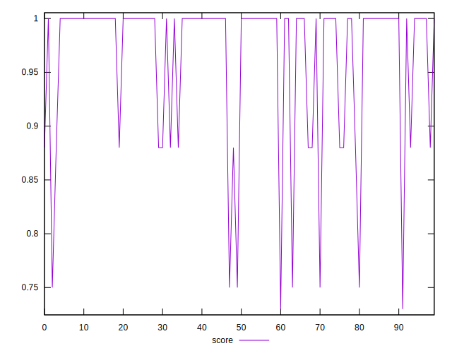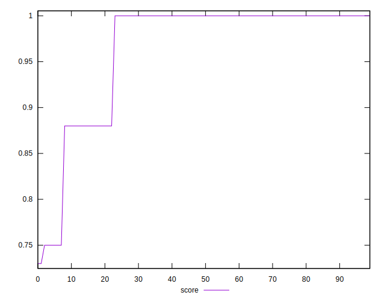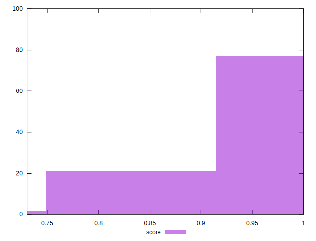
## Raw Estimate

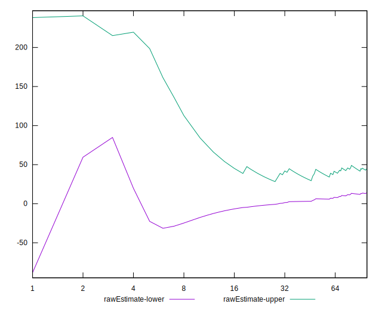
## Score Estimate

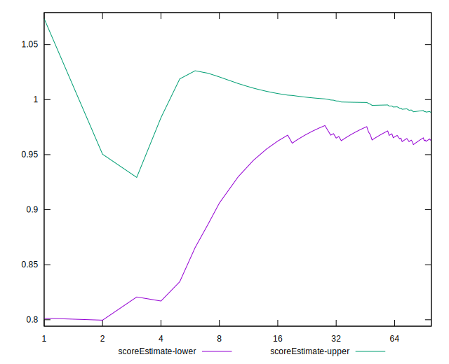
## P Score


```yaml
p90min: 0.75
p90max: 1
p90range: 0.25
p90mean: 0.9667553191489362
median: 1
p90stdev: 0.06864845478266114
mad: 0
stdevBySn: 0
lfitCenter: 0.9762874866264468
lfitStdev: 0.050683718458230644
mfitCenter: 0.9762874866264468
mfitStdev: 0.06352262093933819
mfitConfidence: 0.006352262093933819
p90skewness: -1.9660263657248143
p90eccentricity: 1.0000000000000009
p90discretization: 31.333333333333332
outlandishness: 0.9878433772631791

```

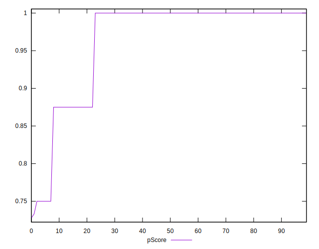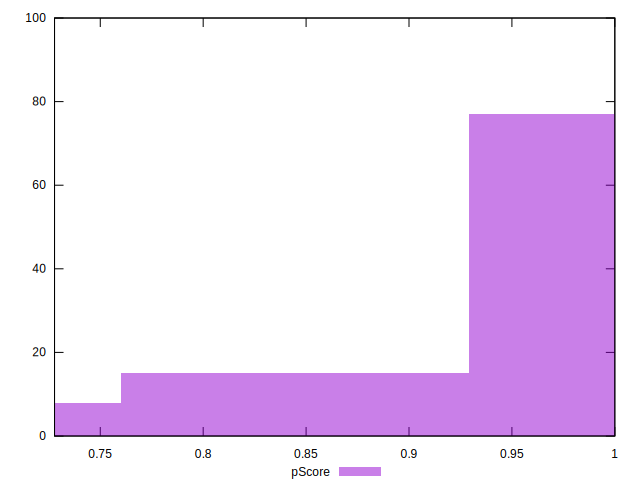
## Score Difference


```yaml
p90min: 0
p90max: 0
p90range: 0
p90mean: 0
median: 0
p90stdev: 0
mad: 0
stdevBySn: 0
lfitCenter: 0
lfitStdev: 0
mfitCenter: 0
mfitStdev: 0
mfitConfidence: 0
p90skewness: .nan
p90eccentricity: .nan
p90discretization: 94
outlandishness: .nan

```


## P Score Difference


```yaml
p90min: -0.0050000000000000044
p90max: 0
p90range: 0.0050000000000000044
p90mean: -0.0006619385342789605
median: 0
p90stdev: 0.001675070608316738
mad: 0
stdevBySn: 0
lfitCenter: -0.00042486194433327896
lfitStdev: 0.0010058982035155886
mfitCenter: -0.00042486194433327896
mfitStdev: 0.0012607064404349278
mfitConfidence: 0.0001260706440434928
p90skewness: -2.1728075020767452
p90eccentricity: 1.0000000000000016
p90discretization: 31.333333333333332
outlandishness: 1.2460140625000014

```

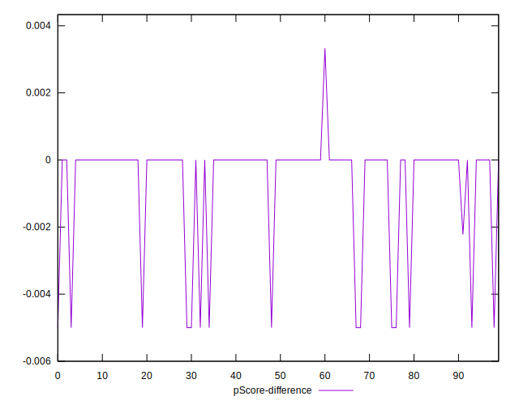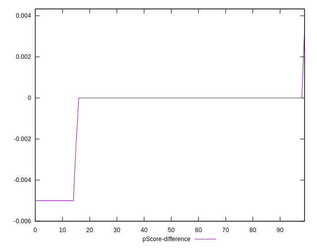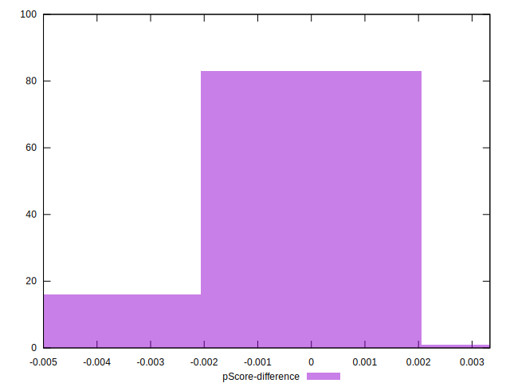